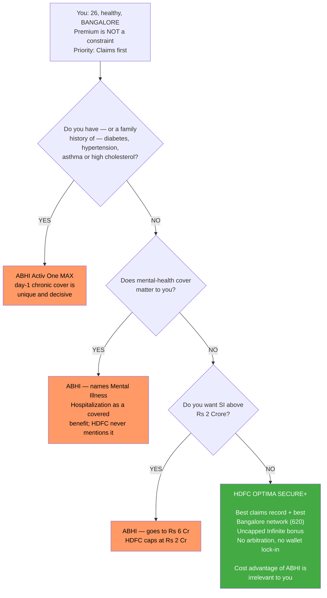

# 🥊 Head-to-Head: HDFC Optima Secure+ vs Aditya Birla Activ One MAX

_Decision document · January 2026 · **Individual, age 26, BANGALORE · premium is not a constraint**_
_Both plans re-tested against the full ~30-dimension framework. Neither triggers the override veto._

> **The short version.** The weighted scores are **4.55 vs 4.60** — a **0.05 gap**, which is **smaller than the uncertainty in the inputs**. The totals cannot decide this. **Your own stated priority order can, and it points the other way to the totals.**

---

## 0. ⚡ UPDATED for your actual profile — Bangalore, age 26, price no object

Three inputs changed the analysis, and **all three point the same way.**

### (a) 🚩 The decisive open item is now RESOLVED — Bangalore network counts

The earlier comparison used **Mumbai**. Re-run for **Bengaluru**, same source (PolicyBazaar):

| Insurer | **Cashless hospitals in Bengaluru** | National network | **% of network in your city** |
|---|---:|---:|---:|
| 🔵 **HDFC ERGO** | **620** ⭐ | ~14,431 | **4.30%** ⭐ |
| 🟠 **Aditya Birla** | **560** | ~16,500 | 3.39% |
| *(Care Health, for reference)* | *392* | *~11,909* | *3.29%* |

```
Bengaluru cashless hospitals (PolicyBazaar - same source)
  HDFC ERGO      ########################  620   (4.30% of national)  <- leads
  Aditya Birla   #####################     560   (3.39%)
  Care Health    ###############           392   (3.29%)
```

> ✅ **HDFC leads Bangalore on both absolute count (+10.7%) and metro concentration.** This is the item flagged as *"most likely to flip the decision"* — it **did not flip it; it confirmed it.**
>
> ⚠️ **Two honest caveats.** **560 is entirely ample in absolute terms** — you are not short of hospitals with either plan, and the practical difference between 620 and 560 in one city is small. And **source dispersion is wide** (HDFC Bengaluru is quoted at 620 / 378 / 360; ABHI at 560 / 419 / 171 across sources). **The PolicyBazaar figures are used because they are the one source applied consistently to every plan in this study.** **Verify by pin code for your own neighbourhood before buying.**

### (b) 💰 "Premium is no concern" — this removes Aditya Birla's largest advantage

ABHI won **M4 Cost (5 vs 4)**, and that win rested almost entirely on **HealthReturns paying back up to 100% of premium** plus better per-lakh efficiency. **If cost is not a constraint, that advantage is worth approximately nothing to you** — while its **downside (a forfeitable wallet that locks you in) still applies in full.**

```
  ABHI's two wins, re-weighted for YOUR profile:
    M2 Exclusions (20%)  -> largely INERT   (PED reduction + day-1 chronic
                                             cover you don't need at 26, healthy)
    M4 Cost       (15%)  -> now IRRELEVANT  (price is no object)
  HDFC's two wins:
    M3 Claims     (25%)  -> FULLY LIVE      (and now confirmed for Bangalore)
    M6 Fine print  (5%)  -> FULLY LIVE      (no arbitration, no wallet lock-in)
```

### (c) 📈 Price no object means a LARGE sum insured — and ABHI's advantages are SI-GATED

If cost isn't binding you should buy a big SI (₹50L–₹1Cr+). **That is exactly where Aditya Birla's advantages switch off:**

| At a ₹1 Crore sum insured | Aditya Birla MAX | HDFC Optima Secure+ |
|---|---|---|
| PED waiting reduction | 🚩 **Unavailable — offered only ≤ ₹50L** | ⚠️ Channel-only (also unavailable) — **now a tie** |
| Specific-disease waiting reduction | 🚩 **Unavailable — offered only ≤ ₹25L** | — |
| Bonus engine | ⚠️ Super Credit **hard-capped at ₹3 Cr** → the "6×" delivers only **~4×** at a ₹1Cr base | ⭐ **Infinite Benefit — UNCAPPED, forever, claim-proof** |
| Max SI available | ⭐ ₹6 Cr | ₹2 Cr *(ample for you)* |

> ⭐ **This is the sharpest new finding: at the sum insured you should actually buy, ABHI's Module-2 advantage disappears entirely** — its waiting-period reductions are SI-gated out of existence above ₹50L — **and its bonus gets clipped by the ₹3 Crore cap, while HDFC's Infinite Benefit keeps compounding without limit.**

### (d) 🗺️ Zone note (informational only)
Bangalore is **not** the top pricing band for most of these insurers — Care puts Bengaluru (Urban) in **Zone 5 of 7**, ACKO in its cheaper **Zone B**, and HDFC/ABHI in their middle tiers rather than Tier 1 (Delhi/Mumbai). **Moot for you, but it means Bangalore quotes will come in below the Delhi/Mumbai anchors used earlier in this study.**

> ### 🔵 **Net effect: the recommendation does not change — it strengthens. HDFC ERGO Optima Secure+.**
> Aditya Birla's case rested on **cost (now irrelevant)** and **exclusions (inert for a healthy 26-year-old, and SI-gated away at the sum insured you should buy)**. HDFC's case rests on **claims reliability — now confirmed best in Bangalore too — and the cleanest contract exit terms.**

---

## 1. The scores, and why they don't settle it

| Module | Weight | **HDFC Optima Secure+** | **Aditya Birla MAX** | Winner |
|--------|:------:|:----------------------:|:--------------------:|:------:|
| **M3 · Claims & servicing** | **25%** | **5** | 4 | 🔵 **HDFC** |
| **M1 · Coverage & benefits** | **25%** | **5** | **5** | ⚖️ tie |
| **M2 · Exclusions & waiting** | **20%** | 4 | **5** | 🟠 **ABHI** |
| **M4 · Cost & premium** | **15%** | 4 | **5** | 🟠 **ABHI** |
| **M5 · Insurer quality** | **10%** | 4 | 4 | ⚖️ tie |
| **M6 · Fine print & longevity** | **5%** | **5** | 4 | 🔵 **HDFC** |
| **TOTAL** | 100% | **4.55** | **4.60** | 🟠 ABHI by 0.05 |

> ⚠️ **Why 0.05 is not a result.** Several module scores rested on **unverified inputs**. ✅ **One of them — ABHI's metro hospital count — is now RESOLVED for Bangalore (§0), in HDFC's favour.** The others (ABHI's core solvency, both premium curves) remain open, and any one could move the totals by **0.1–0.25, i.e. 2–5× the gap**. **The totals cannot decide this; fit can.**

---

## 2. The decisive fact: your priority order disagrees with the totals

You set the priority order at the top of this study as **Claims reliability › Coverage › Exclusions › Cost.**

```
  YOUR PRIORITY          MODULE        HDFC   ABHI    WINNER
  ------------------------------------------------------------
  1. Claims reliability   M3 (25%)       5      4     >>> HDFC
  2. Coverage             M1 (25%)       5      5         tie
  3. Exclusions           M2 (20%)       4      5     >>> ABHI
  4. Cost                 M4 (15%)       4      5     >>> ABHI
  ------------------------------------------------------------
  HDFC wins your #1.  ABHI wins your #3 and #4.
```

> **HDFC wins the single thing you said matters most, and loses on the two you ranked lowest.** The weighting (25/25/20/15/10/5) already encodes that priority — but **a 0.05 margin is too thin for the arithmetic to override the ordering.**

---

## 3. Where each wins — and whether it matters *for you*

### 🔵 HDFC wins Claims (M3) — on verified data

| Evidence | HDFC | ABHI |
|---|---|---|
| ICR vs **own peer segment** | **81.6–89.5%** vs private-general 77.5% ✅ **above** | ~71.5% vs SAHI 68.1% ✅ above |
| Claim Settlement Ratio | **97.45%** (highest in study) | ~95.9% |
| Complaints per 10k claims | **4.99–9.28** (best) | below industry 27.06, exact figure unconfirmed |
| Settled within 3 months | 98.85% | **100%** ⭐ |
| Repudiation rate | unverified | **~4.1%** ⭐ (half the industry's ~8%) |
| **Per-district network density** | **≈17.4 — #1 in study** | ≈15.8 — #2 |
| **Cashless hospitals in BENGALURU** | ⭐ **620 = 4.30% of network** — **verified, same-source** | **560 = 3.39%** — *(now measured; see §0)* |
| Late claim intimation | ⭐ **express condonation** *"for reasons beyond the control of the Insured Person"* | ⚠️ unverified |

> ✅ **RESOLVED for Bangalore (§0): HDFC 620 vs ABHI 560** — HDFC leads on both absolute count (+10.7%) and concentration (4.30% vs 3.39%). ⚠️ **But 560 is ample in absolute terms**, so this is a **clear but modest** win, not a knockout. **You will claim where you live — and in Bengaluru both plans give you a wide choice.**

### 🔵 HDFC wins Fine Print (M6)

- ✅ **No arbitration clause.** ABHI's wording makes **an arbitral award a *condition precedent to any suit*** — and it's **asymmetric**: it binds you on *how much* disputes but not where the insurer denies liability outright. Arbitration costs you real money; the Ombudsman is free.
- ✅ **No wallet lock-in.** ABHI's HealthReturns balance *"shall automatically lapse"* on termination — **the richest earn-back in the study is also its strongest lock-in.**
- ✅ **A three-option non-disclosure remedy ladder** (exclude / add waiting / load) rather than a binary void-and-forfeit.
- ⚠️ *But HDFC carries the instalment claim trap in its harsher "shall" form — ABHI has none.*

### 🟠 ABHI wins Exclusions (M2) — but mostly in theory for you

| | HDFC | ABHI | **Does it affect a healthy 26-year-old?** |
|---|---|---|---|
| PED waiting | 36 months, **reduction is channel-only — you can't buy it** | reducible… **but only ≤₹50L SI** | ❌ **No — you have no pre-existing condition to wait on** |
| Day-1 chronic cover | ❌ none | ⭐ **yes — unique in study** | ⚠️ **Only if you develop//have diabetes, hypertension, asthma** |
| Specific-disease list | closed, 24 months | closed | ⚖️ equivalent |
| Tobacco exclusion | ✅ none | ✅ none | ⚖️ both clean |
| Mental illness | 🚩 zero mentions in wording | ✅ **named covered benefit** | ⚠️ **ABHI is genuinely better here** |

> **ABHI's M2 win is real but conditional.** Its two biggest advantages — the PED reduction and day-1 chronic cover — **are worth little to someone with nothing to declare**, and the PED reduction **vanishes above ₹50L anyway**. Its **mental-illness advantage is unconditional and does matter.**

### 🟠 ABHI wins Cost (M4) — if you'll actually use it

- ⭐ **HealthReturns pays back up to 100% of premium** for staying active — the richest earn-back studied. **HDFC offers none.**
- ⚠️ **But:** it's a **forfeitable wallet** (lock-in), and **worth ₹0 if you don't engage with the fitness tracking.**
- 🚩 **HDFC has the opposite problem:** it is the **only finalist with claim-linked pricing** — a **21%/18% discount you lose by claiming**. Economically, HDFC charges you for claiming; ABHI doesn't.

### ⚖️ Coverage (M1) — a genuine tie, in different shapes

| | HDFC | ABHI |
|---|---|---|
| Room / ICU at actuals, every tier | ✅ | ✅ |
| Bonus engine | ⭐ **Infinite: +100%/yr, UNCAPPED forever, claim-proof** | Super Credit +100%/yr to 500%, **hard cap ₹3 Cr** |
| Restore | ✅ unlimited, same *or* unrelated illness | ✅ unlimited |
| Consumables | ✅ inbuilt (Protect) | ✅ inbuilt (Claim Protect) |
| **Limits FIXED in wording** | ~6 delegations | ⭐ **only 3 — best in study** |
| Voluntary room-cap modifier | ⚠️ **exists (§2.13)** | ⭐ **none** |
| Max SI | ₹2 Cr | ⭐ **₹6 Cr** |

> **HDFC's uncapped Infinite Benefit is the single best cover-growth engine in the study** — a ₹25L base becomes ₹1Cr+ over a decade with **no ceiling and no claim reset**. **ABHI's is capped at ₹3 Cr**, which clips the "6×" to roughly 4× at a ₹1Cr base. **ABHI's counter is a tighter contract** — 3 delegated limits vs 6, and no opt-in room cap that could silently attach.

### ⚖️ Insurer (M5) — both flawed, differently

| | HDFC ERGO | Aditya Birla Health |
|---|---|---|
| Structure | ✅ **multi-line** — has a cross-subsidy cushion | 🚩 **monoline SAHI — no cushion**; only *reprice* or *pay less*, both landing on you |
| Combined ratio | 🚩 **~123%, WORSENING** from 112% | ⚠️ ~114%, **IMPROVING** from ~121% |
| Where the loss sits | ✅ **Motor-TP — not your line** | 🚩 **health — the line you're buying** |
| Solvency | 🚩 **fell to 1.56× (Jun-24)**, within 0.06 of floor; 2.00× recovery **partly sub-debt** | ⚠️ ~1.98×; **core-vs-sub-debt unverified** |
| Rating | ⭐ **CRISIL AAA/Stable** | ⚠️ **unverified** |
| Parent | ⭐ HDFC Bank + **Munich Re (retained)** | ✅ Aditya Birla Group + ADIA |
| Profitability | ✅ profitable, **₹145 cr dividend** | ⚠️ still loss-making, improving |

> **A genuine trade.** HDFC has the **stronger balance sheet and rating but a deteriorating, debt-flattered position**; ABHI has a **weaker but improving one, with no cushion if it worsens.** Neither is comfortable. **HDFC's AAA and dividend-paying profitability are the harder facts.**

---

## 4. The decision tree



---

## 5. Recommendation

> ### 🔵 **For you — 26, healthy, Bangalore, price no object — HDFC ERGO Optima Secure+ is the choice, despite trailing by 0.05. The updated inputs strengthen this, they don't weaken it.**

**Four reasons:**

1. **It wins your stated top priority on verified evidence.** Claims is 25% of the score and #1 in your ordering. HDFC leads on ICR-vs-peer, CSR, complaints, **and — critically — has the best metro cashless network in the study, measured against the same source as its rivals. ABHI's metro count has never been tested.** You claim where you live.
2. **ABHI's two biggest advantages are largely inert for you.** Its M2 win rests on a **PED reduction you don't need** (nothing to declare) that **vanishes above ₹50L anyway**, and **day-1 chronic cover for conditions you don't have**. Its M4 win rests on **HealthReturns, which is worth ₹0 unless you actively engage** — and carries lock-in if you do.
3. **The exit stays cleaner.** HDFC has **no arbitration clause** and **no forfeitable wallet**; ABHI has both. Over a 40-year hold, keeping the option to port cheaply is worth more than a discount you might not earn.
4. **The uncapped Infinite Benefit is the best cover-growth engine studied** — no ceiling, no claim reset. ABHI's is **hard-capped at ₹3 Cr**.

**⚠️ Switch to ABHI Activ One MAX if any of these is true:**
- You have, or have a family history of, **diabetes / hypertension / asthma / high cholesterol** → day-1 chronic cover is decisive and unique.
- You will **genuinely use the fitness tracking** → up to 100% premium back is a large, real saving HDFC cannot match.
- You want **SI above ₹2 Cr** → HDFC's ceiling is ₹2 Cr; ABHI goes to ₹6 Cr.
- **Mental-health cover matters to you** → ABHI names it as a covered benefit; HDFC's wording never mentions it.
- You are **uneasy about HDFC's balance sheet** — solvency dipping to 1.56× with a sub-debt-flattered recovery and a worsening 123% combined ratio is a legitimate reason to prefer an improving insurer.

---

## 6. Before you buy — close these five open items

| # | Item | Why it matters | Where to get it |
|---|------|----------------|-----------------|
| 1 | ✅ **RESOLVED — ABHI's Bengaluru count** | Measured: **HDFC 620 vs ABHI 560.** Did not flip the decision; confirmed it | *Done (§0). Still worth a pin-code check for your own neighbourhood* |
| 2 | **Quotes at ₹50L–₹1Cr, age 26, Bangalore** | ⚠️ **Lower priority now** — price is no object. Useful only to confirm no surprise loading | Each insurer's calculator |
| 3 | **ABHI's current credit rating** and **core solvency ex-sub-debt** | HDFC's AAA is verified; ABHI's is not. A material M5 input | ICRA / CRISIL issuer search |
| 4 | **Both schedules must name the right rung** — "Optima Secure **+**" and "Activ One **MAX**" | Both sell cheaper siblings under one UIN with **capped rooms** | Your policy schedule, before payment |
| 5 | **HDFC only:** confirm **§2.13 room-rent modifier is NOT applied** | It re-enables proportionate deduction | Your policy schedule |

> ### 💡 **Given price is no constraint, buy ₹1 Crore now, not ₹25L.**
> Both plans **restart every waiting clock — and the 5-year moratorium — on any later SI increase**, so stepping up at 35 is materially worse than buying big at 26. You are at your cheapest price and longest runway. **And with HDFC's uncapped Infinite Benefit, a ₹1Cr base compounds without any ceiling** — the single strongest argument for buying large, early, on this specific plan.

---

## Sources

- [HDFC Optima Secure+ — full study](policies/hdfc_optima_secure/README.md) · modules [M1](policies/hdfc_optima_secure/module1_coverage.md) · [M2](policies/hdfc_optima_secure/module2_exclusions.md) · [M3](policies/hdfc_optima_secure/module3_claims.md) · [M4](policies/hdfc_optima_secure/module4_cost.md) · [M5](policies/hdfc_optima_secure/module5_insurer.md) · [M6](policies/hdfc_optima_secure/module6_finprint.md)
- [Aditya Birla Activ One MAX — full study](policies/aditya_birla_activ_max/README.md) · modules [M1](policies/aditya_birla_activ_max/module1_coverage.md) · [M2](policies/aditya_birla_activ_max/module2_exclusions.md) · [M3](policies/aditya_birla_activ_max/module3_claims.md) · [M4](policies/aditya_birla_activ_max/module4_cost.md) · [M5](policies/aditya_birla_activ_max/module5_insurer.md) · [M6](policies/aditya_birla_activ_max/module6_finprint.md)
- Framework and weights: [study_plan.md](study_plan.md) · Screening and carry-forward flags: [screening/stage2_shortlist.md](screening/stage2_shortlist.md)
