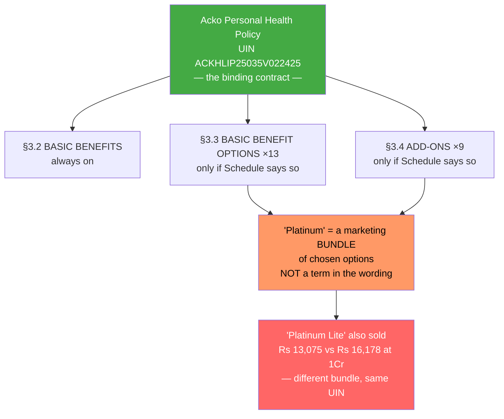
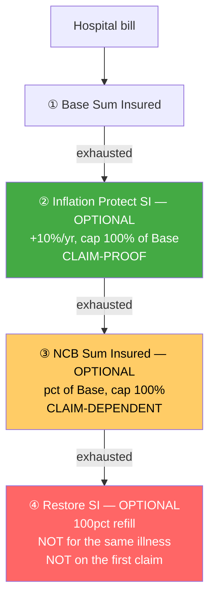

# Module 1 — Coverage & Benefits

_Source: **Acko Personal Health Policy — policy wording** (UIN **ACKHLIP25035V022425**, v02 2024-25 filing), Sections 2 (Definitions), 3.1 (General Conditions), 3.2 (Basic Benefits), 3.3 (Basic Benefit Options), 3.4 (Add-ons); Acko marketing/plan pages for the "Platinum" configuration. Files in `resources/`._
_Profile studied: **Individual (single adult), age 26, metro tier-1**_
_Studied across SI tiers: **₹10L / ₹25L / ₹50L / ₹1Cr** (product range ₹10L → "Unlimited")_

> ⚠️ **Promoted into the study by explicit user decision.** Acko was **ELIMINATED at Stage 1 on filter F3** (ICR 57.82%, below the 60% floor) — see [stage1_hard_filters.md](../../screening/stage1_hard_filters.md). It is studied here because every *other* filter passed, several best-in-study, and because F3 proved mis-specified. **The ICR concern is NOT resolved and carries forward to Module 3.**

> **Plain-English intro.** "Coverage" = *what the policy pays for, and how much*. For every other finalist, that question is answered by reading the policy wording. **For Acko it largely isn't** — and that is this module's central finding.

---

## 🚩 The structural finding — **"Platinum" does not exist in the binding contract**

The plan you are quoted as **"ACKO Platinum Health Plan"** is a **marketing bundle name**. The binding contract is the **Acko Personal Health Policy (UIN ACKHLIP25035V022425)**, and the word **"Platinum" appears nowhere in its 57 pages** — verified by full-text search.

What the wording actually contains is a **configurable chassis**: a small set of always-on Basic Benefits, plus **thirteen "Basic Benefit Options" (§3.3) and nine Add-ons (§3.4)** that apply **only if your Schedule says so**.



> ⚠️ **Variant-ladder mis-selling check** *(framework — HDFC M1)* — **the most acute case in the study.** SBI sold 5 named rungs under one UIN; **Acko sells an open-ended set of configurations under one UIN, and the bundle names ("Platinum", "Platinum Lite") are not contractual terms at all.** Two people both holding "ACKO Platinum" can have **materially different cover** if their Schedules differ. **You cannot verify what you bought from the wording — you must obtain and read YOUR OWN Schedule of Benefits.**

### How much does the wording actually fix? **Almost nothing.**

| What you'd want the contract to guarantee | Where Acko's wording puts it |
|---|---|
| Room rent / ICU limit | ⚠️ *"as specified in the policy schedule"* (§3.2.2) |
| PED waiting period | ⚠️ *"expiry of number of months, as specified in the Policy Schedule"* (§4) |
| Co-payment % | ⚠️ *"as specified in the policy schedule"* (§3.3.4 / 3.3.5 / 3.3.6) |
| Restore Sum Insured | ⚠️ Optional — only *"if opted for"* (§3.3.2) |
| Bonus / cover growth | ⚠️ Optional — NCB (§3.3.3) **or** Inflation Protect (§3.3.12) |
| Consumables cover | ⚠️ Optional — *"Waiver of non-payable medical expenses"* (§3.3.8) |
| Zero initial waiting | ⚠️ Optional — *"Initial 30 days waiting period waiver"* (§3.3.13) |

**Count of limits delegated to the Schedule rather than fixed in the contract: 37.** → **New dimension #1 below.**

## Variant / configuration
| Item | Detail |
|------|--------|
| Product variant studied | **"ACKO Platinum Health Plan"** — a **marketing bundle**, not a wording term. A cheaper **"Platinum Lite"** bundle exists under the same UIN (₹13,075 vs ₹16,178 at ₹1Cr, age 25 Delhi) |
| Product / UIN | **Acko Personal Health Policy · ACKHLIP25035V022425** (v02, 2024-25 filing) |
| Wording version in `resources/` | `policy_wording_acko_personal_health.pdf` — 57 pp, from Acko's own CMS (fetched 18-Jul-2026). A 62-pp partner copy carries the **same UIN** |
| Base sum insured option | **₹10L / ₹25L / ₹50L / ₹1Cr / "Unlimited"** |
| Basis | **Individual** (single adult, age 26) |
| Insurer | **ACKO General Insurance Limited** · IRDAI Regn **157** · CIN U66000KA2016PLC138288 |

---

## 🔑 Claim-lever definitions (Phase-1 wording forensics)

| Definition | Acko wording | Why it matters | vs HDFC Optima (benchmark) |
|------------|--------------|----------------|-----------------------------|
| **Any One Illness — relapse window** | 🚩 **DEFINED — *"continuous period of illness and includes relapse within 45 days"*** (def. 3) | A return within 45 days is the **same** claim, not a fresh one — it caps what you can draw | Optima also **45 days** → **level, and worse than Care & SBI, which have no relapse rule at all** |
| **Pre-existing disease** | Lookback per IRDAI standard; **waiting period is *"as specified in the Policy Schedule"*** — marketed as **0–3 years by health evaluation** | The timer on your existing conditions | Optima 36 mo fixed → **Acko potentially far better (can be ZERO), but not contractually fixed** |
| **Room Rent** | def. 45 + §3.2.2 — **schedule-driven, with an explicit proportionate-deduction mechanism** | Defines the biggest silent payout-shrinker | Optima: at actuals, fixed in wording → **Optima's guarantee is stronger** |
| **Proportionate deduction** | 🚩 **Expressly mechanised** (§3.2.2) with a worked example at a **₹2,000/day** limit. ✅ **Mitigant: does NOT apply to medicines/items billed at MRP** | Shrinks the whole bill pro-rata | Optima: not triggered (no cap) |
| **Reasonable & Customary** | Present (§3.1 f) — *"We will indemnify only those costs… that are Reasonable and Customary Charges"* | Lets insurer trim a bill — discretionary | Present in Optima too |
| **Medically Necessary** | Present (§3.1 g) | Lets insurer reject care it deems excessive | Present in Optima too |

---

## 🛏️ Room economics across the SI ladder

| SI tier | Room rent (Platinum bundle) | ICU | Proportionate-deduction risk? |
|---------|------------------------------|-----|-------------------------------|
| **₹10L** | "No restriction" *(per marketing)* | "No restriction" | ⚠️ **None — IF your Schedule says so** |
| **₹25L** | "No restriction" | "No restriction" | ⚠️ Same caveat |
| **₹50L** | "No restriction" | "No restriction" | ⚠️ Same caveat |
| **₹1Cr** | "No restriction" | "No restriction" | ⚠️ Same caveat |

> **Finding — the *outcome* matches the benchmark; the *guarantee* does not.** On the Platinum configuration, room and ICU are uncapped at every SI — **as good as HDFC Optima and Care Supreme, and better than Bajaj** (SI-gated). ✅ No SI-band gating found.
>
> 🚩 **But the mechanism is inverted.** Care's wording *states* the eligible room is **"No limit"** as the default (3.1.1 ix). **Acko's wording states the opposite default** — the room limit is whatever the Schedule says, and §3.2.2 exists specifically to **mechanise the proportionate deduction when you exceed it**, complete with a worked ₹2,000/day example. **For Care, "no room cap" is a contractual promise; for Acko it is a configuration setting.** Both deliver the same thing today; only one is enforceable from the wording.

---

## Benefit-stacking math

> **How the layers combine.** Base SI, then up to three **optional** layers, then Restore:



| Layer | This plan | Notes |
|-------|-----------|-------|
| **Base SI** | ₹10L / ₹25L / ₹50L / ₹1Cr / Unlimited | The only layer guaranteed by the wording |
| **Instant multiplier (e.g. 2x day-1)** | ❌ **None** | No day-1 multiplier (as with Care) |
| **Annual bonus / infinite benefit** | **+10% of Base SI per year, cap 100%** — marketed as claim-proof. ⚠️ **The wording has TWO different engines:** **NCB (§3.3.3) is claim-DEPENDENT** (*"if anyone… makes no claim"*), while **Inflation Protect (§3.3.12) is claim-INDEPENDENT**. Both cap at 100% of Base SI | 🚩 **Naming conflict that costs money — see brochure-vs-wording.** ⚠️ **NCB is forfeited entirely if you don't renew the option** (§3.3.3) |
| **Restoration / recharge** | **Restore Sum Insured — OPTIONAL (§3.3.2), 100% refill, unlimited times** | 🚩 **Materially weaker than marketed.** Wording: **"not available for the treatment of an illness for which a claim has already been made"** (unrelated illness only) and **"will not trigger for the first claim"**. Not carried forward. **Care and SBI both refill for the SAME illness; Acko does not** |
| **Per-claim cap rule** | 🚩 **THE WORDING CONTRADICTS ITSELF — see below** | The single most important number in the policy is stated two different ways |

### 🚩 CRITICAL — the per-claim cap is stated two incompatible ways

| Clause | What it says |
|--------|--------------|
| **§3.1(d)(4)** | *"Our total, cumulative and maximum liability for **Any One Illness** in a Policy Year is **the Base Sum Insured only**."* |
| **§3.3.2** | *"For Treatment of a single illness… the maximum claim amount payable shall not exceed the sum of **Base Sum Insured; Inflation Protect Sum Insured; and NCB Sum Insured**."* |

> **Why this matters enormously.** "Any One Illness" is defined to include **relapse within 45 days**, so it captures most real treatment episodes. Under the **§3.1(d)(4) reading, a single illness draws the Base Sum Insured ONLY** — meaning **the entire bonus stack (up to +100%) is unusable for the one thing most likely to bankrupt you**, and a ₹10L policy grown to ₹20L still pays only ₹10L for a cardiac event. Under the **§3.3.2 reading**, the bonus layers *do* stack.
>
> **These cannot both be true.** §3.1 sits in *"General Conditions Applicable to Benefits"* and is drafted as an overriding limit, which would ordinarily prevail — the **worse** reading. ⚠️ **UNVERIFIED which governs.** *Confirming source: a written clarification from Acko underwriting, or the per-claim limit stated on the Schedule of Benefits.* **Resolve this before purchase — it is worth up to 100% of your sum insured.**

### How cover scales with SI (Platinum bundle, after 10 claim-free years)
```
              Base SI   + bonus (cap 100%)     = Ceiling      Premium @25 Delhi
  Rs 10L      ##          ##                     Rs 20L        unverified
  Rs 25L      #####       #####                  Rs 50L        unverified
  Rs 50L      ##########  ##########             Rs 100L       unverified
  Rs 1Cr      ####################               Rs 2Cr        Rs 16,178  <- best value
              + Restore refills 100% — but ONLY for a DIFFERENT illness
              ! and possibly NONE of the bonus applies to a single illness (see above)
```
> ✅ **Passes the multiplier hard-cap check** *(framework — ABHI M1)*: both growth engines are **%-of-Base-SI with no flat-rupee ceiling**. ⚠️ But the **100% cap is modest** — level with Care's base CB, below SBI Platinum's 200%.

### Premium scaling with SI *(indicative — full curve is M4)*
| Profile | SI | Premium |
|---|---|---|
| Age 25, Delhi, **ACKO Platinum** | **₹1Cr** | **₹16,178** |
| Age 25, Delhi, ACKO Platinum **Lite** | ₹1Cr | ₹13,075 |
| ₹10L / ₹25L / ₹50L | — | ⚠️ **unverified** — *confirming source: [Acko quote engine](https://www.acko.com/health-insurance/)* |

> **Finding — the headline price is extraordinary.** **₹1 crore of cover for ₹16,178/yr at age 25 = ₹162 per lakh** — against **Care Supreme's ~₹13,312 for ₹15L (₹887/lakh)** and **SBI Platinum's ₹482/lakh at ₹1Cr**. Even allowing for GST-free pricing across all of them, Acko is **~3x more SI-efficient than the cheapest finalist**. ⚠️ **This is exactly what a 57.82% ICR looks like from the buyer's side — cheap premium, fewer rupees paid back. M3 must test whether that is efficient digital pricing or claims stinginess.**

---

## Feature checklist

| Feature | Detail | Notes |
|---------|--------|-------|
| **Room rent** | ✅ **No restriction on the Platinum bundle, all SI tiers** | ⚠️ **Schedule-driven, not wording-guaranteed** — §3.2.2 mechanises proportionate deduction if exceeded. ✅ Deduction spares MRP-billed medicines |
| **Cumulative Bonus ceiling** | **+10%/yr, cap 100% of Base SI** | Level with Care's base CB; below SBI Platinum's 200% |
| **Claim impact on bonus** | ⚠️ **Depends which engine your Schedule grants.** **Inflation Protect (§3.3.12) = claim-proof ✅; NCB (§3.3.3) = lost on a claim ❌**. Marketing promises claim-proof | 🚩 **Check your Schedule names Inflation Protect.** NCB also **forfeited entirely if the option isn't renewed** |
| **Pre / post-hospitalisation** | **60 days pre / 120 days post** *(marketing)* | ⚠️ Behind **HDFC and Care (180 post)**; ahead of **SBI (90)**. Days not fixed in wording |
| **Day-care procedures** | ✅ **Covered** (§3.2.3), basic benefit | Out-patient expressly excluded |
| **Domiciliary / home healthcare** | ✅ **Domiciliary covered** (§3.2.7) — **3+ consecutive days, reimbursement-only** | No separate home-healthcare benefit |
| **AYUSH** | ⚠️ **In-patient AYUSH only** (§3.2.10) — *"Any medical expense other than in-patient care AYUSH treatment expenses are not covered"* | Narrower than **Care and SBI (full SI, broader)** |
| **Modern treatments** | ✅ **All 12 IRDAI-mandated procedures covered** (§3.2.11) as a **basic** benefit | ⚠️ Sub-limits, if any, are **schedule-driven** — *unverified*; Care and SBI fix "up to SI" in the wording |
| **Day-1 cover for listed chronic conditions** | ✅ **Effectively yes, and best-in-study** — **initial waiting 0, specific-illness waiting 0, PED 0–3 yrs by health evaluation** *(marketing)*; wording provides §3.3.13 initial-waiting waiver and §3.3.10 specific-illness reduction as **options** | 🚩 **Outstanding if delivered — but every one of these is an option in the wording, and the PED wait is literally "as specified in the Schedule."** Verify on your own Schedule |
| **Consumables / non-medical (Protect-type)** | ⚠️ **OPTIONAL — "Waiver of non-payable medical expenses" (§3.3.8)**; included in the Platinum bundle *(marketing)* | Same posture as **Care (rider)**; weaker than **SBI/HDFC/ABHI (inbuilt)** |
| **Consumables economics (₹ per admission covered?)** | Covered **if the option is on your Schedule**, against the Annexure 1 non-payables list | Typical gap ₹15k–₹1L/admission |
| **Wellness / HealthReturns / earn-back** | ⚠️ **No premium earn-back mechanism found** in the wording. §3.4.9 Value Added Services; §3.4.4 discounted OPD network rates | ❌ **Weaker than Care (up to 30% renewal discount) and SBI (30%)** — nothing to offset net cost (M4) |
| **Ambulance (road / air)** | **Road Ambulance Limit** (§3.2.5) — basic benefit, **limit schedule-driven**. ✅ **Domestic Emergency Evacuation Limit (§3.2.6)** — basic benefit, incl. **air ambulance** where medically warranted, India only, pre-auth required | ✅ **Emergency evacuation as a BASIC benefit is genuinely rare** — Care and SBI sell air ambulance as a paid rider |
| **Organ-donor cover** | ✅ **Covered** (§3.2.8) | ⚠️ **Excludes donor pre/post-hosp, donor screening, organ acquisition, transport & preservation** — narrower than Care's "up to SI" |
| **Daily cash / shared room** | **Add-on only** — §3.4.6 Daily Hospital Cash | Not in the base bundle |
| **Preventive health check-up** | ✅ **Annual full-body check-up** *(marketing)*; wording §3.3.11 — an **option** | Exempt from the Super Top-up deductible (§3.3.7) |
| **E-opinion / global-emergency cover** | ✅ **Second Opinion is a BASIC benefit (§3.2.9)** — no rider needed. ❌ **International cover NOT in the Platinum bundle** (available as option §3.3.1 Worldwide in-patient) | ✅ **Second opinion inbuilt beats SBI (Platinum-only) and Care (GP e-consult only)** |
| **Maternity / OPD / add-ons** | ❌ **No maternity.** OPD only via add-ons (§3.4.3 OPD, §3.4.1 Doctor-on-call, §3.4.2 Family physician, §3.4.5 Monthly NCB OPD SI); §3.4.7/3.4.8 Accidental Death & Disability | *(Down-weighted.)* For a single 26-yo, no maternity is not material now |
| **Voluntary co-pay / network-gatekeeping modifiers** *(framework — Care M1)* | 🚩 **THREE discount-for-risk levers:** **§3.3.4 First Notification of Claim** (discount now; **compulsory co-pay if you fail to notify within 48 hrs**), **§3.3.5 Preferred Providers Network** (discount now; **compulsory co-pay if treated outside the PPN**), **§3.3.6 Co-pay** (flat discount-for-co-pay) | 🚩 **The densest set of these levers in the study.** §3.3.4 is a **new sub-type — a *notification-linked* co-pay** (new dimension #2). Verify none is silently on your Schedule |
| **Super Top-up / deductible** *(NEW ROW — Rule 3)* | §3.3.7 — the same chassis can be sold as a **super top-up** with an annual aggregate deductible | ✅ Useful for the framework's base-vs-layered architecture question (M4) |

---

## 🆕 NEW DIMENSIONS discovered in this module *(Rule 3)*

### 1. Wording-fixed vs Schedule-delegated limits — how much does the contract actually guarantee? *(→ new bullet in study_plan M1)*
Every module of this framework assumes **the wording fixes the numbers** — it is the premise of the "brochure sells, wording binds" rule itself. **Acko breaks that premise.** Its wording delegates limits to the Schedule in **37 places**, including **room rent, ICU, PED waiting period, co-payment %, pre/post-hospitalisation days and modern-treatment limits**, and makes **restore, bonus, consumables cover and even the initial-waiting-period waiver into options**. The consequence is that the binding contract, read end to end, **does not tell you what you are covered for** — and the marketing name ("Platinum") that *does* describe a configuration **appears nowhere in it**.
> **New generalisable check: "Count how many material limits the wording FIXES versus DELEGATES to the Schedule. A wording that delegates most limits offers a materially weaker guarantee than one that fixes them, even when today's configuration is identical — because the insurer can re-configure future offerings, two buyers of the 'same' plan can hold different cover, and the buyer cannot verify the product pre-purchase from the contract. Where delegation is heavy, the Schedule of Benefits becomes the real contract and MUST be obtained and read before purchase."**

### 2. Notification-linked co-payment — a new sub-type of the discount-for-risk lever *(→ extends the Care M1 bullet in study_plan M1)*
The framework already catches **voluntary room-cap modifiers** (Bajaj/SBI) and **voluntary co-pay / network-gatekeeping modifiers** (Care's Smart Select and True Connect). Acko's **§3.3.5 Preferred Providers Network** is squarely the Care type. But **§3.3.4 "First Notification of Claim" is new**: you take a **premium discount now** in exchange for agreeing to notify Acko **within 48 hours of hospitalisation**, and **if you fail, a compulsory co-payment is applied to the claim.** This converts an **administrative deadline into a priced financial penalty**.
> **Interesting comparison with Care (M3):** Care makes its 48-hour intimation a **condition precedent to liability** — miss it and the claim can be **refused entirely**. Acko instead prices the failure as a **co-payment**. **Acko's construction is arguably the fairer of the two** — proportionate rather than total — but it is still a real cost triggered by a phone call you might be too ill to make. → **Add to the modifier check: "does any discount lever attach a penalty to a PROCEDURAL failure (notification, network routing) rather than to a medical cost-share?"**

---

## Brochure-vs-wording check *(Rule 2)* — **the widest gap in the study**

🚩 **Four material discrepancies. Wording binds in every case.**

| # | Marketing / aggregator says | **Binding wording says** | Effect |
|---|------------------------------|--------------------------|--------|
| 1 | **"ACKO Platinum Health Plan"** | **The word "Platinum" does not appear anywhere in the 57-page wording.** The contract is the *Acko Personal Health Policy*, a configurable chassis | ⚠️ You cannot verify your plan from the wording; the Schedule is the real contract |
| 2 | **"No room rent limit"** | §3.2.2 makes room rent **"as specified in the policy schedule"** and **mechanises proportionate deduction**, with a worked **₹2,000/day** example | ⚠️ True only as a configuration; not a contractual guarantee |
| 3 | **"Restoration — 100% of cover restored, multiple hospitalisations"** | §3.3.2: **optional**; **"not available for the treatment of an illness for which a claim has already been made"**; **"will not trigger for the first claim"** | 🚩 **Unrelated illness only** — Care and SBI both refill for the *same* illness |
| 4 | **"No-claim bonus 10% each year, even if you've claimed"** | The clause actually named **"No Claim Bonus" (§3.3.3) is claim-DEPENDENT** — it pays *"if anyone insured makes no claim"*. The **claim-proof** engine is a differently-named clause, **Inflation Protect (§3.3.12)** | 🚩 **A naming conflict worth up to 100% of SI.** If your Schedule grants "NCB" and not "Inflation Protect", **a single claim stops your cover growing** |

⚠️ **Plus one internal wording contradiction** (not brochure-vs-wording): the **per-claim cap** stated incompatibly at §3.1(d)(4) vs §3.3.2 — see above. *(The framework's "test the wording against itself" check — SBI M2 — catching a **live conflict** for the first time, not merely unused headroom.)*

⚠️ **Plus a version-drift flag:** the prospectus published alongside the product carries the **older UIN ACKHLIP23114V012223** (v01, 2022-23) while the wording is **v02 ACKHLIP25035V022425**. Quote the v02 UIN.

> **Carry-forward flags** *(stage2_shortlist.md)*: Acko's open flag is **M3 — the 57.82% ICR that eliminated it at Stage 1**. **Not resolved here, and this module sharpens it in both directions:** the **₹162-per-lakh pricing** is consistent with a genuinely cheap, efficient digital insurer *(benign)*, but the **restore-excludes-same-illness limitation, the possible Base-SI-only per-claim cap and the NCB naming trap** are all mechanisms by which **less gets paid out than a buyer expects** *(adverse)*. **M3 must weigh the 15.58/10k complaint ratio and 99.98%-within-3-months settlement speed against these.**

---

## Sources

- [Acko Personal Health Policy — Policy Wording, UIN ACKHLIP25035V022425](resources/policy_wording_acko_personal_health.pdf) — *binding, 57 pp; def. 3 Any One Illness (45-day relapse), def. 45 Room Rent; **§3.1(d) Sum Insured limits & the Any-One-Illness cap**; §3.2.1–3.2.11 Basic Benefits; **§3.3.1–3.3.13 Basic Benefit Options** (Restore, NCB, First Notification, PPN, Co-pay, Super Top-up, non-payables waiver, Inflation Protect, waiting waivers); §3.4.1–3.4.9 Add-ons; Annexure 1 non-medical items*
- [Acko Personal Health Policy — partner copy, same UIN](resources/policy_wording_ditto_copy.pdf) — *62 pp; used to cross-check the official 57-pp version*
- [Acko Personal Health Policy — Prospectus](resources/prospectus_acko_personal_health.pdf) — ⚠️ *carries the OLDER UIN **ACKHLIP23114V012223** (v01, 2022-23) — version-drift flag; the v02 wording governs*
- [Ditto — ACKO Platinum Health Plan review](https://joinditto.in/health-insurance/acko/platinum-health/) — *the "Platinum" configuration: SI ₹10L→Unlimited, no room-rent/ICU restriction, 60/120 pre-post, 100% restore, +10%/yr bonus capped at 100%, zero co-pay, PED 0–3 yrs, zero initial and specific-illness waiting, AYUSH, consumables, annual check-up, domiciliary*
- [Ditto — Acko Health Insurance premium chart](https://joinditto.in/articles/health-insurance/acko-health-insurance-premium-chart/) — ***₹1Cr at age 25 Delhi: Platinum ₹16,178 · Platinum Lite ₹13,075***
- [Beshak — Acko Platinum Health Insurance](https://www.beshak.org/insurance/health-insurance/best-health-insurance-plans/acko-platinum-health-insurance/) · [PolicyX — Acko Platinum](https://www.policyx.com/health-insurance/acko-health-insurance/platinum-health-plan.php) — *corroborating configuration and the 14,300+ network claim*
- [ACKO Insurance — Downloads](https://www.acko.com/download/) — *source of the policy wording, fetched 18-Jul-2026*
- Framework: [study_plan.md](../../study_plan.md) · screening: [stage1_hard_filters.md](../../screening/stage1_hard_filters.md) · [stage2_shortlist.md](../../screening/stage2_shortlist.md)
- Benchmarks referenced: [HDFC Optima Secure+ M1](../hdfc_optima_secure/module1_coverage.md) · [Care Supreme M1](../care_supreme/module1_coverage.md) · [SBI Super Health M1](../sbi_super_health/module1_coverage.md) · [Bajaj Health Guard M1](../bajaj_health_guard/module1_coverage.md)

---

**Module 1 score (1–5): 3.5 / 5**

**Rationale.** As a *configuration*, ACKO Platinum is arguably the most attractive coverage sheet in the entire study: **uncapped room and ICU at every SI tier**, **zero initial waiting, zero specific-illness waiting and a PED wait of 0–3 years set by health evaluation** — comfortably the fastest ramp-up of any plan examined and far ahead of SBI's 24-month PED — plus **all 12 modern treatments, day-care, domiciliary, organ donor, consumables, annual check-up**, a **claim-proof +10%/yr bonus to 100%**, and two genuinely rare inclusions as **basic** benefits: **Second Opinion (§3.2.9)** and **Domestic Emergency Evacuation including air ambulance (§3.2.6)**, both of which rivals sell as riders. At **₹16,178 for ₹1 crore at age 25 — about ₹162 per lakh** — it is roughly **3× more sum-insured-efficient than the cheapest finalist**.

It cannot score above 3.5 because **the contract does not underwrite the sales pitch.** The word **"Platinum" appears nowhere in the binding wording**; the policy is a chassis that **delegates 37 material limits — room rent, ICU, PED waiting, co-pay %, pre/post days — to a per-policy Schedule**, and makes **restore, bonus, consumables and even the initial-waiting waiver optional**. Three marketed features are materially narrower in the wording: **restore excludes the same illness and never triggers on a first claim**, the clause actually called **"No Claim Bonus" is claim-dependent** (only the differently-named *Inflation Protect* is claim-proof), and a **45-day Any-One-Illness relapse window** applies. Most seriously, the wording **contradicts itself on the per-claim cap** — §3.1(d)(4) limits Any One Illness to the **Base Sum Insured only** while §3.3.2 permits the bonus layers to stack, an unresolved conflict **worth up to 100% of the sum insured** that must be clarified in writing before purchase. **A superb configuration sitting on the study's weakest contractual guarantee — and the 57.82% ICR that eliminated it at Stage 1 remains open for Module 3.**
