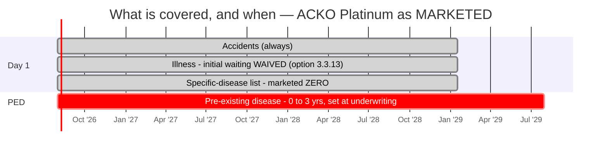

# Module 2 — Exclusions & Waiting Periods

_Source: **Acko Personal Health Policy — policy wording** (UIN **ACKHLIP25035V022425**, v02 2024-25 filing) — Section 2 (Definitions), **Section 4.1 Standard Exclusions (4.1.1–4.1.14)**, **Section 4.2 Specific Exclusions (4.2.1–4.2.4)**, §5.2.2–5.2.3 (underwriting power, zones), §3.3.10/3.3.13 (waiting-period options), Annexure 1 (non-medical items). Files in `resources/`._
_Profile studied: **Individual (single adult), age 26, metro tier-1**_
_Studied across SI tiers: **₹10L / ₹25L / ₹50L / ₹1Cr**_

> **Plain-English intro.** Module 1 asked *"what do they pay for?"*. This module asks the harder question: **"what will they NOT pay for, and how long am I paying premiums before each cover switches on?"**
> - **Waiting period** = a timer. You're paying, but that thing isn't covered yet.
> - **PED (Pre-Existing Disease)** = anything you already had. Longest timer, and the #1 source of rejections.
> - **Exclusion** = never covered, no timer, ever.
>
> **Acko's headline claim — "zero waiting period" — is the single best waiting profile in this study.** This module tests whether the contract actually delivers it. **Short answer: the contract doesn't fix it at all.**

---

## Claim-lever definitions (extract first)

| Definition | This plan | Why it bites |
|------------|-----------|--------------|
| **Pre-existing disease (lookback)** | IRDAI-standard PED definition. ⚠️ **The WAITING PERIOD is *"the expiry of number of months, **as specified in the Policy Schedule**"*** (§4.1.1 a) — marketed as **0–3 years by health evaluation** | The window that defines "pre-existing". **Acko fixes no number in the contract** — it can be zero, or 36 months, depending on your underwriting |
| **Any One Illness (relapse window)** | 🚩 **DEFINED — *"continuous period of illness and includes relapse within 45 days"*** (def. 3) | A return within 45 days is the **same** claim. Combined with §3.1(d)(4) (M1's unresolved per-claim cap), this is the plan's sharpest lever |
| **Reasonable & Customary charges** | Present (§3.1 f) — *"We will indemnify only those costs… that are Reasonable and Customary Charges"* | Lets insurer trim the bill — discretionary |
| **Medically Necessary** | Present (§3.1 g) — hospitalisation must be medically necessary and prescribed in writing | Lets insurer reject treatment it deems excessive |

---

## Waiting periods & restrictions

| Item | Detail | Concern |
|------|--------|---------|
| **Initial (30-day) waiting** | **30 days** (§4.1.3, Code-Excl03) — *the only waiting period Acko actually fixes in the wording*. ✅ **Exceptions:** accidents covered day 1; **does not apply at all with >12 months continuous coverage**. ✅ **Waivable** via option **§3.3.13 "Initial 30 days waiting period waiver"** — the Platinum bundle includes it | ⚠️ **Applies afresh to any enhanced Sum Insured** (§4.1.3 c) |
| **PED waiting** | ⚠️ **NOT FIXED — *"number of months, as specified in the Policy Schedule"*** (§4.1.1). Marketed as **0–3 years, set by health evaluation** | 🚩 **Potentially the best in the study (can be ZERO — beating SBI's 24 months) or as bad as 36 months — the wording permits either.** **Reducible by whom?** Not a channel or SI question here: it is set **per-policy at underwriting**, so it is neither channel-restricted (the HDFC trap) nor SI-gated (the ABHI trap) — but it is also **not guaranteed**. ⚠️ §4.1.1(d): PED covered after the period **only if declared at application and accepted** |
| **Specific-disease waiting (list)** | ⚠️ **Duration NOT fixed — *"as specified in the Policy Schedule"*** (§4.1.2); marketed as **0**. **The list itself has 18 heads** — extracted in full below | 🚩 **See the open-ended item 18 below — this is the module's most serious structural finding.** ⚠️ §4.1.2(c): if a listed disease is also your PED, **the LONGER timer applies**. ⚠️ §4.1.2(d): applies **even if contracted after** you buy. ✅ Accidents exempt. Option **§3.3.10** can further reduce these |
| **Enhancement-of-SI resets waiting** | ⚠️ **YES — all three restart on the increase:** PED (§4.1.1 b), specific-disease (§4.1.2 b), 30-day (§4.1.3 c) — each *"shall apply afresh to the extent of sum insured increase"*. **The 60-month moratorium also restarts** on the enhanced limit | ⚠️ **Material for a 26-year-old.** "Buy ₹10L now, step up to ₹1Cr at 35" restarts every clock on the new ₹90L. ✅ **Mitigant unique to Acko: at ₹162/lakh, buying ₹1Cr outright at entry is genuinely affordable** — the cheapest escape from this trap in the study |
| **Co-pay** | ✅ **NONE mandatory. No age trigger. No zone trigger.** Co-pay exists only as **three opt-in discount levers**: **§3.3.6** (flat co-pay for a discount), **§3.3.4 First Notification** (co-pay if you miss the 48-hour call), **§3.3.5 Preferred Providers Network** (co-pay if treated outside the PPN) | ✅ **Good** — no forced cost-sharing at any age. 🚩 **But three ways a co-pay can arrive on your Schedule**, and §3.3.4/§3.3.5 trigger on **procedural**, not medical, grounds (M1 new dimension). **Verify none is silently carried** |
| **Sub-limits / disease capping** | ⚠️ **Not fixed in the wording — schedule-driven throughout.** Marketing states no disease-wise sub-limits on the Platinum bundle | ⚠️ **Unverified from the contract.** Contrast Care and SBI, which fix "up to SI" in the wording. *Confirming source: your Schedule of Benefits* |
| **Modern-treatment sub-limits (12 mandated)** | ✅ All 12 covered as a **basic** benefit (§3.2.11), no sub-limit stated. 🚩 **BUT §4.2.3/4.2.2(8) permanently excludes several modern modalities** — **cyber knife treatment, KTP laser, Femto laser surgeries, hyperbaric oxygen therapy, RFQMR/ECP/EECP, bioabsorbable stents, valves and implants**, and **radio-frequency ablation unless pre-approved in writing** | 🚩 **INTERNAL CONFLICT: §3.2.11 covers "Stereotactic radiosurgeries" while §4.2.2(8d) excludes "cyber knife treatment" — cyber knife IS a stereotactic radiosurgery platform.** A cancer patient could be told the modality is both covered and excluded. **Unverified which prevails** — *confirming source: written clarification from Acko underwriting* |
| **Mental-illness coverage (parity?)** | 🚩 **ZERO mentions.** The 57-page wording contains **no definition of "Mental Illness", no "Mental Health Establishment" definition, and no mental-illness cover clause** — verified by full-text search (0 hits). It is **also not excluded** | 🚩 **A likely regulatory gap — see the analysis below.** IRDAI has mandated mental-illness parity since **31 Oct 2022**, and both **SBI** (defs 17/18/19) and **Care** (def 2.2.14) carry the full enabling construct. **Acko carries none of it**, and its **Hospital definition requires "a fully equipped operation theatre"** — which most standalone psychiatric facilities do not have. **New dimension #2** |
| **Zone-based co-pay** | ✅ **NONE.** §5.2.3 classifies **two zones — Zone A (Delhi/NCR, Mumbai incl. Navi Mumbai/Thane/Kalyan, Kolkata incl. Howrah) and Zone B (Rest of India)** — expressly *"for the purpose of calculating premium"* only. **No zone-co-pay clause exists** | ✅ **Metro buyers pay the Zone-A price but are never penalised at claim time** for being treated in a costlier city. ✅ **Simpler than Care's 7 zones**; less favourable than SBI's zone-agnostic pricing |
| **Deductible / aggregate deductible** | **Optional only** — **§3.3.7 Super Top-up**, an annual aggregate deductible; the same chassis is sold as a super top-up product. ✅ Preventive Health Check-up (§3.3.11) is **exempt** from the deductible | Chosen for a discount; not forced |
| **Permanent exclusions (full list)** | **~31 items across two sets — and Acko usefully labels which are negotiable:** **§4.2.2 "Permanent Exclusions Set 1 (CAN BE WAIVED)" — 11 items**: self-inflicted injury · breach of law · **STDs other than HIV/AIDS** (incl. screening & prevention) · hazardous sports (**professional only** ✅) · unproven/experimental **+ radio-frequency ablation unless pre-approved** · treatment outside India (unless §3.3.1) · **external** congenital anomaly · **specific treatments** (chiropractic/spinal manipulation, muscle stimulation, RFQMR/ECP/EECP, hyperbaric oxygen, KTP & Femto laser, **cyber knife**, bioabsorbable stents/valves/implants) · **sleep disorders incl. sleep apnoea & snoring** · **substance abuse — including the tobacco-cancer carve-out below** · OPD (unless add-on). **§4.2.3 "Set 2 (CANNOT BE WAIVED)" — 6 items**: suicide/self-injury · dental (unless accident) · circumcision & sex-transformation · **prosthetics and cochlear implants** (unless accidental/intra-operative) · war, terrorism, nuclear/bio/chemical · **hormone replacement therapy and growth hormone therapy** | ✅ **The two-set "waivable / not waivable" structure is unusual and genuinely useful transparency** — no other finalist tells you which exclusions are negotiable. ✅ **HIV/AIDS expressly carved OUT of the STD exclusion** — progressive. 🚩 **But see the tobacco-cancer exclusion below**, and note **sleep apnoea, HRT/growth hormone and cochlear implants** are real gaps |
| **Underwriting-imposed permanent exclusion on declared conditions** | 🚩 **YES, and broadly drafted.** §5.2.2: *"**We reserve the right to apply additional options, exclusions and/or adjust the scope of cover and/or premium**… to reflect any circumstances or material facts declared to Us."* Reinforced by the moratorium clause, which preserves contestability for **"permanent exclusions specified in the policy schedule"** | 🚩 **The HDFC M2 dimension applies in full, and Acko's version is the most open-ended in the study** — it is not limited to ICD codes or named conditions. ⚠️ **These schedule-placed exclusions survive the 60-month moratorium forever.** ✅ For a healthy 26-year-old the risk is low today — but Acko's **0–3 year PED "health evaluation"** is precisely the underwriting moment at which such an exclusion would be applied |
| **Non-disclosure consequences** | ⚠️ **Harsh and binary** (def. 15): *"The policy shall be **void** and **all premiums paid thereon shall be forfeited**"* on misrepresentation, mis-description or non-disclosure of any material fact | ⚠️ Same standard as Care. **Moderated by the 60-month moratorium** (contestability ends except for **established fraud** and **schedule-specified permanent exclusions**). **Rule: over-disclose in writing at proposal** |

---

## 🚩 THE STRUCTURAL FINDING — the specific-disease list is **open-ended**

§4.1.2(f) lists **17 named heads** — and then **item 18**:

> **"18. Any other specific conditions in Schedule: Any other condition or treatment mentioned under this head in the Schedule will have a waiting period as specified in the Schedule."**

**The 17 named heads** (all subject to a schedule-set duration): ① Eyes — cataract, glaucoma, retina · ② Pancreatitis, biliary & urinary stones · ③ Genitourinary — fibroids, PCOD, endometriosis, prolapse, D&C, hysterectomy · ④ Cysts, tumours, polyps, nodules, lumps (benign/in-situ) · ⑤ Prostate hyperplasia, hydrocele · ⑥ Rectal — haemorrhoids, fissure, fistula, pilonidal sinus · ⑦ **Hernia, all sites** · ⑧ **Arthritis, spondylopathies, intervertebral disc disorders, joint replacement** · ⑨ **Chronic kidney disease & failure** · ⑩ Varicose veins · ⑪ ENT — otitis media, tonsils, adenoids, nasal septum · ⑫ **Internal congenital anomaly** · ⑬ Gastric ulcers & varices · ⑭ **Ligament, tendon & meniscal tear** · ⑮ **Prolapsed intervertebral disc surgery** · ⑯ GERD · ⑰ **Parkinson's / Alzheimer's / Dementia**

```
  EVERY OTHER FINALIST                        ACKO
  ┌─────────────────────────┐                 ┌─────────────────────────┐
  │ Care Supreme: 14 heads  │                 │ 17 named heads          │
  │ SBI: 43 items           │   vs            │        +                │
  │ FIXED IN THE WORDING    │                 │ 18. "any other condition │
  │ — a CLOSED list         │                 │  mentioned in the        │
  └─────────────────────────┘                 │  Schedule"  ← OPEN       │
                                              └─────────────────────────┘
```

> **Why this is serious.** For every other plan in this study, the set of conditions carrying a waiting period is **closed and knowable from the contract** — you can read the 14 or 43 items and know the worst case. **Acko's list is extensible: any condition Acko chooses to name on your Schedule acquires a waiting period of whatever length your Schedule states.** Combined with §4.1.1/§4.1.2 leaving *durations* to the Schedule too, **both the SCOPE and the LENGTH of Acko's waiting periods are set per-policy, and neither is bounded by the contract.**
>
> ⚠️ This is the M2 counterpart of M1's schedule-delegation finding — **but sharper**, because M1's delegation concerned *limits* while this concerns *what is covered at all*. → **New dimension #1.**

---

## 🚩 The tobacco-user cancer exclusion — harsher than Care's

§4.2.2(10), inside the substance-abuse exclusion:

> **"Cancer of oral, oropharynx and respiratory system is specifically excluded in a tobacco user."**

| | **Care Supreme** §4.2(24) | **Acko** §4.2.2(10) |
|---|---|---|
| Wording | *"Any Illness or Injury **attributable to**… tobacco… smoking"* | *"Cancer of oral, oropharynx and respiratory system… **in a tobacco user**"* |
| Scope | **Broader** — any illness | **Narrower** — three cancer sites |
| Trigger | **Causation** — insurer must attribute the illness to tobacco | 🚩 **STATUS** — it applies because you *are* a tobacco user |
| Easier for the insurer to apply? | Harder — causation is arguable | 🚩 **Yes — status is a fact, not an argument** |

> **Finding — same dimension, worse mechanics.** The Care M2 dimension (*lifestyle-attributable illness exclusion*) **recurs here in a status-based form that is materially easier for the insurer to enforce.** A tobacco user's **lung, throat or mouth cancer — the three most common tobacco-related cancers — is excluded outright**, with no causation argument to contest. ⚠️ **If you use tobacco in any form, this single clause may be the most important sentence in the policy.** ✅ It sits in **Set 1 ("can be waived")**, so ask whether it can be waived for you — a question Acko's structure uniquely lets you pose.

---

## 🧠 The mental-health gap — a probable compliance defect

**Full-text search of the 57-page wording returns ZERO hits for "mental illness", "mental health establishment" or "Mental Healthcare Act".**

| Requirement (IRDAI, mandatory since 31 Oct 2022) | SBI Super Health | Care Supreme | **Acko** |
|---|:---:|:---:|:---:|
| "Mental Illness" defined | ✅ def. 17 | ✅ def. 2.2.14 | ❌ **absent** |
| "Mental Health Establishment" treated as a Hospital | ✅ def. 19 | — | ❌ **absent** |
| Mental illness covered at full SI | ✅ | ✅ | ⚠️ **not stated** |
| Mental illness expressly excluded? | No | No | **No** |

> **The practical problem is not the absence of cover — it is the absence of a qualifying facility.** Mental illness is **not excluded**, so on a plain reading a psychiatric admission should be payable under §3.2.1. **But Acko's "Hospital" definition (def. 19) requires *"a fully equipped operation theatre of its own where surgical procedures are carried out."*** Most standalone psychiatric hospitals, rehabilitation facilities and mental-health establishments **have no operating theatre** — and would therefore **fail the Hospital test**, making the claim inadmissible.
>
> This is precisely why the IRDAI-standard construct includes a **separate "Mental Health Establishment" definition** — which SBI carries and Acko does not. **Result: cover that is nominally compliant but may be practically unclaimable at the very facilities that treat the condition.** ⚠️ **UNVERIFIED whether Acko admits such claims in practice** — *confirming source: written confirmation from Acko, or an IRDAI/Ombudsman ruling on an Acko psychiatric claim.* → **New dimension #2.**

---

## 🕐 The waiting-period timeline (healthy 26-year-old, Platinum bundle as marketed)



| Timer | Wording position | Marketed (Platinum) |
|-------|------------------|---------------------|
| Accidents | Always covered | Day 1 ✅ |
| Initial illness | **30 days** (§4.1.3) — waivable by option §3.3.13 | **0** ✅ |
| Specific-disease list (18 heads) | **"as specified in the Schedule"** | **0** ✅ |
| PED | **"as specified in the Schedule"** | **0–3 years**, set by health evaluation |

> **For this buyer (healthy, 26, no PED): if the Schedule delivers the marketed configuration, the policy is fully switched on from day 1 — comfortably the fastest ramp-up in the entire study**, ahead of SBI (12-month specific list, 24-month PED) and far ahead of Care (24-month list, 36-month PED). ⚠️ **But none of it is guaranteed by the contract — every number above comes from marketing, not the wording. Get your Schedule before you pay.**

---

## 🆕 NEW DIMENSIONS discovered in this module *(Rule 3)*

### 1. Open-ended / extensible waiting-period list *(→ new bullet in study_plan M2)*
The framework instructs us to **"extract the *actual list*"** of specific-disease conditions — an instruction that silently assumes **the list is closed**. For Care (14 heads), SBI (43 items) and Bajaj (three fixed tiers) it is. **Acko's §4.1.2(f) item 18 breaks that assumption**: *"Any other condition or treatment mentioned under this head in the Schedule will have a waiting period as specified in the Schedule."* **Both the scope and the duration of the waiting periods are therefore set per-policy and unbounded by the contract** — you cannot read the wording and know your worst case.
> **New generalisable check: "Is the specific-disease waiting list CLOSED (fully enumerated in the wording) or OPEN (extensible via the Schedule)? An open list means the wording cannot tell you what is covered — the Schedule becomes the operative document, two buyers of the same plan can face different exclusions, and the insurer can add conditions at underwriting or renewal without a new UIN. Treat an open list as a material weakening of the contract even where today's Schedule is clean."**

### 2. Mental-illness parity — check the ENABLING DEFINITIONS, not just the absence of an exclusion *(→ new bullet in study_plan M2)*
The existing bullet asks whether mental-illness cover is *"neutered by sub-limits, co-pay or waiting"*. **Acko shows a subtler failure mode: cover neutered by the absence of a qualifying facility.** Acko neither covers nor excludes mental illness explicitly — it simply **omits the entire IRDAI construct** (no *Mental Illness* definition, no *Mental Health Establishment* definition). Because its **Hospital definition demands a fully equipped operation theatre**, a claim at a dedicated psychiatric facility would likely fail the admissibility test even though nothing excludes the condition.
> **New generalisable check: "Don't stop at 'is mental illness excluded?'. Verify the wording contains the ENABLING definitions — *Mental Illness*, *Mental Health Establishment* (deemed a Hospital), and a *Medical Practitioner* definition covering psychiatrists. Without them, a psychiatric admission can fail the Hospital definition (which typically requires an operation theatre) and be inadmissible despite nominal compliance with the Oct-2022 parity mandate."**

---

## Brochure-vs-wording check *(Rule 2)*

🚩 **The gap is the same as M1's, and here it is total: on waiting periods, the marketing states numbers the wording does not contain.**

| Item | Marketing says | **Binding wording says** | Effect |
|------|----------------|--------------------------|--------|
| **Initial waiting** | **"Zero waiting period"** | **30 days** (§4.1.3) — **waived only if option §3.3.13 is on your Schedule** | ⚠️ True only as a configuration |
| **Specific-illness waiting** | **"0 years"** | *"number of months **as specified in the Policy Schedule**"* — with an **18-head, open-ended list** | 🚩 No contractual floor; scope extensible |
| **PED waiting** | **"0–3 years based on health evaluation"** | *"number of months **as specified in the Policy Schedule**"* | ⚠️ Consistent with marketing, but wholly unbounded by the contract |
| **"No sub-limits"** | No disease-wise caps | Not stated anywhere — schedule-driven | ⚠️ Unverifiable pre-purchase |

⚠️ **Plus a live internal conflict:** §3.2.11 covers **"Stereotactic radiosurgeries"** while §4.2.2(8d) excludes **"cyber knife treatment"** — cyber knife *is* a stereotactic radiosurgery platform. *(Second instance of the "test the wording against itself" check firing on Acko — the first was M1's per-claim cap.)*

> **Carry-forward flags** *(stage2_shortlist.md)*: Acko's open flag is **M3 — the 57.82% ICR that eliminated it at Stage 1**. **Not resolved here, and M2 adds weight to BOTH readings.** *Adverse:* the **tobacco-cancer exclusion**, the **open-ended waiting list**, the **broad §5.2.2 underwriting-exclusion power** and the **cyber-knife/modern-treatment conflict** are all mechanisms by which claims can be narrowed — consistent with a low payout ratio. *Benign:* the **two-set "can be waived / cannot be waived" structure is unusually transparent**, **HIV/AIDS is expressly covered**, hazardous sports are excluded for professionals only, and there is **no mandatory or age-triggered co-pay** — none of which is the behaviour of a deliberately stingy insurer. **M3 must weigh these against the 15.58/10k complaint ratio and the 99.98%-within-3-months settlement record.**

---

## Sources

- [Acko Personal Health Policy — Policy Wording, UIN ACKHLIP25035V022425](resources/policy_wording_acko_personal_health.pdf) — *binding, 57 pp; def. 3 Any One Illness, def. 15 disclosure/void, **def. 19 Hospital (operation-theatre requirement)**, def. 44 Waiting Period; **§4.1.1 PED**, **§4.1.2 specified disease + the 18-head open list**, §4.1.3 30-day, §4.1.4–4.1.14 standard exclusions; **§4.2.1 Annexure-1 non-medical**, **§4.2.2 Permanent Exclusions Set 1 (waivable, incl. the tobacco-cancer carve-out and cyber knife)**, **§4.2.3 Set 2 (non-waivable, incl. HRT)**, §4.2.4 PA exclusions; §3.3.10 specific-waiting reduction, §3.3.13 initial-waiting waiver; **§5.2.2 underwriting power to apply additional exclusions**, §5.2.3 two-zone classification (premium only); moratorium clause*
- [Ditto — ACKO Platinum Health Plan review](https://joinditto.in/health-insurance/acko/platinum-health/) — *the marketed waiting profile: **PED 0–3 yrs, specific-illness waiting 0, initial waiting 0**, no co-pay, no sub-limits*
- [Beshak — Acko Platinum Health Insurance](https://www.beshak.org/insurance/health-insurance/best-health-insurance-plans/acko-platinum-health-insurance/) · [PolicyX — Acko Platinum](https://www.policyx.com/health-insurance/acko-health-insurance/platinum-health-plan.php) — *corroborating configuration*
- [IRDAI Master Circular on Health Insurance, 29 May 2024](https://irdai.gov.in/) — *60-month moratorium; PED waiting ≤36 months; **mandated mental-illness cover (since 31 Oct 2022)**; 12 modern treatments*
- [Mental Healthcare Act 2017 / IRDAI circular on mental-illness parity](https://irdai.gov.in/) — *the parity requirement against which the mental-health gap above is assessed*
- Framework: [study_plan.md](../../study_plan.md) · screening: [stage1_hard_filters.md](../../screening/stage1_hard_filters.md) · [stage2_shortlist.md](../../screening/stage2_shortlist.md)
- Benchmarks referenced: [Care Supreme M2](../care_supreme/module2_exclusions.md) · [SBI Super Health M2](../sbi_super_health/module2_exclusions.md) · [HDFC Optima Secure+ M2](../hdfc_optima_secure/module2_exclusions.md) · [Bajaj Health Guard M2](../bajaj_health_guard/module2_exclusions.md)

---

**Module 2 score (1–5): 3.0 / 5**

**Rationale.** On the *marketed* configuration Acko has **the best waiting-period profile in the entire study** — **zero initial waiting, zero specific-illness waiting and a PED wait of 0–3 years set at underwriting**, meaning a healthy 26-year-old could be fully covered from day one, far ahead of SBI (12/24 months) and Care (24/36 months). It also earns real credit elsewhere: **no mandatory, age-triggered or zone-based co-pay**; a **two-zone classification used for premium only, with no zone-co-pay trap**; hazardous sports excluded for **professionals only**; **HIV/AIDS expressly carved out** of the STD exclusion; and — uniquely in this study — an exclusions catalogue **split into "can be waived" and "cannot be waived" sets**, which is genuinely useful transparency no rival offers.

It scores only 3.0 because **almost none of that is contractual, and three specific defects are serious.** **(1) Both the LENGTH and the SCOPE of the waiting periods are delegated to the Schedule** — §4.1.1 and §4.1.2 fix no number, and **item 18 of the specific-disease list is an open-ended catch-all** letting Acko add *any* condition with *any* duration per policy, so the wording cannot tell you your worst case (every rival's list is closed). **(2) The mental-health construct is entirely absent** — zero mentions of *Mental Illness* or *Mental Health Establishment* in 57 pages, while the Hospital definition demands an operation theatre most psychiatric facilities lack, leaving cover that is nominally compliant with the Oct-2022 parity mandate but **probably unclaimable where it matters**. **(3) A status-based tobacco exclusion** removes **oral, oropharyngeal and respiratory cancers** from any tobacco user with no causation argument available — mechanically harsher than Care's "attributable to" formulation. Add a **live conflict between covered "stereotactic radiosurgery" and excluded "cyber knife"**, an **unusually open-ended underwriting power to add exclusions (§5.2.2) that survive the moratorium**, exclusions for **sleep apnoea, HRT and cochlear implants**, and **enhancement of SI restarting every clock** — though on that last point Acko alone offers a cheap escape, since ₹1Cr at ₹162/lakh makes buying big at entry realistic. **The best waiting periods in the study, promised by the weakest contract in the study.**
