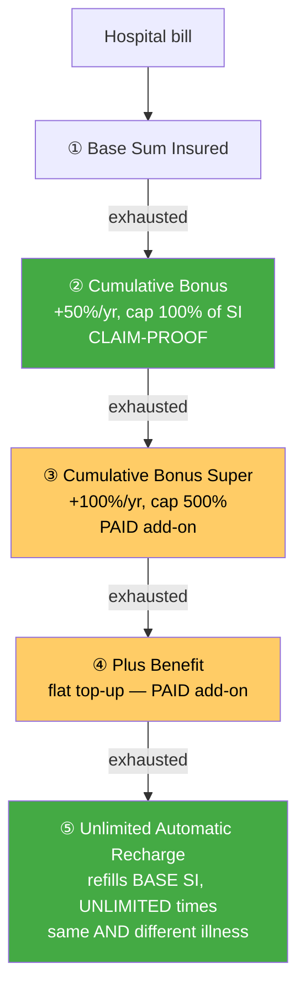

# Module 1 — Coverage & Benefits

_Source: Care Supreme **policy wording** (UIN **CHIHLIP27061V032627**, v03 2026-27 filing), Sections 2 (Definitions) & 3 (Benefits) + Annexure I (Non-Medical list); current prospectus & brochure. All files in `resources/`._
_Profile studied: **Individual (single adult), age 26, metro tier-1**_
_Studied across SI tiers: **₹10L / ₹25L / ₹50L / ₹1Cr**_

> **Plain-English intro.** "Coverage" = *what the policy pays for, and how much*. Two policies with the same ₹25L **Sum Insured** (SI = the most the insurer will pay in a year) can behave very differently once you read: **(a)** whether you can pick any hospital room or get penalised for it, **(b)** how much free extra cover you earn each year, **(c)** whether your SI can be *refilled* after a big claim, and **(d)** the silent gaps — gloves, syringes, PPE, the "non-payable" items that run ₹15k–₹1L per admission. This module scores all of that, at every SI tier.
>
> **Care Supreme in one line:** a clean, single-plan SAHI product whose *base* benefits are almost all uncapped ("up to Sum Insured"), with a **claim-proof bonus** and **unlimited restore** — but which pushes several things a metro buyer actually wants (consumables cover, the headline "600% cover", a shorter PED wait) **into paid add-ons**, and which — unlike SBI — **charges by zone**.

---

## ✅ Structural fact — Care Supreme is **ONE plan, not a variant ladder**

Unlike SBI Super Health (5 rungs under one UIN) or Bajaj Health Guard (SI-gated room tiers), **Care Supreme is a single plan**. Every SI from ₹5L to ₹1Cr carries the **same base benefit set** — the differences across the SI ladder are just two rupee-denominated sub-limits and premium. This removes the **variant-ladder mis-selling hazard** that bit SBI (a "Prime" certificate with no multiplier) and Bajaj (a capped-room sibling).

| Item | Detail |
|------|--------|
| Product variant studied | **Single plan — no variants.** Coverage is uniform across the whole SI ladder |
| Product / UIN | Care Supreme · **CHIHLIP27061V032627** (v03, 2026-27 filing) — *the current wording; supersedes v01 CHIHLIP23128V012223* |
| Wording version in `resources/` | `policy_wording_care_supreme_CHIHLIP27061V032627.pdf` (83 pp, careinsurance.com, fetched 17-Jul-2026). Old v01 kept as `policy_wording_v01_..._old.pdf` for the version-diff finding below |
| Base sum insured options | **₹5L / 7L / 10L / 15L / 25L / 50L / ₹1Cr** — all four studied tiers exist on the one plan |
| Basis | **Individual** (single adult, age 26). Individual max 6 persons; floater max 2A+2C |
| Zone bought | **Zone 1 (Delhi NCR) or Zone 2 (Mumbai MMR)** — ⚠️ Care Supreme is **zone-priced across 7 zones** (metro = the dearest zones). *Not* zone-agnostic like SBI — see feature checklist & M4 |

---

## 🔑 Claim-lever definitions (Phase-1 wording forensics)
_The fine-print levers an insurer uses to trim or deny a claim. Extract these before trusting any headline benefit._

| Definition | Care Supreme wording | Why it matters | vs HDFC Optima (benchmark) |
|------------|----------------------|----------------|-----------------------------|
| **PED — waiting period** | **36 months** default (Excl01 / def. 2.1.36). Reducible **only by paying** for *PED Wait Period Modification* (→24/12 mo) or *Instant Cover* (→30 days, 4 named conditions) | How long your pre-existing conditions stay uncovered | Optima **36 mo** → **level with HDFC**, but **worse than SBI's inbuilt 24 mo**. The "2-yr PED" in our screening note is the **paid-modifier** figure, not the default ⚠️ |
| **Named-ailment (specific-disease) waiting** | **24 months** (Excl02), 14-item list. Reducible by paid *Named Ailment Wait Period Modification* | Second waiting tier | Optima 24 mo → **level** |
| **Room Rent (def.)** | 2.1.42 + **2.2.2 "Associate Medical Expenses"** — anchors proportionate-deduction maths | Defines the room benefit and *what* gets pro-rated | Standard |
| **Reasonable & Customary** | 2.1.40 — present, discretionary (applies to every indemnity clause) | Lets insurer trim a bill to "customary" rates | Present in Optima too |
| **Medically Necessary** | 2.1.28 — present, discretionary (every base benefit is gated on it) | Lets insurer reject care it deems excessive | Present in Optima too |
| **Any One Illness — relapse window** | **Not defined** in the wording. Recharge (3.1.4) explicitly serves *"same illness as well as different Illnesses"* | The absence *helps*: no relapse rule shrinking your refill | Optima has a **45-day** relapse rule → **Care cleaner** ✅ |
| **Proportionate deduction** | Applies **only if** *Room Rent Modification* is opted (3.2.2). Default schedule room = **"No limit"** (3.1.1 ix). Even when triggered, it bites only **Associate Medical Expenses** (room, OT, surgeon fees) — **NOT pharmacy, consumables, implants or diagnostics** (2.2.2 note) | The bill-shrinking mechanic | Optima: no cap → not triggered. Care's default is the same; its pro-ration, if opted, is *narrower* than the usual "whole bill" cut ✅ |

> ⚠️ **Note the definitional headroom** *(framework — SBI M2 "wording vs wording")*: def. 2.1.48 permits a Named-Ailment waiting *"up to 36 months"* while Excl02 actually sets **24**. Not a live conflict (the exclusion binds), but the unused 12-month headroom could be occupied by a future revision without a new UIN. Flagged for M2.

---

## 🛏️ Room economics — a genuine, uniform strength

> **Why this matters most (plain English).** If a policy caps your daily room rent and you take a costlier room, the hospital's bill is cut back **in the same proportion**. It is the biggest silent shrinker of a payout, and it bites hardest in **metro tier-1** where room rates are highest.

| SI tier | Room rent eligibility | ICU | Proportionate-deduction risk? |
|---------|----------------------|-----|-------------------------------|
| **₹10L** | **"No limit" — any room, no cap** (3.1.1 ix-i) | **"No limit"** | ✅ **None** (default) |
| **₹25L** | **"No limit"** | **"No limit"** | ✅ **None** |
| **₹50L** | **"No limit"** | **"No limit"** | ✅ **None** |
| **₹1Cr** | **"No limit"** | **"No limit"** | ✅ **None** |

> **Finding — room economics match the HDFC benchmark and, like SBI, do NOT degrade at low SI.** The default eligible room is *"No limit"* at **every** SI (3.1.1, condition ix), so there is **no proportionate deduction anywhere on the ladder** — beating **Bajaj** (single-A/C room below ₹10L) and matching **HDFC "at actuals"** and **SBI "actuals up to SI"**.
>
> ⚠️ **The one room trap — a voluntary cap sold as a discount** *(framework — SBI/Bajaj M1)*: **Room Rent Modification** (3.2.2) lets you *opt in* to a Single-Private-AC or Twin-Sharing cap in exchange for cheaper premium — which **switches proportionate deduction back on**. **Do not opt it if the no-cap benefit is why you chose the plan, and check the schedule doesn't carry it silently.** Mitigant: even when opted, ICU stays uncapped and the pro-ration spares pharmacy/consumables/implants/diagnostics (2.2.2).

---

## Benefit-stacking math

> **How the layers combine (plain English).** Buckets drawn down in a **fixed order** (General Condition 2.II + 3.1.4):
> **① Base SI** → **② Cumulative Bonus** → **③ Cumulative Bonus Super** *(paid add-on)* → **④ Plus Benefit** *(paid add-on)* → then **⑤ Unlimited Automatic Recharge** refills the **base SI**, unlimited times, for any further claim.



| Layer | This plan | Notes |
|-------|-----------|-------|
| **Base SI** | ₹10L / ₹25L / ₹50L / ₹1Cr | The headline cover, uncapped room & most benefits |
| **Instant multiplier (e.g. 2× day-1)** | ❌ **None.** Care has no day-1 SI multiplier | ⚠️ **A real gap vs HDFC's 2× "Secure"** and SBI's Health Multiplier. Cover grows only through the annual bonus, not instantly |
| **Annual bonus / infinite benefit** | **Cumulative Bonus: +50% of SI per claim-free... *any* year — cap 100% of base SI** (3.1.3). **CLAIM-PROOF:** *"In the event of a Claim there is no impact on the accrual"* (3.1.3 vi) | ✅ **Quality matches HDFC's claim-proof Infinite Benefit and beats SBI's claim-*erodable* ECB.** ⚠️ **But the ceiling is only 100%** — hit in 2 years, then it stops. To reach the advertised 500%/600% you must **pay for CB Super / the "Care Advanced" add-on** — see finding below |
| **Restoration / recharge** | **Unlimited Automatic Recharge — reinstates base SI UNLIMITED times/yr, for same AND different illness** (3.1.4) | ✅ **Best-in-class.** Triggers once base SI + CB + CB Super + Plus are exhausted; **no Any-One-Illness relapse trap.** Usable only for Hospitalization + Road Ambulance; unused refill doesn't carry forward |
| **Per-claim cap rule** | **Base SI + CB + CB Super (if opted) + Plus (if opted)** for a single claim (Gen. Cond. 2.II); Recharge then refills base SI for *subsequent* claims | Recharge cannot enlarge a *single* claim beyond the stack above |

### ⚠️ Finding — the headline "up to 600% cover" is a **paid add-on**, and the *base* bonus ceiling is only 100%
The brochure's banner ("Up to 600% increase in total coverage") rests on **Cumulative Bonus Super**, now delivered via the **paid "Care Advanced" add-on (Cumulative Bonus Booster)** — not the base plan. The **base plan's own bonus caps at 100% of SI** (2 claim-free years and it's maxed). So:

| Growth engine | In base plan? | +/yr | Ceiling | Claim-proof? |
|---------------|:-------------:|:----:|:-------:|:------------:|
| **Cumulative Bonus** | ✅ inbuilt | +50% | **100% of SI** | ✅ yes (3.1.3 vi) |
| **Cumulative Bonus Super** | ❌ **paid add-on** | +100% | **500% of SI** | ✅ yes (3.2.10 iii) |

> **Read:** the *quality* is excellent (both bonuses accrue **regardless of claims** — a real edge over SBI's ECB, which one claim erodes). But the *base* growth ceiling (100%) is **modest** vs SBI Platinum's 200% ECB and Aditya Birla's much higher multipliers — the big numbers cost extra. ✅ **Passes the multiplier hard-cap check** (bonuses are %-of-SI, no flat-rupee ceiling) — contrast Bajaj's flat-₹5L Recharge cap.

### How total cover scales with SI (base plan, after 2 claim-free years → CB maxed at 100%)
```
                Base SI   + CB (cap 100%)     = Ceiling (base plan)   + Unlimited Recharge refills base SI, unlimited times
  ₹10L          ▓▓         ▓▓                   ₹20L
  ₹25L          ▓▓▓▓▓      ▓▓▓▓▓                ₹50L
  ₹50L          ▓▓▓▓▓▓▓▓▓▓ ▓▓▓▓▓▓▓▓▓▓           ₹100L
  ₹1Cr          ▓▓▓▓▓▓▓▓▓▓▓▓▓▓▓▓▓▓▓▓            ₹2Cr
  (+ CB Super paid add-on can lift the ceiling to +500% of SI)
```
> Cover scales **cleanly and uniformly** with SI — no bonus-type swap or inversion across the ladder (contrast SBI, where ₹1Cr forces a weaker engine). Per-claim ceiling grows proportionally, and Recharge makes the *annual* ceiling effectively unlimited for multiple separate claims.

---

## Feature checklist

| Feature | Detail | Notes |
|---------|--------|-------|
| **Room rent** | ✅ **"No limit" — any room, all SI tiers** (default) | Matches HDFC; **beats Bajaj**. ⚠️ optional Room Rent Modification can re-impose a cap — don't opt it |
| **Cumulative Bonus ceiling** | **+50%/yr → cap 100% of SI** (base). CB Super (paid) → cap 500% | ⚠️ Base ceiling **modest** vs SBI Platinum 200% / AB higher. Uniform across SI (no inversion) |
| **Claim impact on bonus** | ✅ **NONE — bonus does not reduce on a claim** (3.1.3 vi; 3.2.10 iii) | ✅ **Matches HDFC's claim-proof Infinite Benefit; beats SBI's erodable ECB.** A genuine strength |
| **Pre / post-hospitalisation** | **60 days pre / 180 days post** (3.1.1 iv–v), up to SI | ✅ **Matches the HDFC benchmark (60/180) and BEATS SBI (90-day post on 4 of 5 rungs).** Post-hosp docs due within 30 days of the 180-day window closing |
| **Day-care procedures** | ✅ **ALL day-care procedures, up to SI** (3.1.1 ii) | Broad — not a limited list |
| **Domiciliary / home healthcare** | ✅ **Domiciliary up to SI** (3.1.1 vii; >3 consecutive days, **reimbursement-only**). ❌ **No separate "home healthcare" benefit** | ⚠️ Domiciliary **excludes a 12-condition list** (asthma, hypertension, diabetes, epilepsy, arthritis, psychiatric, URTI, etc.) — the common chronic conditions people actually treat at home. Narrower than it looks |
| **AYUSH** | ✅ **Actuals up to SI** (3.1.1 vi) | Full-SI, no sub-limit — best-in-class |
| **Modern treatments** | ✅ **12 "Advance Technology Methods" up to SI, NO sub-limit** (3.1.1 iii) — robotic, oral chemo, immunotherapy, deep-brain stimulation, stem-cell (bone-marrow), etc. | ✅ **No 50%/₹5L cap — beats the common industry sub-limit;** brochure: *"No sub-limits on Modern or Conventional Treatments"* |
| **Day-1 cover for listed chronic conditions** | ❌ **Not day-1 in base.** Paid **Instant Cover** (3.2.5) waives the PED wait on **Diabetes / Hypertension / Hyperlipidemia / Asthma** to the **31st day** (after a 30-day initial wait) | ⚠️ Near-day-1 but **only for 4 conditions and only if you pay for it**; mutually exclusive with PED Wait Modification. Weaker than Aditya Birla's true inbuilt day-1 chronic cover. Also a **Health Management Program** (3.2.20) for chronic-disease coaching |
| **Consumables / non-medical (Protect-type)** | ⚠️ **OPTIONAL — "Claim Shield" add-on** (3.2.17): makes Annexure I **List-I** non-payables (gloves, PPE, syringes, etc.) payable up to SI | ⚠️ **KEY GAP.** Unlike **SBI (built-in on all rungs), HDFC (Protect inbuilt) and Aditya Birla (default)**, Care makes you **pay extra** to close the ₹15k–₹1L-per-admission consumables hole. Without it, that gap is live |
| **Consumables economics (₹ per admission covered?)** | Only if **Claim Shield opted** → List-I items payable up to SI, no separate ₹ cap | Typical real gap **₹15k–₹1L/admission** → **only absorbed if you buy the rider** |
| **Wellness / HealthReturns / earn-back** | **Wellness Benefit (3.2.13, optional):** 10,000 steps/day = 1 "Healthy day"; **270 days → 30% renewal discount** (240→20%, 180→15%, 120→10%). Plus **Be-Fit** unlimited gym (3.2.12), AI fitness/nutrition coaching | ✅ Genuine earn-back, magnitude comparable to ABHI HealthReturns. ✅ **Structured as a renewal-premium DISCOUNT, not an accrued wallet → NO forfeiture lock-in on porting** (good for M6). ⚠️ Optional cover |
| **Ambulance (road / air)** | Road: **up to SI at ₹15L+; capped ₹10,000 below ₹15L** (3.1.2 + brochure note 3). Air: **optional add-on, up to ₹5L/yr** (3.2.14) | ⚠️ **SI-gated road ambulance bites the ₹10L tier** (₹10k cap); ₹25L/50L/1Cr get full-SI. Air ambulance is a **paid** rider |
| **Organ-donor cover** | ✅ **Actuals up to SI** (3.1.1 viii) | Donor's pre/post-hosp expenses excluded |
| **Daily cash / shared room** | ❌ **None** — no hospital daily-cash benefit in the plan | Gap vs SBI/Bajaj which pay ₹500–1,000/day for shared-room stays |
| **Preventive health check-up** | ✅ **Annual Health Check-up, once per insured per policy year** (3.2.11); does **not** reduce SI. Test set richer at >₹10L (adds TMT) | Cashless, at network; no rupee sub-limit trap |
| **E-opinion / global-emergency cover** | **Unlimited E-Consultation with a General Physician** (3.1.5). ❌ **No specialist second-opinion / e-opinion. ❌ No global / international / treatment-abroad cover** | ⚠️ **Care Supreme is India-only** — no worldwide or emergency-abroad cover (contrast SBI Platinum's global cover). GP-only e-consult is thinner than an expert e-opinion |
| **Maternity / OPD / add-ons** | ❌ **No maternity in the plan** (only *New Born Cover* 3.2.8 to add a baby from day 1). OPD-type extras are riders: **Women Care** (3.2.15 — mammography/cervical/PCOD diagnostics), **Mental Health Wellbeing** (3.2.16 — OPD counselling) | *(Down-weighted per framework.)* For a single 26-yo, the absence of maternity is not material now but note it for later life-stage |
| **Zone-based pricing / zone co-pay** *(framework row — SBI M4/M1)* | ⚠️ **Zone-PRICED across 7 zones** (Zone 1 Delhi-NCR, Zone 2 Mumbai MMR the dearest). ✅ **BUT no zone-based co-pay clause** found in the wording | ⚠️ **Opposite of SBI's zone-agnostic win** — a metro buyer pays a Zone-1/2 loading (M4). Mitigant: **no zone-co-pay trap** (you aren't penalised for being treated in a costlier zone than you bought) |
| **Multiplier hard-cap check** *(framework — ABHI M1)* | ✅ **Passes** — CB and CB Super are **%-of-SI, no flat-rupee ceiling** | Contrast Bajaj Recharge (flat ₹5L) and ABHI Super Credit (₹3Cr cap) |
| **Voluntary co-pay / network-gatekeeping modifiers** *(NEW ROW — Rule 3)* | ⚠️ **Two** discount-for-restriction levers: **Smart Select** (3.2.1 — **20% co-pay** if treated outside the Annexure-III preferred-hospital list) and **True Connect** (3.2.19 — **10% co-pay** unless you first consult an empaneled physician) | ⚠️ Both cut premium in return for a **claim-time co-pay**; check the schedule doesn't carry them silently. See new dimension below |
| **Unlimited Care** *(NEW ROW)* | Optional (3.2.18): removes the annual-SI limit for **one claim in the policy lifetime**; must be held 5 continuous years; **ceases once used** | A catastrophe backstop — paid, one-shot |

---

## 🆕 NEW DIMENSION discovered in this module *(Rule 3)*

### Voluntary **co-pay / network-gatekeeping** modifier sold as a discount *(→ new sub-bullet in study_plan M1; also feeds M4)*
The framework already flags the **voluntary room-cap / sub-limit modifier sold as a discount** (Bajaj's 8%-for-a-room-cap; SBI's `Room Rent –2%` Base Cover Modifier). Care Supreme reveals a **distinct second class of the same trick — co-pay/gatekeeping modifiers**:
- **Smart Select** — a premium discount in exchange for a **20% co-pay on every claim treated outside a preferred-hospital list** (Annexure III, revisable on the website).
- **True Connect** — a premium discount in exchange for a **10% co-pay unless you route non-emergency treatment through an empaneled physician first** (a gatekeeper).

These don't cap a *benefit* — they attach a **percentage co-pay** or a **network/gatekeeper condition** that only bites at claim time, so they're invisible on the certificate's benefit grid. → **New generalisable check: "does the plan sell a voluntary co-pay or network-gatekeeping modifier for a discount, and does the schedule silently carry it?"** Added to study_plan M1 (the existing room-cap-modifier bullet), applied here.

---

## Brochure-vs-wording check *(Rule 2)*

✅ **Current (v03) brochure and binding wording agree** on every material item tested — room "No limit", CB claim-proof 100%, post-hosp 180, modern-treatment "no sub-limits", road-ambulance ₹10k-below-₹15L gate, SI ladder ₹5L–₹1Cr.

⚠️ **Findings (not live conflicts):**
1. **Version drift — PED wait improved 48→36 months.** The **old v01 brochure** (still circulating on aggregators, UIN CHIHLIP23128V012223) prints **PED 48 months**; the **current v03 wording** sets **36 months**. Always quote the **current** UIN. *(Our screening's "PED 2-yr" is the **paid-modifier** figure, not the default — corrected here.)*
2. **"Up to 600% cover" is a paid add-on**, not the base plan — the base Cumulative Bonus ceiling is **100% of SI** (see stacking finding). Not false (asterisked to "Care Advanced" add-on) but a headline-vs-base gap a buyer must read past.
3. **Consumables read as a headline strength but are a rider** — "Claim Shield" is an **optional** benefit (3.2.17), not inbuilt.

> **Carry-forward flags** *(stage2_shortlist.md)*: Care's open flag is **M3** — ICR ≈64.5% + above-average complaints (young book vs stingy culture). **Not an M1 matter**; carried forward intact. Nothing in this module resolves or weakens it. (M1 shows a *generous* coverage design — which makes a low ICR more likely a claims-*culture* question than a thin-product one; M3 must adjudicate.)

---

## Sources

- [Care Supreme — Policy Wording, UIN CHIHLIP27061V032627 (v03)](resources/policy_wording_care_supreme_CHIHLIP27061V032627.pdf) — *binding; Sec 2 definitions, Sec 3 base + optional benefits, Annexure I non-medical list*
- [Care Supreme — Prospectus cum Sales Literature (v03)](resources/prospectus_care_supreme_CHIHLIP27061V032627.pdf)
- [Care Supreme — Current Brochure (v03)](resources/brochure_care_supreme_current.pdf) — *SI ladder, zone map, benefit summary; used for the brochure-vs-wording test*
- [Care Supreme — Old v01 wording (CHIHLIP23128V012223)](resources/policy_wording_v01_CHIHLIP23128V012223_old.pdf) and [old v01 brochure](resources/brochure_care_supreme.pdf) — *evidence for the 48→36-month PED version-drift finding*
- [Care Health — Care Supreme product page](https://www.careinsurance.com/product/care-supreme) · [Instant Cover & PED Modification explainer](https://www.careinsurance.com/blog/health-insurance-articles/instant-cover-and-ped-modification)
- Framework: [study_plan.md](../../study_plan.md) · carry-forward flags: [stage2_shortlist.md](../../screening/stage2_shortlist.md)
- Benchmarks referenced: [HDFC Optima Secure+ M1](../hdfc_optima_secure/module1_coverage.md) · [SBI Super Health M1](../sbi_super_health/module1_coverage.md) · [Bajaj Health Guard M1](../bajaj_health_guard/module1_coverage.md)

---

**Module 1 score (1–5): 4.0 / 5**

**Rationale.** Care Supreme is a clean, well-built coverage book whose best features are **structural and uniform across the whole SI ladder** (no variant-mis-selling trap): **uncapped room + ICU at every SI** (no proportionate deduction — matches HDFC, beats Bajaj), **60/180 pre/post-hospitalisation** (matches the HDFC benchmark and *beats* SBI's 90-day post), a **claim-proof Cumulative Bonus** (matches HDFC's quality, beats SBI's erodable ECB), **Unlimited Automatic Recharge for same *and* unrelated illness with no relapse trap** (best-in-class restore), and **full-SI AYUSH / modern-treatment / day-care / organ-donor cover with no sub-limits**. A discount-structured wellness earn-back (up to 30%, no wallet lock-in) is a real plus for a 26-year-old.

Held to 4.0 by four real gaps: **(1) consumables cover is a PAID rider (Claim Shield), not inbuilt** — the ₹15k–₹1L per-admission hole that SBI, HDFC and Aditya Birla close by default; **(2) the base bonus ceiling is only 100%** — the advertised 500%/600% needs the paid "Care Advanced" add-on, and there is **no day-1 SI multiplier** at all; **(3) it is zone-priced** (metro Zone-1/2 loading — the opposite of SBI's zone-agnostic edge, though with no zone-co-pay trap); and **(4) smaller holes** — no daily cash, no global/emergency-abroad cover, GP-only e-consult (no expert e-opinion), road ambulance capped ₹10k below ₹15L (bites the ₹10L tier), and domiciliary that excludes the common chronic conditions. **Best value for this profile: ₹25L–₹50L** (both clear the ₹15L road-ambulance gate and buy uncapped rooms + claim-proof bonus + unlimited recharge cheaply); **add Claim Shield** to make the consumables cover match the peer set.
