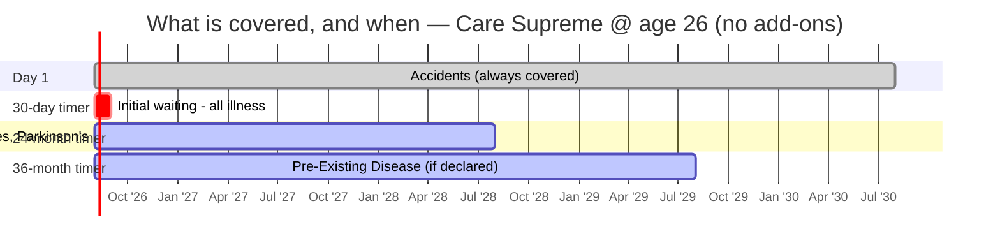

# Module 2 — Exclusions & Waiting Periods

_Source: Care Supreme **policy wording** (UIN **CHIHLIP27061V032627**, v03 2026-27 filing) — Sec 2 (Definitions), **Sec 4.1 Standard Exclusions (Waiting Periods + Permanent)**, **Sec 4.2 Specific Exclusions**, Sec 5 (General Terms), Annexure I (Non-Medical list); current prospectus (Schedule of Benefits, Optional-Benefit grid, Pre-Policy Medical grid). Files in `resources/`._
_Profile studied: **Individual (single adult), age 26, metro tier-1**_
_Studied across SI tiers: **₹10L / ₹25L / ₹50L / ₹1Cr**_

> **Plain-English intro.** Module 1 asked *"what do they pay for?"*. This module asks the harder question: **"what will they NOT pay for, and how long am I paying premiums before each cover actually switches on?"** Three ideas do all the work:
> - **Waiting period** = a timer. You're paying, but that specific thing isn't covered yet.
> - **PED (Pre-Existing Disease)** = anything you already had before buying. Longest timer — and the #1 reason claims get rejected.
> - **Exclusion** = never covered, no timer, ever.
>
> **This is the module where most claim denials are born** — hence 20% of the score.

---

## Claim-lever definitions (extract first)

| Definition | This plan | Why it bites |
|------------|-----------|--------------|
| **Pre-existing disease (lookback)** | **36 months** (def. 2.1.36) — anything *diagnosed*, or for which *advice/treatment was received*, in the 36 months before the policy starts | The window that defines "pre-existing". Industry-standard lookback. **Distinct from the *waiting* period** (also 36 mo here — see below) |
| **Any One Illness (relapse window)** | **Not defined.** Unlimited Automatic Recharge (3.1.4) explicitly serves *"same illness as well as different Illnesses"* | ✅ **Its absence helps.** HDFC Optima's 45-day relapse rule treats a return within 45 days as the *same* claim; Care has no such trap on its refill |
| **Reasonable & Customary charges** | Present (def. 2.1.40) — every base benefit is gated on R&C; reinforced by permanent-exclusion **4.2(25)** (*"not reasonable and customary and/or not medically necessary"*) | Lets insurer trim a bill to "customary" rates — discretionary |
| **Medically Necessary** | Present (def. 2.1.28) — every base benefit gated on it; reinforced by 4.2(25) | Lets insurer reject treatment it deems excessive |

> ⚠️ **Internal wording headroom** *(framework — SBI M2 "wording vs wording")*: def. **2.1.48** permits a Named-Ailment (specific-disease) waiting *"up to **36 months**"*, while operative clause **4.1(a)(ii)** and the Schedule of Benefits set it at **24 months**. Not a live conflict (the exclusion binds), but 12 months of unused headroom a future revision could occupy without a new UIN. Re-check on any future variant.

---

## Waiting periods & restrictions

| Item | Detail | Concern |
|------|--------|---------|
| **Initial (30-day) waiting** | **30 days** for any illness (Excl03). **Exceptions:** ✅ accidents covered day 1; ✅ **does not apply with >12 months continuous coverage** | ⚠️ **Applies afresh to any enhanced Sum Insured** (Excl03 c) |
| **PED waiting** | **36 months** default (Excl01) — the plan's biggest M2 weakness. **Reducible ONLY by paying** for *PED Wait Period Modification* (→ **24 or 12 months**, per schedule) or *Instant Cover* (→ **31st day**, but only Diabetes/HTN/Hyperlipidemia/Asthma, and only if already pre-existing) | ⚠️ **A full year worse than SBI's inbuilt 24 mo.** Level with HDFC/Bajaj (36). **Who can opt the reduction?** It's an ordinary priced optional benefit — **individual-buyable, no channel restriction and no SI-gate found in the wording** (contrast HDFC's channel-only cut and ABHI's SI-gated cut). ⚠️ Excl01(d): cover after 36 mo applies only if the PED was **declared and accepted**. ⚠️ Enhancement restarts the clock (Excl01 b) |
| **Specific-disease (Named Ailment) waiting (list)** | **24 months** (Excl02), **14-category list** (extracted below). Reducible to **12 months** via paid *Named Ailment Wait Period Modification* | Matches HDFC/Bajaj's 24-mo list. ⚠️ Excl02(c): if a listed disease is *also* your PED, **the LONGER timer applies** (→36 mo). ⚠️ Excl02(d): applies **even if you contract it *after* buying**. ⚠️ Enhancement restarts (Excl02 b) |
| **Enhancement-of-SI resets waiting** | ⚠️ **YES — all timers restart on the increase**: 30-day (Excl03 c), specific (Excl02 b), PED (Excl01 b), *and* the moratorium (5.12) — all *"apply afresh to the extent of Sum Insured increase"* | ⚠️ **Material for a 26-yo.** The natural plan — "buy ₹10L now, step up to ₹50L at 35" — **restarts a 36-month PED clock on the new ₹40L**. Argues for **buying the larger SI at entry** (M1: ₹50L is only modestly dearer than ₹10L per-lakh) rather than laddering up later |
| **Co-pay** | ✅ **NONE mandatory. No age trigger. No zone trigger.** Co-pay is a **purely optional** discount lever (3.2.7) — chooseable at 5/10/20/30/50% | ✅ **Excellent and rare** — many plans force co-pay on senior entrants or specific zones; Care does not. ⚠️ *Smart Select* (20%) and *True Connect* (10%) are separate **opt-in** co-pays and are **additive** to any other — don't let the schedule carry them silently (M1 new dimension) |
| **Sub-limits / disease capping** | ✅ **No disease-wise capping on any illness.** The **only** rupee sub-limit that bites this profile is **road ambulance ₹10,000 below ₹15L SI** (full-SI at ₹15L+). Air ambulance ₹5L (paid rider). Bariatric covered up to SI (no separate cap) if BMI criteria met | ✅ **Unusually clean sub-limit sheet** — far fewer rupee caps than SBI. The ₹10k road-ambulance cap bites only the **₹10L** tier of this study |
| **Modern-treatment sub-limits (12 mandated)** | ✅ **NONE — "Advance Technology Methods up to Sum Insured"** (3.1.1 iii): robotic surgery, oral chemo, immunotherapy (monoclonal), deep-brain stimulation, stereotactic radiosurgery, uterine-artery embolisation/HIFU, balloon sinuplasty, intra-vitreal injections, bronchial thermoplasty, green/holmium-laser prostate, IONM, haematopoietic stem-cell | ✅ **Standout.** Industry norm is a **50%-of-SI or flat ₹5L cap**. Care caps **nothing** — at ₹50L a robotic surgery can draw the full ₹50L. **Matches SBI, beats most.** ⚠️ 4.2(22): any *other* advance-tech method **not** on this 12-item list is permanently excluded |
| **Mental-illness coverage (parity?)** | ✅ **In-patient mental illness covered at full SI** (not excluded; def. 2.2.14 Mental Illness). Optional **Mental Health Wellbeing** rider (3.2.16) adds *OPD* counselling for depression/OCD/anxiety/PTSD | ✅ **Parity on hospitalisation** — no separate cap, waiting or co-pay; with room uncapped (M1) a psychiatric admission is treated like any other. ⚠️ **Mental retardation / intellectual disability permanently excluded** (4.2 (8)) — standard |
| **Zone-based co-pay** | ✅ **NONE.** Care is **zone-PRICED** (7 zones — M1/M4) but the wording has **no zone-co-pay clause** | ✅ You are **not** penalised at claim time for being treated in a costlier zone than you bought in. (The *premium* still carries a metro-zone loading — M4.) |
| **Deductible / aggregate deductible** | **Optional only** (3.2.6) — an Aggregate Deductible (₹10k–₹10L) you bear before the insurer pays; does **not** reduce SI | Chosen for a premium discount; not forced. *(Check reversibility at renewal — M6.)* |
| **Permanent exclusions (full list)** | **≈40 items = 15 Standard (4.1 b, Excl04–18) + 25 Specific (4.2)** — see catalogue below | ✅ Mostly the **standard IRDAI catalogue**, but with **several Care-specific additions worth reading** — a broad *lifestyle-attributable* exclusion, RMO/service/night charges, external prosthesis/durable equipment, hormone-replacement therapy (see new dimension + notes) |
| **Underwriting-imposed permanent exclusion on declared conditions** | ⚠️ **No explicit ICD-code carve-out clause** (unlike SBI's B.IX/B.XI). The levers are softer: **Disclosure clause 5.1(b)** — on the facts declared the Company *"may adjust the scope of cover and/or the premium… /reject the claim"* — and **Excl01(d)** (PED covered post-36-mo only if declared *and accepted*). Counter-offer / permanent-exclusion *practice* is **unverified** | ✅ **For this profile the risk is ~nil** — and structurally lower than SBI's, because **no medical tests are required up to age 65 with no PED declared** (below), so there is no test result to hang a carve-out on. **Confirming source:** the proposal form / a live underwriting decision |
| **Non-disclosure consequences** | ⚠️ **Harsh:** *"The Policy shall be **void** and **all premium paid… forfeited**"* on misrepresentation/mis-description/non-disclosure of any **Material Fact** (5.1). **Fraud** (5.6): all benefits forfeited; paid claims clawed back, **jointly & severally**. **Mitigant:** no repudiation if the insured proves the statement was true to best knowledge with no intent to deceive | ⚠️ Standard-harsh, **moderated by the 60-month moratorium** (5.12 — after 5 continuous years nothing is contestable *except proven fraud **and** the policy's permanent exclusions*). **Feeds M6.** Practical rule: **over-disclose at proposal** |

---

## 🩺 Pre-policy medical-test grid — **no cliff** *(framework dimension — SBI M4/M2)*

> **Why this matters (plain English).** Some insurers make you take medical tests before they'll issue a big policy — and a bad result can mean a loading, a permanent carve-out, or rejection. **The question the framework forces: at what age/SI does the test become mandatory?**

| Age | Care Supreme requirement |
|-----|--------------------------|
| **Up to 65 years** | ✅ **No medical tests — at ANY Sum Insured** (₹5L → ₹6Cr), *provided no PED is declared* |
| 66 years and above | Fixed test set (MER, CBC & ESR, HbA1c, cholesterol, ECG, SGPT, creatinine, RUA) |
| Any age, if PED / adverse history declared | Tele-underwriting / specific tests as deemed fit |

> **Finding — Care has NO SI-gated medical-test cliff, and this is the mirror-image of SBI.** SBI Super Health flips a healthy buyer from *zero scrutiny* to *full medicals + 150%-loading exposure* on a **₹5L step from ₹25L to ₹30L**. **Care requires nothing up to age 65 at any SI** — a healthy 26-year-old can buy **₹1Cr with no tests, no loading exposure and no carve-out surface**. Care also **bears the full test cost** (2/3-yr tenure; 50% on 1-yr). ✅ **A genuine, quantifiable advantage for buying a large SI young** — and it removes the "invisible cost of the higher tier" that penalised SBI's ₹30L+ rungs. *(Refinement added to study_plan M4 — credit the *absence* of the cliff, don't just detect its presence.)*

---

## 📋 The specific-disease (Named Ailment) list — the actual conditions *(Excl02 f, extracted verbatim)*

> **Plain English:** named things **not covered for the first 24 months** (→12 mo if you pay for the modifier) — *even if you develop them after buying, and even if you're perfectly healthy today*. Accidents are always exempt.

**The 14 categories:**
1. **Arthritis** (non-infective), **Osteoarthritis & Osteoporosis**, Gout, Rheumatism, **Spinal Disorders**, **Joint Replacement Surgery**, Arthroscopic Knee / ACL / Meniscal & Ligament repair
2. Benign **ENT** disorders & surgeries (Adenoidectomy, Mastoidectomy, Tonsillectomy, Tympanoplasty), **Nasal Septum Deviation**, Sinusitis
3. **Benign Prostatic Hypertrophy**
4. **Cataract**
5. Dilatation & Curettage (D&C)
6. **Fissure / Fistula in anus, Haemorrhoids / Piles, Pilonidal Sinus, Gastric & Duodenal Ulcers**
7. Genito-urinary system surgery (unless malignant)
8. **All types of Hernia & Hydrocele**
9. Hysterectomy for menorrhagia / fibromyoma / uterine prolapse (unless malignant)
10. Internal tumours, skin tumours, cysts, nodules, polyps incl. **breast lumps** (unless malignant)
11. **Kidney / Ureteric / Gall-Bladder Stone, Lithotripsy**
12. Myomectomy for fibroids
13. Varicose veins & varicose ulcers
14. **Parkinson's / Alzheimer's / Dementia**

### ✅ Third-waiting-tier check *(framework dimension — Bajaj M2)* — **Care has NO third tier**

| Procedure | Bajaj Health Guard | **Care Supreme** |
|-----------|:------------------:|:----------------:|
| Joint replacement | **36 months** (separate tier) | ✅ **24 months** (list item 1) → 12 mo if modifier bought |
| Vertebral / spine surgery | **36 months** (separate tier) | ✅ **24 months** (list item 1, "Spinal Disorders") |
| Parkinson's / Alzheimer's | **36 months** (separate tier) | ✅ **24 months** (list item 14) |
| Genetic disorder | **36 months** (separate tier) | Not separately carved → PED rule only |

> **Finding.** Bajaj quarantines joint replacement, spine surgery and Parkinson's in a **separate 36-month tier** *longer* than its 24-month list. **Care folds all of them into the ordinary 24-month list** (reducible to 12). Care's architecture is genuinely **two-tier (30-day + 24-month) + PED 36-month** — no hidden third rung. **Matches SBI's clean structure; beats Bajaj.**

---

## 🕐 The waiting-period timeline (healthy 26-year-old, no PED, default plan)

| Timer | Applies to | Default | With paid modifier |
|-------|-----------|:-------:|:------------------:|
| Day 1 | Accidents; everything not otherwise listed (after 30d) | ✅ | ✅ |
| 30 days | Any illness (waived with >12 mo continuous cover) | 30d | 30d |
| **24 months** | The 14-category specific list above | **24 mo** | **12 mo** (Named-Ailment Modification) |
| **36 months** | PED (declared & accepted only) | **36 mo** | **24 / 12 mo** (PED Modification) *or* **31 days** for 4 conditions (Instant Cover) |

> **For this buyer (healthy, 26, no PED):** only the **30-day initial** and the **24-month specific list** realistically bite. After **two years** the default policy is effectively fully switched on — **slower than SBI's 12-month ramp** unless you pay for the Named-Ailment modifier. The **36-month PED timer only matters if you already have a condition** (irrelevant to a healthy 26-yo today, but note it if buying for a parent).

---

## 🗂️ Permanent-exclusions catalogue — the notable items

Beyond the standard IRDAI list (obesity unless BMI ≥40/≥35+comorbidity, cosmetic, change-of-gender, unproven, sterility/IVF, war, nuclear, self-injury, etc.), **read these Care-specific carve-outs:**

| Clause | Exclusion | Why it matters for this buyer |
|--------|-----------|-------------------------------|
| **4.2 (24)** | ⚠️ **"Any Illness or Injury *attributable to* consumption, use, misuse or abuse of tobacco, intoxicating drugs, alcohol, hallucinogens, smoking"** | **The single most important M2 finding.** This is *far broader* than the standard "addiction treatment" exclusion — it can be read to deny a **smoker's lung disease/cancer or a drinker's liver disease** by attributing the illness to the habit. A discretionary denial lever. **New dimension below** |
| **4.2 (17)** | RMO charges, service charge, surcharge, **night charges** "under whatever head", transport by visiting consultant | Combines with **consumables (Claim Shield) being only a paid rider** (M1) → a real **non-payables gap** unless you buy the rider |
| **4.2 (5)** | External prosthesis, wheelchairs, walkers, **glucometer**, crutches, CPAP for sleep apnea, **oxygen concentrator**, cochlear implant & related surgery | Durable-equipment gap — standard but worth knowing |
| **4.2 (7)** | **External** congenital anomaly (screening/counselling/treatment) | *Internal* congenital disease is **covered** after the specific wait — only *external* is permanently out (standard) |
| **4.2 (23)** | **Hormone replacement therapy** | Permanently excluded |
| **4.1 b (6)** | Hazardous/adventure sports — **only as a *professional*** | ✅ Recreational trekking/scuba/climbing is **fine**; only professional participation is excluded |
| **4.1 b (12)** | Refractive error correction **< 7.5 dioptres** | Standard — LASIK for mild myopia not covered |

---

## 🆕 NEW DIMENSION discovered in this module *(Rule 3)*

### Lifestyle-attributable illness exclusion (the "tobacco / alcohol / smoking-*attributable*" carve-out) *(→ new bullet in study_plan M2; row above)*
The framework's permanent-exclusions bullet lists the usual ~37 items and the *addiction-treatment* exclusion, but never flags the **much broader "attributable-to" construction**. Care 4.2(24) excludes **"any Illness or Injury attributable to… tobacco… alcohol… smoking."** Unlike "treatment *for* alcoholism" (a narrow, treatment-of-the-addiction exclusion already in the standard list), an **"illness *attributable to*"** clause reaches the **downstream disease** — a smoker's COPD/lung cancer, a drinker's cirrhosis/pancreatitis — and hands the insurer a **discretionary attribution-based denial** for some of the costliest, most common conditions. → **New generalisable check: "Does the wording permanently exclude illnesses *attributable to* tobacco/alcohol/smoking (downstream disease), or only *treatment of the addiction* itself? The former is a broad denial lever; extract its exact wording and weight it — especially for anyone who smokes or drinks."**

*(Also added, as a refinement to the existing study_plan M4 medical-test-cliff bullet: **credit the ABSENCE of a cliff as a positive** — Care requires no tests up to age 65 at any SI, the mirror of SBI's ₹30L cliff, so a large SI can be bought young with no loading/carve-out surface.)*

---

## Brochure-vs-wording check *(Rule 2)*

✅ **No live conflict** in the current v03 set. Waiting periods agree across the **binding wording** (Excl01–03), the **prospectus Schedule of Benefits**, and the **Optional-Benefit grid**: PED 36 mo (→24/12 paid), specific 24 mo (→12 paid), initial 30 days. Co-pay is described as **optional** everywhere; modern treatment as **up to SI** everywhere.

⚠️ **Findings (not live conflicts):**
1. **Version drift (carried from M1):** the **old v01 brochure** (still on aggregators) prints **PED 48 months**; the **current v03 wording sets 36**. Our screening's "shortest PED wait (2 yr)" is the **paid-modifier** figure, **not the default** — the honest default is **36 months**, level with HDFC/Bajaj and **a year worse than SBI's inbuilt 24**.
2. **Definition headroom:** named-ailment def. 2.1.48 says *"up to 36 months"* vs the grid's 24 (wording-vs-wording headroom).

> **Carry-forward flags** *(stage2_shortlist.md)*: Care's open flag is **M3** — ICR ≈64.5% + above-average complaints (young book vs stingy culture). **Not an M2 matter**; carried forward intact. **But M2 sharpens the M3 question:** the broad **lifestyle-attributable exclusion (4.2.24)**, the discretionary **R&C / Medically-Necessary** levers and **RMO/consumables** non-payables are exactly the *mechanisms* by which a low-ICR insurer could be trimming payouts. **M3 must test whether Care's low ICR reflects these denial levers being used, or merely a young/cheap book.**

---

## Sources

- [Care Supreme — Policy Wording, UIN CHIHLIP27061V032627 (v03)](resources/policy_wording_care_supreme_CHIHLIP27061V032627.pdf) — *binding; defs 2.1.28/36/40/48, 2.2.14; **Sec 4.1(a) Waiting Periods (Excl01–03)**; **4.1(b) Standard Permanent Exclusions (Excl04–18)**; **4.2 Specific Exclusions (1–25)**; 5.1 disclosure, 5.5 multiple policies, 5.6 fraud, 5.12 moratorium; Annexure I non-medical list*
- [Care Supreme — Prospectus cum Sales Literature (v03)](resources/prospectus_care_supreme_CHIHLIP27061V032627.pdf) — *§7 Pre-Policy Medical Check-up grid; §8 Schedule of Benefits + Optional-Benefit grid (co-pay 5–50%, deductible ₹10k–10L, PED/Named-Ailment modifiers)*
- [Care Supreme — Current Brochure (v03)](resources/brochure_care_supreme_current.pdf) — *waiting-period summary used for the brochure-vs-wording test*
- [Care Supreme — Old v01 wording & brochure (CHIHLIP23128V012223)](resources/policy_wording_v01_CHIHLIP23128V012223_old.pdf) — *evidence for the 48→36-month PED version-drift finding*
- [IRDAI Master Circular on Health Insurance, 29 May 2024](https://irdai.gov.in/) — *regulatory floor: PED wait ≤36 mo, 60-month moratorium, mandated mental-illness & modern-treatment cover*
- Framework: [study_plan.md](../../study_plan.md) · carry-forward flags: [stage2_shortlist.md](../../screening/stage2_shortlist.md)
- Benchmarks referenced: [HDFC Optima Secure+ M2](../hdfc_optima_secure/module2_exclusions.md) · [SBI Super Health M2](../sbi_super_health/module2_exclusions.md) · [Bajaj Health Guard M2](../bajaj_health_guard/module2_exclusions.md)

---

**Module 2 score (1–5): 4.0 / 5**

**Rationale.** A **clean, mostly-standard exclusions sheet with two genuine structural strengths**: **no SI-gated medical-test cliff** (nothing required up to age 65 at any SI, insurer pays the cost — the mirror-image of SBI's ₹30L cliff, and a real reason a healthy 26-year-old can buy a large SI young with no loading or carve-out surface), and **no mandatory / age-triggered / zone co-pay** (co-pay is a purely optional discount lever). Add **uncapped modern treatments**, an **unusually thin rupee-sub-limit sheet** (only the ₹10k road-ambulance cap below ₹15L bites this profile), **in-patient mental-illness parity**, and **no hidden third waiting tier** (joint replacement, spine and Parkinson's sit in the ordinary 24-month list where Bajaj quarantines them for 36).

Held to 4.0, not higher, by three real frictions: **(1) the default PED wait is 36 months** — a full year worse than SBI's inbuilt 24, and reducible to 24/12 **only by paying** for a modifier; **(2) a broad lifestyle-attributable permanent exclusion (4.2.24)** that can deny *downstream* smoking/alcohol illnesses by attribution — a discretionary denial lever a low-ICR insurer bears watching on (feeds M3); and **(3) SI-enhancement restarts every waiting clock and the moratorium** on the increase, so laddering up later is penalised — argue for the larger SI at entry. The specific-disease list is standard and reducible to a best-in-class 12 months, and non-disclosure is the usual void-and-forfeit, moderated by the 60-month moratorium (M6).
