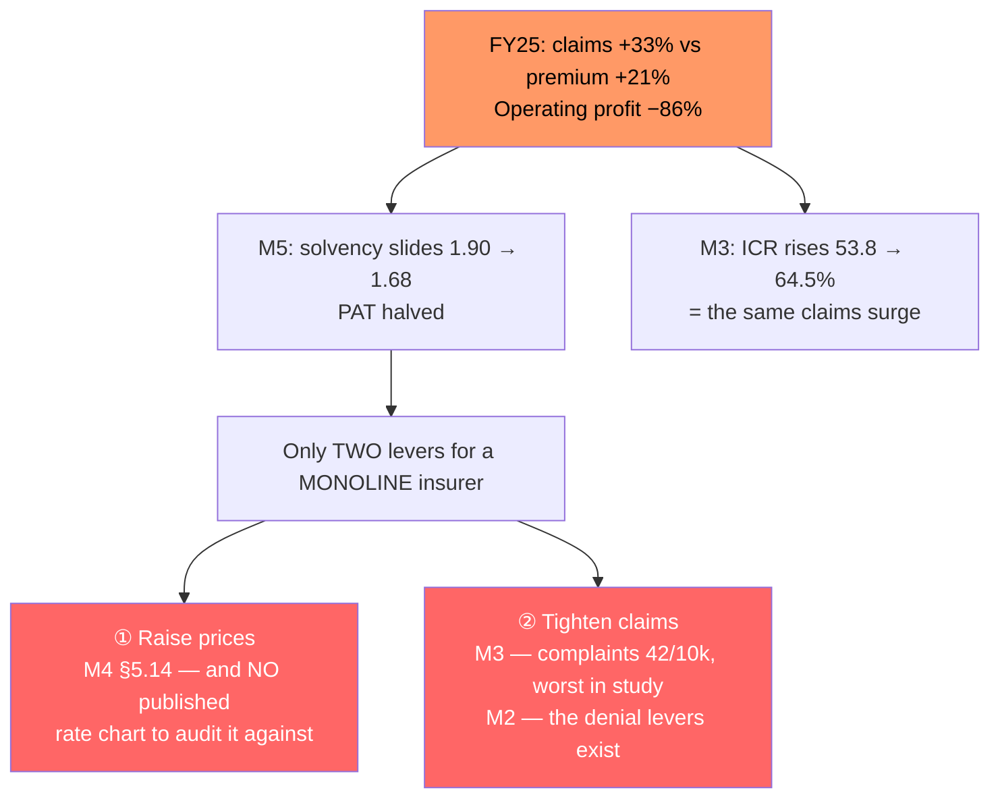

# Module 5 — Insurer Quality

_Source: IRDAI + Care Health financials, CRISIL & India Ratings rating actions, IRDAI enforcement orders, Religare Enterprises disclosures. Wording ref: UIN **CHIHLIP27061V032627**._
_Profile studied: **Individual (single adult), age 26, metro tier-1** — a **40+ year** relationship, so this module asks whether the *company* survives and stays fair, not whether the *product* is good._

> **Plain-English intro.** You are buying a promise that must hold for four decades. Three questions:
> - **Solvency ratio** = the safety buffer. IRDAI demands **at least 1.50** (₹1.50 of assets for every ₹1 of expected liabilities). Higher = safer. **The trend matters more than the level.**
> - **Combined ratio / profitability** = is the insurer making or losing money on insurance? A company under profit pressure has only two ways out — **charge you more, or pay you less**.
> - **Promoter & rating** = who stands behind it, and what do independent agencies think.

---

## The headline table

| Metric | Value |
|--------|-------|
| **Solvency ratio (min 1.5)** | ⚠️ **1.68×** (FY24-25) — clears the regulatory floor, but by only **0.18**. **The thinnest buffer of any finalist studied** (SBI General 2.13× headline / **1.84× core**) |
| **Solvency trend** | 🚩 **DECLINING three years running: 1.90× (2022) → 1.73× (Dec 2023) → 1.68× (FY24-25).** Direction is the wrong way, and the gap to the 1.50 floor has shrunk from 0.40 to **0.18** |
| **Years in business** | **~19 years since incorporation (2007), ~14 years operating (since 2012).** IRDAI Registration No. **148**. Formerly **Religare Health Insurance**; **74.5 lakh+ claims settled** — a mature, high-volume operation (this is what killed the "young book" theory in M3) |
| **Promoter / backing** | ⚠️ **Ownership changed hands in a contested battle.** **Religare Enterprises Ltd (REL) holds 62.8%** of Care Health. **REL itself was taken over by the Burman family (Dabur promoters) in Feb 2025**, concluding an ~18-month contested saga via a **₹2,116 crore open offer** for 26%. In **Feb 2026** REL announced a **scheme of arrangement splitting its financial-services and insurance arms**, with REL retaining Care Health as the group's insurance-focused entity. ✅ The Burmans are an established, deep-pocketed Indian promoter group — and now hold stakes across **all three** insurance segments |
| **Financial strength / rating** | ⚠️ **Mixed, and the weakest of the finalists.** ✅ **India Ratings UPGRADED Care Health to `IND AA-/Stable` on 29 Jan 2026** — crucially, **after** the ownership change. 🚩 But **CRISIL withdrew its `CRISIL A+/Stable` corporate credit rating in April 2024 *at the company's own request***. **`IND AA-` is two notches below the AAA carried by SBI General and Bajaj**, and below Star Health's `IND AA+` |
| **SAHI vs general insurer** | **Pure-play SAHI (standalone health insurer)** — retail health is **~100% of the book**. ✅ **You are the core customer**, not a rounding error: no risk of the product being deprioritised by a distracted multi-line parent. 🚩 **But there is NO other line to cross-subsidise a bad health year** — see the new dimension below |
| **Profitability (RoE / combined ratio)** | 🚩 **Sharply deteriorating in FY25.** GWP **₹6,864cr → ₹8,318cr (+21%)** but **claims incurred ₹3,074cr → ₹4,096cr (+33%)** — claims growing **half again as fast as premium**. **Operating profit collapsed ₹356cr → ₹49cr (−86%)**; **PAT ₹305cr → ₹155cr (−49%)**. Net worth ₹2,018cr (Dec 2023). Market share ~**2.16%** of non-life GDPI. ⚠️ **Combined ratio and RoE not separately published — unverified** *(confirming source: [Care Health public disclosures](https://www.careinsurance.com/public-disclosures.html), FY24-25 Form NL segment reporting)* |
| **Regulatory actions** | 🚩 **IRDAI imposed a ₹1 crore penalty** on Care Health over an **ESOP violation**: the company granted **22.71 million ESOPs**, of which **7.57 million were exercised by Dr Rashmi Saluja** (then non-executive chairperson of parent Religare) on **4 Oct 2023 — *after IRDAI had already rejected* the request to approve the issuance**. IRDAI ordered a **buyback at ₹45.32/share** and cancellation of unvested options, citing breaches of the **Insurance Act 1938** and IRDAI's 2016/2018 guidelines on non-executive director remuneration. ⚖️ **SAT stayed the order (Aug 2024)** — the matter is under appeal |

---

## 📉 The financial trajectory — the single most important chart in this module

```
Care Health Insurance, FY24 → FY25

  Gross Written Premium   ₹6,864 cr ──────────► ₹8,318 cr    +21%   ✅ growing fast
  Claims incurred         ₹3,074 cr ──────────► ₹4,096 cr    +33%   ⚠️ growing FASTER
  Operating profit        ₹  356 cr ──────────► ₹   49 cr    −86%   🚩 near-wipeout
  Profit after tax        ₹  305 cr ──────────► ₹  155 cr    −49%   🚩 halved

  Solvency  1.90× (2022) ──► 1.73× (Dec-23) ──► 1.68× (FY25)
            └──── buffer above the 1.50 floor: 0.40 → 0.23 → 0.18 ────┘
```

> **What this means in plain English.** Care is **selling a lot more insurance but paying out disproportionately more in claims**, and the profit has almost entirely evaporated. This is **the same fact M3 saw from the other side**: the ICR climbing 53.82% → 57.69% → **64.53%** is *exactly* this claims surge. So M3's "rising ICR = a maturing book" reading is **confirmed here — and its cost is now visible.** The book is maturing into **genuine claims inflation that the current pricing does not cover.**
>
> ⚠️ **The consequence for a buyer:** an insurer in this position has to act. **M4's §5.14 repricing power is no longer theoretical — this is the motive**, and Care publishes **no rate chart** against which a future hike could be audited (M4's new dimension). **M3's complaint ratio of 42 per 10,000 claims is the other lever already in visible use.**

---

## 🔗 How the modules connect — one story, three symptoms



> **This is the central M5 finding.** Care's deteriorating underwriting, M3's complaint ratio and M4's unauditable repricing power are **not three separate observations — they are one problem seen from three angles.** A monoline insurer under margin pressure has **nowhere else to go**.

---

## 🆕 NEW DIMENSION discovered in this module *(Rule 3)*

### Monoline vs multi-line **loss-absorption capacity** — how many levers does the insurer have, and do any of them spare the policyholder? *(→ new bullet in study_plan M5)*
The framework's two existing structural tests — **"attribute the combined ratio BY SEGMENT"** and **"retail-health share of the book"** (both SBI M5) — are built for a **multi-line** insurer, and they **quietly break on a pure-play SAHI**. For Care there is no segment attribution to perform (health *is* the company), and the "core customer vs rounding error" trade-off resolves trivially. But collapsing the analysis there **misses the thing that actually matters**:

| | **Multi-line insurer** (SBI General) | **Pure-play SAHI** (Care Health) |
|---|---|---|
| Whose losses are they? | Motor's — **health book was healthy** (87.86% ICR) | **The health book's — there is no elsewhere** |
| Levers to fix a bad health year | ① cross-subsidise from motor/fire/marine · ② reprice · ③ tighten claims | ① reprice · ② tighten claims — **that's all** |
| Who absorbs it? | Can be absorbed **internally** | **Falls on the policyholder, necessarily** |
| Buyer's read | Loss elsewhere = **indirect** threat | Loss in health = **direct** threat |

> **New generalisable check: "Count the insurer's loss-absorption levers. A multi-line insurer under pressure in health has a third exit — cross-subsidy from another line — that a monoline SAHI structurally does not. For a monoline, deteriorating underwriting has only two outlets, *raise prices* or *pay less*, and BOTH land on the policyholder. Weight a deteriorating combined ratio / falling solvency MORE heavily for a monoline than for a multi-line insurer showing the same numbers."** The corollary is that a pure-play SAHI's *positive* — you are the core customer — is real but **cheap**; the absence of a cushion is the expensive half of the trade, and the framework previously scored only the cheap half.

### *(Refinement to the existing Bajaj M5 ownership bullet)*
That bullet asks the right mitigant question — *"was the credit rating reaffirmed **after** the ownership change?"* — and Care **passes** it (IND AA-/Stable upgrade, 29 Jan 2026, post-Burman-takeover). But Care also surfaces a check the bullet misses: **a rating can be *withdrawn*, and at whose request matters.** CRISIL's `A+/Stable` was **withdrawn in April 2024 at Care's own request**, mid-way through the contested takeover — removing an independent monitor precisely when scrutiny was most warranted. → **Add: "Check whether any rating has been withdrawn, when, and at whose request. A company-requested withdrawal removes external monitoring and is a soft negative signal, even where another agency later rates the entity."**

---

## Assessment against the framework's structural tests

| Framework test | Care Health finding |
|----------------|---------------------|
| **Core solvency ex-sub-debt vs the rating trigger** *(SBI M5)* | ⚠️ **Partially unverifiable.** Headline **1.68×**. Whether it is flattered by subordinated debt is **unverified**, as is India Ratings' **negative trigger level** for Care. *Confirming source: the full [India Ratings rating rationale](https://www.indiaratings.co.in/pressrelease/68230) (page would not render for me) and Care's FY24-25 public disclosures.* **Even taken at face value, 1.68× is only 0.18 above the floor and falling** — the concern stands regardless of composition |
| **Combined ratio BY SEGMENT** *(SBI M5)* | **Test collapses — Care is monoline.** 100% of the deterioration sits in the line the buyer is purchasing. **A direct warning, not an indirect one** (contrast SBI, where a 109.6% blended ratio was motor-driven and health was fine) |
| **Retail-health share of the book** *(SBI M5)* | **≈100%.** ✅ Core customer, no withdrawal-by-neglect risk. 🚩 **No cross-subsidy capacity** — see new dimension |
| **Combined-ratio trajectory** *(ABHI M5)* | 🚩 **Deteriorating.** Combined ratio itself unverified, but every underlying is worsening (claims outpacing premium, operating profit −86%, PAT −49%, solvency down 3 yrs). Contrast **ABHI at 114% but improving from 121% = de-risking**; Care is moving the **opposite** way |
| **Ownership / promoter-exit risk** *(Bajaj M5)* | ⚠️ **Major change, well mitigated.** Contested 18-month takeover; new promoter Feb 2025; restructuring Feb 2026. ✅ **Mitigant test PASSED — rating upgraded *after* the change** (IND AA-/Stable, Jan 2026). The Burmans are a credible long-term Indian promoter |
| **Health claims payout ratio vs ICR** *(cross-check)* | **Coherent with M3 and explained here:** CSR 96.74% (by count) beside ICR 64.53% (by rupees). The FY25 claims surge (+33%) is what is *pushing the ICR up* — and simultaneously destroying margin |

---

## Brochure-vs-wording check *(Rule 2)*

✅ **No conflict** — M5 draws on financial and regulatory filings rather than product documents, and nothing in Care's brochure or wording contradicts them.

⚠️ **Two disclosure gaps worth naming:**
1. **Care does not publish a combined ratio or RoE** in an accessible form; both had to be inferred from GWP/claims/PAT movements. *(Confirming source: FY24-25 Form NL public disclosures.)*
2. **The primary rating rationale is not readable** — India Ratings' press-release page did not render, so `IND AA-/Stable` (29 Jan 2026) is confirmed **only via a secondary source**, and the **prior rating and the upgrade's reasoning are unverified**. ⚠️ **Flagged explicitly per the study's METHOD RULE** (SBI M5: *"never quote a rating from a text dump — render or parse the document and read the figure in context"*). **The rating symbol and date should be re-confirmed from India Ratings directly before the final decision.**

> **Carry-forward flags** *(stage2_shortlist.md)*: Care's M3 flag is **already resolved** (ICR defused on peer-segment benchmarking; complaints confirmed). **M5 materially strengthens the second half of that resolution:** the FY25 numbers show *why* claims friction is likely to persist or worsen — **a monoline insurer whose operating profit fell 86% has only pricing and claims-tightening to fix it**. ⚠️ **New item for the decision tree:** Stage 2 scored Care **Stability = 4/5**. On a **declining 1.68× solvency, a −49% PAT, an IRDAI governance penalty and the weakest rating of the finalists, that is not supportable — ~2.5/5 is.** Combined with M3's network correction (4→3), **Care's Stage-2 total falls from 24/30 to ~21.5/30.**

---

## Sources

- [CRISIL Ratings — Care Health Insurance Limited, 29 April 2024](https://www.crisil.com/mnt/winshare/Ratings/RatingList/RatingDocs/CareHealthInsuranceLimited_April%2029_%202024_RR_341926.html) — ***rating WITHDRAWN at the company's request***; prior **`CRISIL A+/Stable`**; **solvency 1.73× (Dec-2023), down from 1.90× (2022)**; net worth ₹2,018 cr vs ₹1,650 cr
- [ScanX — "Care Health Insurance Receives Credit Rating Upgrade to IND AA-/Stable from India Ratings"](https://scanx.trade/stock-market-news/stocks/care-health-insurance-receives-credit-rating-upgrade-to-ind-aa-stable-from-india-ratings/31301208) — ***`IND AA-/Stable`, 29 January 2026*** *(secondary source — prior rating and rationale unverified; see method flag)*
- [India Ratings — Care Health Insurance Limited](https://www.indiaratings.co.in/pressrelease/68230) — ***primary rating rationale; page would not render — the source that would confirm the prior rating, the rationale, any sub-debt and the agency's negative trigger***
- [Moneylife — "IRDAI Slaps ₹1 Crore Penalty on Care Health Insurance, Asks It To Buy Back ESOPs from Religare Chief Rashmi Saluja"](https://www.moneylife.in/article/irdai-slaps-rs1-crore-penalty-on-care-health-insurance-asks-it-to-buy-back-esops-from-religare-chief-rashmi-saluja/74730.html) and [TaxGuru — IRDAI penalty for ESOP violation](https://taxguru.in/corporate-law/irdai-imposes-penalty-care-health-insurance-esop-violation.html) — *22.71M ESOPs granted; 7.57M exercised **after IRDAI's rejection**; buyback at ₹45.32/share; Insurance Act 1938 + 2016/2018 guideline breaches*
- [Business Standard — "SAT stays Irdai order against Religare's Saluja, Care Health in ESOP case"](https://www.business-standard.com/companies/news/sat-stays-irdai-order-against-religare-s-saluja-care-health-in-esop-case-124080901656_1.html) — *the stay; matter under appeal*
- [Business Today — "Burman backed Religare to split financial services and insurance arms"](https://www.businesstoday.in/industry/story/burman-backed-religare-to-split-financial-services-and-insurance-arms-what-changes-for-shareholders-516180-2026-02-15) and [Asia Insurance Post — "With REL ownership, Burmans have now stakes in all 3 segments"](https://asiainsurancepost.com/archives/62858) — *Burman control Feb 2025; ₹2,116 cr open offer; **REL holds 62.8% of Care Health**; Feb 2026 scheme of arrangement*
- [UnlistedZone — "Why Care Health Insurance's profits fell in FY25 despite higher premium collections"](https://unlistedzone.com/why-care-health-insurances-profits-fell-in-fy25-despite-higher-premium-collections) and [Chryseum — Care Health Q4FY25 highlights](https://www.chryseum.in/trending_now/care-health-insurance-limited-q4fy25-highlights/) — *GWP ₹6,864→₹8,318 cr; claims ₹3,074→₹4,096 cr; operating profit ₹356→₹49 cr; PAT ₹305→₹155 cr*
- [Ditto — Care Health Claim Settlement Ratio](https://joinditto.in/articles/health-insurance/care-health-insurance-claim-settlement-ratio/) — ***solvency 1.68×***; CSR 96.74%; complaints 42/10k claims
- [Care Health — Public Disclosures](https://www.careinsurance.com/public-disclosures.html) — ***the confirming source for the unverified combined ratio, RoE and sub-debt composition***
- Framework: [study_plan.md](../../study_plan.md) · carry-forward flags: [stage2_shortlist.md](../../screening/stage2_shortlist.md)
- Benchmarks: [SBI Super Health M5](../sbi_super_health/module5_insurer.md) · [Bajaj Health Guard M5](../bajaj_health_guard/module5_insurer.md) · [HDFC Optima Secure+ M5](../hdfc_optima_secure/module5_insurer.md)

---

**Module 5 score (1–5): 2.5 / 5**

**Rationale.** This is Care's weakest module, and the concerns are structural rather than cosmetic. **Solvency is the thinnest of any finalist and has fallen three years running — 1.90× → 1.73× → 1.68×, leaving just 0.18 above IRDAI's 1.50 floor** — while **FY25 profitability collapsed: claims rose 33% against 21% premium growth, operating profit fell 86% (₹356cr → ₹49cr) and PAT halved.** Because Care is a **pure-play SAHI, none of that can be absorbed elsewhere**: unlike SBI General — whose 109.6% combined ratio was driven by *motor* while its health book stayed healthy — **100% of Care's deterioration sits in exactly the line this buyer is purchasing**, and a monoline insurer under margin pressure has only two exits, **raise prices or pay less**, both of which land on the policyholder. That is not speculation: it is precisely what **M3 already measured** (complaints 42 per 10,000 claims, the study's worst) and what **M4 flagged as unauditable** (§5.14 repricing with no published rate chart). Add an **IRDAI ₹1 crore penalty for granting ESOPs after the regulator had expressly rejected them** — a governance failure of intent, not paperwork — and the **weakest credit rating of the finalists (`IND AA-` versus AAA for SBI General and Bajaj)**, compounded by **CRISIL's `A+` being withdrawn at Care's own request in April 2024**, mid-takeover, removing an independent monitor.

It is not scored lower because the mitigants are real and forward-looking. **Care is growing strongly (GWP +21% to ₹8,318 crore, ~2.16% of non-life GDPI, top-5 SAHI), is 14 years into operations with 74.5 lakh claims settled, and remains above the regulatory solvency floor.** The ownership upheaval — an 18-month contested battle ending in **Burman family control (Feb 2025)** — **passes the framework's key mitigant test: India Ratings *upgraded* Care to `IND AA-/Stable` on 29 January 2026, after the change** — a genuine external vote of confidence, and the ESOP governance failure is plausibly a **legacy of the displaced Religare regime** that the new promoter replaces. As a **pure SAHI the buyer is also the core customer**, with no risk of the product being neglected by a distracted multi-line parent. ⚠️ **Two figures remain unverified and should be closed before the final decision — the combined ratio / sub-debt composition of the 1.68× solvency, and the primary India Ratings rationale (whose page would not render, so the rating is confirmed only via a secondary source).**
