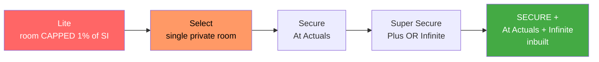
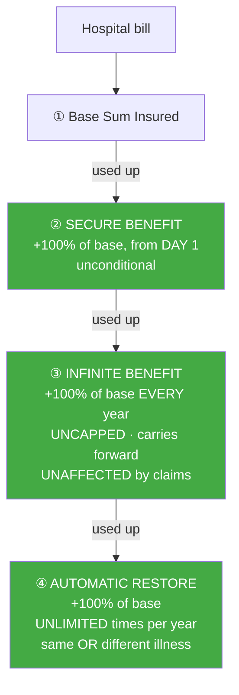

# Module 1 — Coverage & Benefits

_Source: **binding policy wording** `my:Optima Secure` (UIN **HDFHLIP26058V082526**, in `resources/`), Section A (Definitions) & Section B (Benefits); cross-checked against brochure and prospectus. **The wording governs.**_
_Profile studied: **Individual (single adult), age 26, metro tier-1**_
_Studied across SI tiers: **₹10L / ₹25L / ₹50L / ₹1Cr**_
_🔄 **Re-tested January 2026 against the full current framework** — HDFC was studied first, as the benchmark, so ~20 dimensions discovered later (in Bajaj, Aditya Birla, SBI, Care and ACKO) had never been applied to it. They are applied below._

> **Plain-English intro — what "coverage" actually means.**
> Your **Sum Insured (SI)** is the most the insurer will pay in a year. But two policies with the same ₹25L SI can behave completely differently, because four things decide what you really get:
> - **Can you pick any hospital room?** If the policy caps your room rent and you take a nicer room, they cut *the entire bill* — surgeon, tests, ICU — by the same proportion. This is the biggest hidden shrinker of a payout.
> - **Does your cover grow each year?** And does it stop growing if you claim?
> - **Can the SI be refilled** if one illness eats it all?
> - **Are the small "non-payable" items covered** — gloves, syringes, PPE? These run **₹15,000–₹1,00,000 per admission** and most policies quietly refuse them.
>
> **Optima Secure+ in one line:** the study's benchmark — it says *yes* to all four, and it fixes those promises **in the contract** rather than leaving them to your policy schedule.

---

## ⚠️ First — make sure you're buying the right rung

`my:Optima Secure` is **five different plans sold under one name and one UIN**. They are *not* equivalent, and the cheaper ones cap your room rent.

| Variant | Room rent | Cover growth | Verdict |
|---|---|---|---|
| **Lite** | 🚩 **Capped — 1% of SI/day** (ICU 2%) | Cumulative Bonus | Proportionate deduction applies |
| **Select** | 🚩 Single private room only | CB 25% | Capped |
| **Secure** | ✅ At Actuals | + Plus Benefit | Good |
| **Super Secure** | ✅ At Actuals | Plus *or* Infinite | Better |
| **⭐ Secure +** | ✅ **At Actuals** | **Infinite inbuilt (uncapped)** | **The rung studied** |



> 🚩 **Variant-ladder mis-selling check** *(this framework dimension was first discovered here)*: all five rungs share **one name and one UIN**, so the certificate looks near-identical. **Your policy schedule must literally say "Optima Secure +".** A *Lite* policy at the same SI has a **1%-of-SI daily room cap** — at ₹10L that is ₹10,000/day, and exceeding it cuts your whole bill proportionally.

## Variant / configuration
| Item | Detail |
|------|--------|
| Product variant studied | **Optima Secure +** — the top rung of `my:Optima Secure` |
| Variant ladder (same UIN) | Lite → Select → Secure → Super Secure → **Secure +** |
| Product / UIN | **HDFHLIP26058V082526** |
| Wording version in `resources/` | `PolicyWordings_myOptimaSecurePlus-76673175551+(1).pdf` — 69 pp |
| Base sum insured options | **₹10 / 15 / 20 / 25 / 50 / 100 / 200 L** (studied: ₹10L / ₹25L / ₹50L / ₹1Cr) |
| Basis | **Individual** (single adult, age 26) |
| Zone bought | ⚠️ **Zone-priced across 6 "Premium Tiers"** by city — but ✅ **no zone-based co-pay** (see checklist) |

---

## 🔑 Claim-lever definitions — the fine print that decides claims

> **Why read these first.** These are the levers an insurer can pull to reduce or refuse a claim. They matter more than any headline benefit.

| Definition | Optima Secure+ | What it means for you |
|------------|----------------|------------------------|
| **Pre-existing disease (lookback)** | **36 months** (Def. 35) | Anything diagnosed or treated in the 3 years before you buy counts as "pre-existing" |
| **Any One Illness — relapse window** | ⚠️ **45 days** (Def. 2) | If you're re-admitted for the **same illness within 45 days**, it counts as **one claim**, not two. Limits how the restore benefit helps you. *(Care Supreme and SBI have no such rule — a point against HDFC)* |
| **Reasonable & Customary charges** | Present, and used (Excl. C.3.p) | Lets the insurer trim a bill it considers above local market rates — **discretionary** |
| **Medically Necessary** | Present, and used | Lets the insurer refuse treatment it considers excessive — **discretionary** |
| **Proportionate deduction** | ✅ **Not triggered** — room is At Actuals by default | Only bites if you deliberately opt down to a capped variant |

---

## 🛏️ Room economics — the single best feature

> **Plain English.** If a policy limits your daily room rent to, say, ₹5,000 and you take a ₹10,000 room, the insurer pays only **half of everything** — surgeon's fee, operation theatre, tests, medicines. Your ₹8 lakh bill becomes ₹4 lakh. This is why room rent matters more than almost anything else, especially in a metro where rooms are expensive.

| SI tier | Room rent | ICU | Proportionate-deduction risk |
|---------|-----------|-----|------------------------------|
| **₹10L** | ✅ **At Actuals — any room, no cap** | ✅ At Actuals | ✅ **None** |
| **₹25L** | ✅ At Actuals | ✅ At Actuals | ✅ **None** |
| **₹50L** | ✅ At Actuals | ✅ At Actuals | ✅ **None** |
| **₹1Cr** | ✅ At Actuals | ✅ At Actuals | ✅ **None** |

> ✅ **Finding — no room cap at ANY sum insured, including the smallest.** This is the standout, and it passes the **SI-gated room-eligibility check** *(Bajaj M1 dimension)*: **Bajaj restricts you to a single A/C room below ₹10L** and grants "any room" only at ₹10L+. **HDFC has no such threshold** — a ₹10L Secure+ buyer gets the same uncapped room right as a ₹2Cr buyer.
>
> ⚠️ **BUT — the voluntary room-cap modifier DOES exist here** *(SBI/Bajaj M1 dimension — and it catches HDFC too)*. **§2.13 "Modification of Room Rent"** lets you **opt down from At Actuals to a cap of 1% of base sum insured per day** (with a matching ICU modification), in exchange for cheaper premium. At ₹10L that is a **₹10,000/day room cap — and it switches proportionate deduction back on.**
>
> **Do not opt it if uncapped rooms are why you chose this plan, and check your schedule doesn't carry it.** ✅ **Mitigant:** unlike the PED modifier below, this one is **reconfigurable at renewal** (subject to the company's discretion) — it is not a permanent one-way door.
>
> ✅ **HDFC still passes the other two modifier checks:** it sells **no network-gatekeeping co-pay** and **no notification-linked co-pay**. Contrast **Care Supreme** (Smart Select 20% + True Connect 10%) and **ACKO** (four separate levers). Its cost-sharing levers are limited to the **self-opted Aggregate Deductible ("Value Buy")** and this room modifier.

---

## 🧱 How the cover stacks up

> **Plain English.** Think of four buckets, drawn down in order. When the hospital bill arrives, the insurer empties bucket ① first, then ②, and so on.



| Layer | This plan | What it means |
|-------|-----------|---------------|
| **Base SI** | ₹10L / ₹25L / ₹50L / ₹1Cr | Room and ICU **At Actuals** |
| **Instant multiplier** | ✅ **Secure Benefit: +100% of base, available from day 1** | ⭐ **Unconditional** — passes the **condition-gated-multiplier check** *(SBI M1 dimension)*. SBI's 2–3× multiplier only fires for **37 named serious illnesses**, once a year. **HDFC's applies to any claim.** Unused amount doesn't carry forward |
| **Annual bonus** | ✅ **Infinite Benefit: +100% of base every completed year — UNCAPPED, carries forward, accrues *irrespective of claims*** | ⭐ **The best bonus engine in the study.** Year 2 = +1× base, Year 3 = +2× base, with **no ceiling ever**. ✅ Passes the **multiplier hard-cap check** *(ABHI M1)* — it is %-of-base with **no flat-rupee ceiling** (contrast Bajaj's flat ₹5L Recharge cap and ABHI's ₹3Cr cap). ✅ Passes the **bonus-ceiling-inversion check** *(SBI M1)* — the engine **does not change or weaken at higher SI**, unlike SBI, where the ₹1Cr buyer is forced onto a weaker rung |
| **Restoration / recharge** | ✅ **Automatic Restore: +100% of base, UNLIMITED times a year**, triggers instantly on exhaustion, for **same or unrelated** illness | ⭐ Best-in-class alongside Care. **Better than ACKO**, whose restore **excludes the same illness** and never fires on a first claim |
| **Per-claim cap rule** | One claim ≤ **Base + remaining Secure + remaining Infinite** | ⚠️ Restore refills **between** claims, not **within** one — so a single catastrophic claim cannot draw on the refill |
| **Attaches to** | **Base Coverage (B-1) + Protect Benefit (B-2.3) only** | Not to optional covers (e-opinion, global) |

### 📈 What this looks like over time (₹10L base, no claims)

```
  Year 1   Base 10L  + Secure 10L                    = Rs 20L usable
  Year 2   Base 10L  + Secure 10L + Infinite 10L     = Rs 30L
  Year 3   Base 10L  + Secure 10L + Infinite 20L     = Rs 40L
  Year 5   Base 10L  + Secure 10L + Infinite 40L     = Rs 60L
  Year 10  Base 10L  + Secure 10L + Infinite 90L     = Rs 110L
           ...no ceiling, and a claim does NOT reset it
  + Automatic Restore refills Rs 10L, unlimited times, for further claims
```
> **Read:** a modest ₹10L base compounds into very large cover over a 26-year-old's horizon — **and claiming does not slow it down.** This is the single strongest argument for this plan at a young age.

---

## Feature checklist

| Feature | Detail | Notes |
|---------|--------|-------|
| **Room rent** | ✅ **At Actuals (no cap) — every SI tier** | ICU also At Actuals. No SI threshold |
| **Cumulative Bonus ceiling** | ✅ **UNCAPPED** — Infinite Benefit replaces the usual 10%→100% CB | ⭐ Best in study. SBI Platinum caps at 200%; Care and ACKO at 100% |
| **Claim impact on bonus** | ✅ **NONE — accrues irrespective of claims** | ⭐ Matches Care's claim-proof CB; **beats SBI**, whose ECB is eroded by a claim |
| **Pre / post-hospitalisation** | ✅ **60 days pre / 180 days post** | ⭐ The benchmark. Beats SBI (90-day post) and ACKO (120); matches Care |
| **Day-care procedures** | ✅ **All day-care treatments** (no 24-hour rule) | Broad |
| **Domiciliary / home healthcare** | ✅ **Both covered** | Home healthcare is **cashless-only** and needs pre-authorisation |
| **AYUSH** | ⚠️ In-patient, **up to a sub-limit stated in your schedule** | ⚠️ **Weaker than Care and SBI**, which both give **full SI** with no sub-limit. Verify the figure at your chosen SI |
| **Modern treatments** | ✅ Covered (IRDAI-mandated 12) — **no sub-limit found in the wording** | ⚠️ Verify against the current Annexure A at purchase |
| **Day-1 cover for listed chronic conditions** | ❌ **None** — diabetes/hypertension follow the normal waiting rules | ⚠️ **Weaker than Aditya Birla**, which covers named chronic conditions from day 1. *(ABHI M1 dimension)* |
| **Consumables / non-medical (Protect Benefit)** | ✅ **INBUILT** — pays the Non-Medical Expenses in Annexure B with zero deductions | ⭐ **A major real-world advantage.** **Care and ACKO both sell this as a paid rider**; HDFC includes it |
| **Consumables economics** | Closes the **₹15,000–₹1,00,000 per-admission** silent gap | The most under-appreciated benefit in the plan |
| **Wellness / earn-back** | ❌ **None** — HDFC gives premium *discounts* (M4), not activity-based earn-back | ⚠️ **Weaker than Care (up to 30% off renewal) and Aditya Birla (HealthReturns)**. ✅ But see M6: no wallet also means **no lock-in when porting** |
| **Ambulance (road / air)** | Road: within base cover, to nearest hospital · Air: **up to ₹5,00,000** | ⚠️ Air cap is **flat** — it does not scale with SI |
| **Organ-donor cover** | ✅ Covered (in-patient harvesting) | Excludes donor pre/post-hospitalisation and organ transport/preservation |
| **Daily cash / shared room** | **₹800/day, max ₹4,800** | Only for a shared room in a network hospital, stay >48 hrs; not in ICU |
| **Preventive health check-up** | After each policy year: **₹2,000** (₹10L) · ₹4,000 (₹15L) · ₹5,000 (₹20–50L) · **₹8,000** (₹1–2Cr) | ✅ One of the few benefits that **scales with SI** |
| **E-opinion / global cover** | E-opinion once per insured (51 critical illnesses) · **Global Health Cover is OPTIONAL** (B-2.9/2.10), not inbuilt | ⚠️ ACKO includes second opinion as a **basic** benefit; SBI Platinum includes global cover |
| **Maternity / OPD / add-ons** | Maternity via **Parenthood** add-on; OPD via **Optima Wellbeing** add-on | *(Down-weighted.)* Not material for a single 26-year-old today |
| **Zone-based pricing / zone co-pay** *(NEW ROW — SBI M1/M4 dimension)* | ⚠️ **Zone-priced** — clause 1.24 "Premium Tier" sets **premium** by city (Tiers 1–6). ✅ **NO zone-based co-pay** — treatment in a costlier city triggers no penalty | ✅ Brochure's *"No Geography-Based Co-payment"* is **confirmed by the wording**. Less favourable than SBI's fully zone-agnostic pricing, but the **claim-time trap does not exist** |
| **Voluntary room-cap modifier** *(NEW ROW — SBI/Bajaj M1 dimension)* | ⚠️ **PRESENT — §2.13 "Modification of Room Rent":** opt down from At Actuals to **1% of base SI/day** (+ ICU modification) for a cheaper premium | ⚠️ **Re-enables proportionate deduction.** At ₹10L that's a ₹10,000/day cap. ✅ **Reconfigurable at renewal** (company's discretion) — not a permanent lock. **Don't opt it; check your schedule** |
| **Voluntary co-pay / network-gatekeeping modifiers** *(NEW ROW — Care + ACKO dimension)* | ✅ **NONE.** No network-gatekeeping co-pay, no notification-linked co-pay. Other cost-sharing is limited to the self-opted **Aggregate Deductible ("Value Buy")** | ✅ **Cleaner than Care (2 levers) and ACKO (4 levers)** — but **not** the "zero modifiers" position; see the room modifier above |
| **Wording-fixed vs Schedule-delegated limits** *(NEW ROW — ACKO M1 dimension)* | ✅ **Only ~6 schedule delegations in 69 pages** — room rent, ICU, bonus, restore, pre/post days and consumables are all **fixed in the contract** | ⭐ **The strongest contractual guarantee in the study.** **ACKO delegates 37 limits** to a per-policy schedule, so its "no room cap" is a *setting*; **HDFC's is a promise.** You can verify what you bought from the wording alone |
| **Multiplier hard-cap check** *(NEW ROW — ABHI M1 dimension)* | ✅ **Passes** — Secure and Infinite are both **%-of-base with no flat-rupee ceiling** | Contrast Bajaj (flat ₹5L Recharge cap) and ABHI (₹3Cr Super Credit cap) |

---

## 🔬 HDFC re-tested against the ~20 dimensions discovered *after* it was studied

> Because Optima Secure+ was studied **first**, none of these existed at the time. Applying them now is the point of this rewrite.

| Dimension (discovered in) | HDFC result |
|---|:---|
| SI-gated room eligibility *(Bajaj M1)* | ✅ **Pass** — At Actuals at every SI, no threshold |
| Multiplier hard-cap *(ABHI M1)* | ✅ **Pass** — no flat-rupee ceiling |
| Bonus-ceiling inversion across the ladder *(SBI M1)* | ✅ **Pass** — Infinite doesn't weaken at high SI |
| Condition-gated multiplier *(SBI M1)* | ✅ **Pass** — Secure 2× is **unconditional** |
| Voluntary room-cap modifier *(SBI/Bajaj M1)* | ⚠️ **FAIL** — §2.13 sells an opt-in cap (At Actuals → 1% of SI/day) |
| Voluntary co-pay / network-gatekeeping *(Care M1)* | ✅ **Pass** — none sold |
| Notification-linked co-pay *(ACKO M1)* | ✅ **Pass** — none sold |
| Wording-fixed vs Schedule-delegated *(ACKO M1)* | ✅ **Pass, best in study** — ~6 delegations vs ACKO's 37 |
| Day-1 chronic cover *(ABHI M1)* | ❌ **Fail** — no day-1 chronic cover |
| Zone-agnostic pricing *(SBI M1/M4)* | ⚠️ **Partial** — zone-*priced*, but **no zone co-pay** |
| Consumables inbuilt vs rider | ✅ **Pass** — inbuilt (Care and ACKO charge extra) |
| Wellness earn-back *(ABHI M1)* | ❌ **Fail** — none offered |

**Result: 8 clear passes, 1 partial, 3 fails.** The two fails (no day-1 chronic cover, no wellness earn-back) are **peripheral for a healthy 26-year-old**; the passes cover every structural lever that decides a large claim.

---

## Brochure-vs-wording check *(Rule 2)*

✅ **No conflict found.** Every material brochure claim tested — room At Actuals, Secure 2×, Infinite uncapped and claim-proof, unlimited Restore, Protect Benefit inbuilt, 60/180 pre-post, no geography co-payment — is **confirmed in the binding wording**. This is the **cleanest brochure-vs-wording record of any plan in the study**; contrast ACKO (four material discrepancies plus three internal contradictions) and Care (a 48→36-month PED version drift).

⚠️ **Two items to verify on your own schedule, not conflicts:**
1. The **AYUSH sub-limit** is schedule-set — check the figure at your SI.
2. The **variant name must read "Optima Secure +"** — the cheaper rungs carry room caps.

> **Carry-forward flags** *(stage2_shortlist.md)*: HDFC carries **no open flags** — it entered the study as the rank-1 benchmark and nothing in M1 changes that. ⚠️ **But note for the decision tree:** the two genuine coverage gaps below HDFC's 5/5 — **AYUSH sub-limited** where Care and SBI give full SI, and **no wellness earn-back** where Care and ABHI offer up to 30% — are both areas where a *lower-ranked* plan beats the benchmark.

---

## Sources

- [**Binding wording — `my:Optima Secure`, UIN HDFHLIP26058V082526**](resources/PolicyWordings_myOptimaSecurePlus-76673175551+(1).pdf) — *69 pp; **Section A** Def. 2 (Any One Illness, 45-day relapse), Def. 3 (Aggregate Deductible), Def. 17 (Grace Period), Def. 35 (PED); **Section B** B-1 Base Coverage, B-2.3 Protect Benefit, Secure / Infinite / Restore mechanics, B-2.7 Aggregate Deductible, B-2.9/2.10 optional Global cover; §1.24 Premium Tier (zone pricing, no zone co-pay)*
- [Optima Secure+ Brochure](resources/OptimaSecure_PlusBrochure.pdf) — *Schedule of Key Benefits, worked illustrations; used for the brochure-vs-wording test*
- [Optima Secure Prospectus](resources/optima-plus-prospectus.pdf) — *variant ladder, SI options*
- [HDFC ERGO — Optima Secure product page](https://www.hdfcergo.com/health-insurance/optima-secure) — *current SI tiers and variant list*
- Framework: [study_plan.md](../../study_plan.md) · screening: [stage2_shortlist.md](../../screening/stage2_shortlist.md)
- Benchmarks compared: [Care Supreme M1](../care_supreme/module1_coverage.md) · [SBI Super Health M1](../sbi_super_health/module1_coverage.md) · [Bajaj Health Guard M1](../bajaj_health_guard/module1_coverage.md) · [ACKO Platinum M1](../acko_platinum_health/module1_coverage.md)

---

## Module 1 score: **5 / 5** *(unchanged after re-testing)*

**Rationale.** Re-tested against the full current framework — including twelve dimensions that did not exist when it was first studied — **Optima Secure+ passes nine outright and holds its 5/5**. Its coverage architecture is the best in the study on every lever that decides a large claim: **room and ICU At Actuals at every SI tier including ₹10L** (no SI threshold, unlike Bajaj); an **unconditional day-1 2× Secure Benefit** (SBI's multiplier is gated to 37 named illnesses); an **uncapped Infinite Benefit that accrues irrespective of claims and carries forward forever** — the strongest cover-growth engine studied, with no flat-rupee ceiling and no weakening at higher SI; **unlimited Automatic Restore for same or unrelated illness** (ACKO's excludes the same illness); **60/180 pre- and post-hospitalisation**; and — the most under-appreciated feature — **consumables cover inbuilt via the Protect Benefit**, closing the ₹15k–₹1L per-admission gap that **Care and ACKO both charge extra for**.

Two structural advantages emerged only from the later dimensions. **The wording FIXES its limits** — roughly six schedule delegations across 69 pages, against **ACKO's 37** — so "no room cap" here is a **contractual promise, not a configuration setting** you must verify on your own schedule. And it sells **no voluntary co-pay, room-cap or network-gatekeeping modifier at all** — the only cost-sharing lever is a self-opted deductible — where **Care has two such levers and ACKO four**, any of which can silently attach. The real gaps are minor and peripheral for this buyer: **AYUSH is sub-limited** (Care and SBI give full SI), there is **no day-1 chronic cover** (Aditya Birla's advantage), **no wellness earn-back** (Care and ABHI offer up to 30% off renewal), the **45-day Any-One-Illness relapse window** is a trap Care and SBI don't have, and air ambulance (₹5L) and daily cash (₹800/day) are flat caps that don't scale. **None touches the core promise. This remains the benchmark the rest of the study is measured against.**
