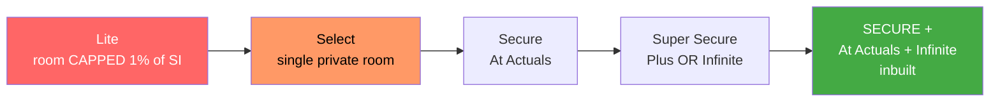
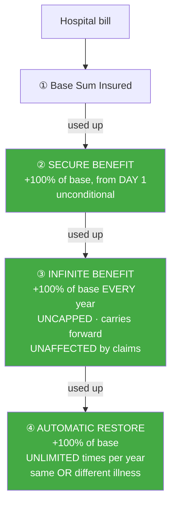

# Module 1 — Coverage & Benefits

_Source: **binding policy wording** `my:Optima Secure` (UIN **HDFHLIP26058V082526**, in `resources/`), Section A (Definitions) & Section B (Benefits); cross-checked against brochure and prospectus. **The wording governs.**_
_Profile studied: **Individual (single adult), age 26, metro tier-1**_
_Studied across SI tiers: **₹10L / ₹25L / ₹50L / ₹1Cr**_
_🔄 **Re-tested January 2026 against the full current framework** — HDFC was studied first, as the benchmark, so ~20 dimensions discovered later (in Bajaj, Aditya Birla, SBI, Care and ACKO) had never been applied to it. They are applied below._

> **Plain-English intro — what "coverage" actually means.**
> Your **Sum Insured (SI)** is the most the insurer will pay in a year. But two policies with the same ₹25L SI can behave completely differently, because four things decide what you really get:
> - **Can you pick any hospital room?** If the policy caps your room rent and you take a nicer room, they cut *the entire bill* — surgeon, tests, ICU — by the same proportion. This is the biggest hidden shrinker of a payout.
> - **Does your cover grow each year?** And does it stop growing if you claim?
> - **Can the SI be refilled** if one illness eats it all?
> - **Are the small "non-payable" items covered** — gloves, syringes, PPE? These run **₹15,000–₹1,00,000 per admission** and most policies quietly refuse them.
>
> **Optima Secure+ in one line:** the study's benchmark — it says *yes* to all four, and it fixes those promises **in the contract** rather than leaving them to your policy schedule.

---

## ⚠️ First — make sure you're buying the right rung

`my:Optima Secure` is **five different plans sold under one name and one UIN**. They are *not* equivalent, and the cheaper ones cap your room rent.

| Variant | Room rent | Cover growth | Verdict |
|---|---|---|---|
| **Lite** | 🚩 **Capped — 1% of SI/day** (ICU 2%) | Cumulative Bonus | Proportionate deduction applies |
| **Select** | 🚩 Single private room only | CB 25% | Capped |
| **Secure** | ✅ At Actuals | + Plus Benefit | Good |
| **Super Secure** | ✅ At Actuals | Plus *or* Infinite | Better |
| **⭐ Secure +** | ✅ **At Actuals** | **Infinite inbuilt (uncapped)** | **The rung studied** |


```mermaid
graph LR
    A["Lite<br/>room CAPPED 1% of SI"] --> B["Select<br/>single private room"]
    B --> C["Secure<br/>At Actuals"]
    C --> D["Super Secure<br/>Plus OR Infinite"]
    D --> E["SECURE +<br/>At Actuals + Infinite<br/>inbuilt"]
    style A fill:#f66,color:#fff
    style B fill:#f96,color:#000
    style E fill:#4a4,color:#fff
```

> 🚩 **Variant-ladder mis-selling check** *(this framework dimension was first discovered here)*: all five rungs share **one name and one UIN**, so the certificate looks near-identical. **Your policy schedule must literally say "Optima Secure +".** A *Lite* policy at the same SI has a **1%-of-SI daily room cap** — at ₹10L that is ₹10,000/day, and exceeding it cuts your whole bill proportionally.

## Variant / configuration
| Item | Detail |
|------|--------|
| Product variant studied | **Optima Secure +** — the top rung of `my:Optima Secure` |
| Variant ladder (same UIN) | Lite → Select → Secure → Super Secure → **Secure +** |
| Product / UIN | **HDFHLIP26058V082526** |
| Wording version in `resources/` | `PolicyWordings_myOptimaSecurePlus-76673175551+(1).pdf` — 69 pp |
| Base sum insured options | **₹10 / 15 / 20 / 25 / 50 / 100 / 200 L** (studied: ₹10L / ₹25L / ₹50L / ₹1Cr) |
| Basis | **Individual** (single adult, age 26) |
| Zone bought | ⚠️ **Zone-priced across 6 "Premium Tiers"** by city — but ✅ **no zone-based co-pay** (see checklist) |

---

## 🔑 Claim-lever definitions — the fine print that decides claims

> **Why read these first.** These are the levers an insurer can pull to reduce or refuse a claim. They matter more than any headline benefit.

| Definition | Optima Secure+ | What it means for you |
|------------|----------------|------------------------|
| **Pre-existing disease (lookback)** | **36 months** (Def. 35) | Anything diagnosed or treated in the 3 years before you buy counts as "pre-existing" |
| **Any One Illness — relapse window** | ⚠️ **45 days** (Def. 2) | If you're re-admitted for the **same illness within 45 days**, it counts as **one claim**, not two. Limits how the restore benefit helps you. *(Care Supreme and SBI have no such rule — a point against HDFC)* |
| **Reasonable & Customary charges** | Present, and used (Excl. C.3.p) | Lets the insurer trim a bill it considers above local market rates — **discretionary** |
| **Medically Necessary** | Present, and used | Lets the insurer refuse treatment it considers excessive — **discretionary** |
| **Proportionate deduction** | ✅ **Not triggered** — room is At Actuals by default | Only bites if you deliberately opt down to a capped variant |

---

## 🛏️ Room economics — the single best feature

> **Plain English.** If a policy limits your daily room rent to, say, ₹5,000 and you take a ₹10,000 room, the insurer pays only **half of everything** — surgeon's fee, operation theatre, tests, medicines. Your ₹8 lakh bill becomes ₹4 lakh. This is why room rent matters more than almost anything else, especially in a metro where rooms are expensive.

| SI tier | Room rent | ICU | Proportionate-deduction risk |
|---------|-----------|-----|------------------------------|
| **₹10L** | ✅ **At Actuals — any room, no cap** | ✅ At Actuals | ✅ **None** |
| **₹25L** | ✅ At Actuals | ✅ At Actuals | ✅ **None** |
| **₹50L** | ✅ At Actuals | ✅ At Actuals | ✅ **None** |
| **₹1Cr** | ✅ At Actuals | ✅ At Actuals | ✅ **None** |

> ✅ **Finding — no room cap at ANY sum insured, including the smallest.** This is the standout, and it passes the **SI-gated room-eligibility check** *(Bajaj M1 dimension)*: **Bajaj restricts you to a single A/C room below ₹10L** and grants "any room" only at ₹10L+. **HDFC has no such threshold** — a ₹10L Secure+ buyer gets the same uncapped room right as a ₹2Cr buyer.
>
> ⚠️ **BUT — the voluntary room-cap modifier DOES exist here** *(SBI/Bajaj M1 dimension — and it catches HDFC too)*. **§2.13 "Modification of Room Rent"** lets you **opt down from At Actuals to a cap of 1% of base sum insured per day** (with a matching ICU modification), in exchange for cheaper premium. At ₹10L that is a **₹10,000/day room cap — and it switches proportionate deduction back on.**
>
> **Do not opt it if uncapped rooms are why you chose this plan, and check your schedule doesn't carry it.** ✅ **Mitigant:** unlike the PED modifier below, this one is **reconfigurable at renewal** (subject to the company's discretion) — it is not a permanent one-way door.
>
> ✅ **HDFC still passes the other two modifier checks:** it sells **no network-gatekeeping co-pay** and **no notification-linked co-pay**. Contrast **Care Supreme** (Smart Select 20% + True Connect 10%) and **ACKO** (four separate levers). Its cost-sharing levers are limited to the **self-opted Aggregate Deductible ("Value Buy")** and this room modifier.

---

## 🧱 How the cover stacks up

> **Plain English.** Think of four buckets, drawn down in order. When the hospital bill arrives, the insurer empties bucket ① first, then ②, and so on.


```mermaid
graph TD
    S["Hospital bill"] --> B1["① Base Sum Insured"]
    B1 -->|used up| B2["② SECURE BENEFIT<br/>+100% of base, from DAY 1<br/>unconditional"]
    B2 -->|used up| B3["③ INFINITE BENEFIT<br/>+100% of base EVERY year<br/>UNCAPPED · carries forward<br/>UNAFFECTED by claims"]
    B3 -->|used up| B4["④ AUTOMATIC RESTORE<br/>+100% of base<br/>UNLIMITED times per year<br/>same OR different illness"]
    style B2 fill:#4a4,color:#fff
    style B3 fill:#4a4,color:#fff
    style B4 fill:#4a4,color:#fff
```

| Layer | This plan | What it means |
|-------|-----------|---------------|
| **Base SI** | ₹10L / ₹25L / ₹50L / ₹1Cr | Room and ICU **At Actuals** |
| **Instant multiplier** | ✅ **Secure Benefit: +100% of base, available from day 1** | ⭐ **Unconditional** — passes the **condition-gated-multiplier check** *(SBI M1 dimension)*. SBI's 2–3× multiplier only fires for **37 named serious illnesses**, once a year. **HDFC's applies to any claim.** Unused amount doesn't carry forward |
| **Annual bonus** | ✅ **Infinite Benefit: +100% of base every completed year — UNCAPPED, carries forward, accrues *irrespective of claims*** | ⭐ **The best bonus engine in the study.** Year 2 = +1× base, Year 3 = +2× base, with **no ceiling ever**. ✅ Passes the **multiplier hard-cap check** *(ABHI M1)* — it is %-of-base with **no flat-rupee ceiling** (contrast Bajaj's flat ₹5L Recharge cap and ABHI's ₹3Cr cap). ✅ Passes the **bonus-ceiling-inversion check** *(SBI M1)* — the engine **does not change or weaken at higher SI**, unlike SBI, where the ₹1Cr buyer is forced onto a weaker rung |
| **Restoration / recharge** | ✅ **Automatic Restore: +100% of base, UNLIMITED times a year**, triggers instantly on exhaustion, for **same or unrelated** illness | ⭐ Best-in-class alongside Care. **Better than ACKO**, whose restore **excludes the same illness** and never fires on a first claim |
| **Per-claim cap rule** | One claim ≤ **Base + remaining Secure + remaining Infinite** | ⚠️ Restore refills **between** claims, not **within** one — so a single catastrophic claim cannot draw on the refill |
| **Attaches to** | **Base Coverage (B-1) + Protect Benefit (B-2.3) only** | Not to optional covers (e-opinion, global) |

### 📈 What this looks like over time (₹10L base, no claims)

```
  Year 1   Base 10L  + Secure 10L                    = Rs 20L usable
  Year 2   Base 10L  + Secure 10L + Infinite 10L     = Rs 30L
  Year 3   Base 10L  + Secure 10L + Infinite 20L     = Rs 40L
  Year 5   Base 10L  + Secure 10L + Infinite 40L     = Rs 60L
  Year 10  Base 10L  + Secure 10L + Infinite 90L     = Rs 110L
           ...no ceiling, and a claim does NOT reset it
  + Automatic Restore refills Rs 10L, unlimited times, for further claims
```
> **Read:** a modest ₹10L base compounds into very large cover over a 26-year-old's horizon — **and claiming does not slow it down.** This is the single strongest argument for this plan at a young age.

---

## Feature checklist — what's IN, what's OUT, and what it saves you

> **How to read each block:** ✅ = what the feature covers · ❌ = what it specifically does **not** cover (the named traps) · 💰 = a worked rupee example of the saving. Examples use realistic Bengaluru-metro costs and are **illustrative** — your actual bill varies, but the *mechanism* is exact.

### 🛏️ Room rent & ICU — **At Actuals (no cap), every SI tier**
- ✅ **Included:** any room category you choose (private, deluxe, suite), at its actual daily cost. ICU/ICCU also at actuals. Applies at **every** SI from ₹10L to ₹2Cr — no threshold.
- ❌ **Excluded:** nothing on room *cost* by default. ⚠️ Only if you **opt in to the §2.13 room-cap modifier** does a 1%-of-SI/day cap (and proportionate deduction) switch on — don't. "Suite/luxury" tiers above the highest single-private category can still be questioned as not R&C.
- 💰 **Saving example:** ₹6L surgery, you take a ₹18,000/day room. On a plan capped at ₹5,000/day, the insurer scales the **whole bill by 5,000/18,000 = 28%** → pays ₹1.68L, **you lose ₹4.32L.** On HDFC at actuals → **insurer pays the full ₹6L, you lose ₹0. Saving: ₹4.32L.**

### 📈 Cumulative Bonus — **UNCAPPED (Infinite Benefit), claim-proof**
- ✅ **Included:** +100% of base SI added **every** completed year, **no ceiling**, carried forward, **unaffected by claims**.
- ❌ **Excluded:** the bonus is calculated on **base SI only** (not the Secure-doubled figure); it attaches to hospitalisation + Protect Benefit, **not** to the fixed sub-limits (air ambulance, daily cash).
- 💰 **Saving example:** ₹1Cr base, year 6, a ₹1.4Cr cancer treatment. Base ₹1Cr + Secure ₹1Cr + 5 yrs bonus ₹5Cr = far more than enough → **fully paid.** On an ordinary "+10%/yr capped at 100%" plan, a ₹1Cr policy caps at ₹2Cr total — still fine here, but on a **₹25L** base the ordinary plan tops out at ₹50L → **you'd lose ₹90L.** The uncapped bonus is what lets a modest base grow into catastrophe-proof cover.

### 🩺 Pre / post-hospitalisation — **60 days before / 180 days after**
- ✅ **Included:** doctor consults, diagnostics, scans, medicines **for the same illness** — 60 days before admission and **180 days after** discharge. Paid from your main SI.
- ❌ **Excluded:** costs for an **unrelated** illness; anything beyond the 60/180 windows; routine/OPD care not linked to the admission.
- 💰 **Saving example:** knee surgery. Pre: ₹18,000 (MRI, consults). Post: ₹55,000 over 5 months (physiotherapy, follow-ups, medicines). **HDFC pays all ₹73,000.** A plan with 90-day post-cover (SBI) would cut off physiotherapy in month 4 → **~₹20,000 lost.**

### 🏥 Day-care procedures — **all of them, no 24-hour rule**
- ✅ **Included:** any procedure needing <24 hrs in a hospital/day-care centre — **cataract, dialysis, chemotherapy, radiotherapy, angiography, lithotripsy, endoscopy**, etc. No "approved list" restriction.
- ❌ **Excluded:** **OPD consultations** (just seeing a doctor, no procedure) — needs the separate Optima Wellbeing rider.
- 💰 **Saving example:** a year of dialysis (~₹4L) or a cataract surgery (~₹60,000) done as same-day procedures → **fully covered.** A plan that only covers a *named list* and omits your specific procedure would pay **₹0** for it.

### 🏠 Domiciliary & home healthcare — **both covered**
- ✅ **Included:** hospital-level treatment at home when you can't be moved / no bed available (domiciliary); insurer-arranged nursing/IV care at home (home healthcare).
- ❌ **Excluded:** **home healthcare is cashless-only + needs pre-authorisation** — arrange it *before* starting or it may not be paid. Domiciliary needs a doctor to certify it genuinely required hospital-level care.
- 💰 **Saving example:** 10 days of at-home treatment for an immobile patient (nurse, drips, monitoring) ~₹90,000 → **covered**, where Bajaj (covers neither) pays **₹0.** *(Low relevance for you at 26; matters if you add a parent later.)*

### 🌿 AYUSH — **in-patient, but sub-limited** ⚠️
- ✅ **Included:** in-patient treatment at a **registered** Ayurveda/Yoga-Naturopathy/Unani/Siddha/Homeopathy hospital, for a covered illness — up to a **schedule sub-limit.**
- ❌ **Excluded:** **spas, wellness retreats, yoga/detox holidays, OPD/outpatient AYUSH.** And crucially, cost **above the sub-limit** (unlike Care/SBI, which give full SI).
- 💰 **Saving example:** a ₹1.5L Ayurvedic in-patient course. If your schedule sub-limit is, say, ₹50,000 → HDFC pays **₹50,000, you lose ₹1L.** Care/SBI (full SI) would pay all ₹1.5L. **This is HDFC's one real coverage gap — but only bites if you specifically choose AYUSH hospitalisation.** *Verify your sub-limit.*

### 🤖 Modern treatments — **all 12, up to full SI (no sub-limit)**
- ✅ **Included, named:** robotic surgery · oral chemotherapy · immunotherapy (monoclonal antibodies) · deep-brain stimulation · stereotactic radiosurgery · stem-cell (bone-marrow) therapy · bronchial thermoplasty · uterine-artery embolisation/HIFU · balloon sinuplasty · intra-vitreal injections · IONM · green/holmium-laser prostate. **Covered up to your full SI.**
- ❌ **Excluded:** experimental/unproven procedures **outside** these 12; treatments not yet IRDAI-recognised. ⚠️ *Verify no cap crept into the current Annexure A.*
- 💰 **Saving example:** ₹12L robotic cancer surgery. On the industry-norm **₹5L (or 50%-of-SI) cap**, insurer pays ₹5L → **you lose ₹7L.** On HDFC (no cap) → **full ₹12L paid. Saving: ₹7L.**

### 🩹 Day-1 cover for chronic conditions — **NONE** ❌
- ✅ **Included:** nothing special — diabetes/hypertension/asthma follow the normal PED/waiting rules.
- ❌ **Excluded from day 1:** any chronic condition you already have waits out the PED period.
- 💰 **Saving example:** irrelevant unless you *already* have such a condition. If you did, Aditya Birla's day-1 cover would pay a ₹2L diabetes-complication claim in year 1 where HDFC pays **₹0** until the PED wait clears. **For a healthy 26-yo → non-issue.**

### 🧤 Consumables / non-medical — **INBUILT (Protect Benefit)** ⭐
- ✅ **Included:** the ~non-payable items on **Annexure B** — gloves, syringes, masks, **PPE kits, gowns, cotton, catheters, admission kits** — paid with **zero deduction**, from your main SI.
- ❌ **Excluded:** genuinely personal items (TV, food for visitors); items already excluded as non-medical *outside* the Annexure-B list.
- 💰 **Saving example:** ₹5L surgery, ₹55,000 of it consumables. HDFC pays the ₹55,000 → **out-of-pocket ₹0.** On Care/ACKO (consumables = **paid rider you didn't buy**) → **you lose ₹55,000. Hits EVERY claim you ever make** (typically 10–20% of each bill).

### 🎁 Wellness / earn-back — **NONE** ⚠️
- ✅ **Included:** ordinary premium discounts only (lifetime, long-term, family — see M4).
- ❌ **Excluded:** no activity/step-based cash-back.
- 💰 **Saving example:** Aditya Birla's HealthReturns can return up to 100% of premium for staying active — on a ₹30,000 premium that's up to ₹30,000/yr back. **HDFC returns ₹0 this way.** ⚠️ But since **cost is no concern for you**, this saving is worth little — and HDFC's no-wallet means **no lock-in** (M6).

### 🚑 Ambulance — road (to SI) + air (**flat ₹5L**)
- ✅ **Included:** road ambulance to the nearest hospital (tied to an admitted claim); **air ambulance inbuilt up to ₹5,00,000.**
- ❌ **Excluded:** air-ambulance cost **above ₹5L**; the ₹5L cap is **flat — never grows** with your SI. Non-emergency transport.
- 💰 **Saving example:** an air lift from near Gaya to a Patna/Bengaluru specialist ~₹4L → **covered.** A ₹7L long-distance lift → HDFC pays ₹5L, **you lose ₹2L.** Most domestic lifts fit under ₹5L. *(Relevant to your Bihar geography; rare.)*

### 🫀 Organ-donor cover — **in-patient harvesting covered**
- ✅ **Included:** the **donor's in-patient hospitalisation** costs for harvesting the organ, when you're the recipient of a covered transplant.
- ❌ **Excluded (named):** donor's **pre- and post-hospitalisation**, donor **screening** costs, **organ acquisition** cost, and **transport/preservation** of the organ.
- 💰 **Saving example:** kidney transplant — donor's surgical hospitalisation ~₹3L → **covered.** But the ~₹50,000 of donor work-up/screening and organ transport → **your cost** (excluded). Net saving ~₹3L, with a ~₹50k residual gap.

### 🛌 Daily cash (shared room) — **₹800/day, max ₹4,800**
- ✅ **Included:** ₹800 cash **per day** if you stay in a **shared room** at a **network** hospital for **more than 48 hours.**
- ❌ **Excluded:** **ICU days**; **private-room** stays (you forfeit it by taking a private room); non-network hospitals. Flat cap ₹4,800 (~6 days).
- 💰 **Saving example:** 5-day shared-ward stay → ₹4,000 cash. ⚠️ **But you'd only get this by *not* using the plan's no-room-cap strength** — so in practice near-zero for you. **A rounding error, not a factor.**

### 🩻 Preventive health check-up — **scales with SI (₹8,000 at ₹1Cr)**
- ✅ **Included:** a free annual check-up after each policy year — **₹2,000 (₹10L) · ₹5,000 (₹20–50L) · ₹8,000 (₹1Cr+)**. Does **not** reduce your SI.
- ❌ **Excluded:** available typically **from the first renewal** (not week 1); tests beyond the covered panel.
- 💰 **Saving example:** ~₹8,000/year of free screening at ₹1Cr SI = **~₹8,000 saved annually** — and the real value is catching rising sugar/cholesterol early, while insured and past waiting periods. **Use it every year.**

### 🌍 E-opinion (inbuilt) / Global cover (**optional**)
- ✅ **Included:** one **e-opinion per insured/year** for **51 critical illnesses** (inbuilt).
- ❌ **Excluded:** **overseas treatment is NOT inbuilt** — base policy settles claims **in India only**; global cover needs the **optional B-2.9/2.10 add-on.**
- 💰 **Saving example:** e-opinion on a cancer diagnosis = free expert review (avoids a possibly unnecessary ₹8L surgery). Global cover: a ₹40L overseas cancer treatment is **₹0 covered unless you bought the add-on.** *(Only matters if you want the overseas option.)*

### 👶 Maternity / OPD — **add-ons only**
- ✅ **Included:** nothing inbuilt.
- ❌ **Excluded:** **maternity** (needs the **Parenthood** add-on); **OPD** consultations/pharmacy (needs **Optima Wellbeing** add-on).
- 💰 **Saving example:** a ₹1.2L delivery is **₹0 covered** without the Parenthood add-on. *(Down-weighted for a single 26-yo now; note it if you plan a family in ~4 years — maternity add-ons carry their own 2–4 yr waits, so add early.)*

---

### 📋 Analytical dimensions *(not benefits — structural checks from the re-test)*

| Dimension | HDFC result |
|-----------|-------------|
| **Zone-based pricing / zone co-pay** *(SBI M1/M4)* | ⚠️ Zone-**priced** (6 tiers; Bengaluru mid-band) · ✅ **NO zone co-pay** — no claim-time penalty for being treated in a costlier city (matters for your Bengaluru/Patna/Gaya travel) |
| **Voluntary room-cap modifier** *(SBI/Bajaj M1)* | ⚠️ **Exists (§2.13)** — opt-down to 1%-of-SI/day for cheaper premium; re-enables proportionate deduction. **Don't opt it; reconfigurable at renewal** |
| **Voluntary co-pay / network-gatekeeping** *(Care + ACKO)* | ✅ **None** of the network/notification co-pay type (Care has 2, ACKO 4). Only a self-opted deductible |
| **Wording-fixed vs Schedule-delegated limits** *(ACKO M1)* | ⭐ **~6 delegations in 69 pp** — limits are **fixed in the contract** (ACKO delegates 37). "No room cap" is a promise, not a setting |
| **Multiplier hard-cap check** *(ABHI M1)* | ✅ **Passes** — Secure & Infinite are %-of-base, **no flat-rupee ceiling** (Bajaj caps Recharge at ₹5L; ABHI caps Super Credit at ₹3Cr) |

---

## 🔬 HDFC re-tested against the ~20 dimensions discovered *after* it was studied

> Because Optima Secure+ was studied **first**, none of these existed at the time. Applying them now is the point of this rewrite.

| Dimension (discovered in) | HDFC result |
|---|:---|
| SI-gated room eligibility *(Bajaj M1)* | ✅ **Pass** — At Actuals at every SI, no threshold |
| Multiplier hard-cap *(ABHI M1)* | ✅ **Pass** — no flat-rupee ceiling |
| Bonus-ceiling inversion across the ladder *(SBI M1)* | ✅ **Pass** — Infinite doesn't weaken at high SI |
| Condition-gated multiplier *(SBI M1)* | ✅ **Pass** — Secure 2× is **unconditional** |
| Voluntary room-cap modifier *(SBI/Bajaj M1)* | ⚠️ **FAIL** — §2.13 sells an opt-in cap (At Actuals → 1% of SI/day) |
| Voluntary co-pay / network-gatekeeping *(Care M1)* | ✅ **Pass** — none sold |
| Notification-linked co-pay *(ACKO M1)* | ✅ **Pass** — none sold |
| Wording-fixed vs Schedule-delegated *(ACKO M1)* | ✅ **Pass, best in study** — ~6 delegations vs ACKO's 37 |
| Day-1 chronic cover *(ABHI M1)* | ❌ **Fail** — no day-1 chronic cover |
| Zone-agnostic pricing *(SBI M1/M4)* | ⚠️ **Partial** — zone-*priced*, but **no zone co-pay** |
| Consumables inbuilt vs rider | ✅ **Pass** — inbuilt (Care and ACKO charge extra) |
| Wellness earn-back *(ABHI M1)* | ❌ **Fail** — none offered |

**Result: 8 clear passes, 1 partial, 3 fails.** The two fails (no day-1 chronic cover, no wellness earn-back) are **peripheral for a healthy 26-year-old**; the passes cover every structural lever that decides a large claim.

---

## Brochure-vs-wording check *(Rule 2)*

✅ **No conflict found.** Every material brochure claim tested — room At Actuals, Secure 2×, Infinite uncapped and claim-proof, unlimited Restore, Protect Benefit inbuilt, 60/180 pre-post, no geography co-payment — is **confirmed in the binding wording**. This is the **cleanest brochure-vs-wording record of any plan in the study**; contrast ACKO (four material discrepancies plus three internal contradictions) and Care (a 48→36-month PED version drift).

⚠️ **Two items to verify on your own schedule, not conflicts:**
1. The **AYUSH sub-limit** is schedule-set — check the figure at your SI.
2. The **variant name must read "Optima Secure +"** — the cheaper rungs carry room caps.

> **Carry-forward flags** *(stage2_shortlist.md)*: HDFC carries **no open flags** — it entered the study as the rank-1 benchmark and nothing in M1 changes that. ⚠️ **But note for the decision tree:** the two genuine coverage gaps below HDFC's 5/5 — **AYUSH sub-limited** where Care and SBI give full SI, and **no wellness earn-back** where Care and ABHI offer up to 30% — are both areas where a *lower-ranked* plan beats the benchmark.

---

## Sources

- [**Binding wording — `my:Optima Secure`, UIN HDFHLIP26058V082526**](resources/PolicyWordings_myOptimaSecurePlus-76673175551+(1).pdf) — *69 pp; **Section A** Def. 2 (Any One Illness, 45-day relapse), Def. 3 (Aggregate Deductible), Def. 17 (Grace Period), Def. 35 (PED); **Section B** B-1 Base Coverage, B-2.3 Protect Benefit, Secure / Infinite / Restore mechanics, B-2.7 Aggregate Deductible, B-2.9/2.10 optional Global cover; §1.24 Premium Tier (zone pricing, no zone co-pay)*
- [Optima Secure+ Brochure](resources/OptimaSecure_PlusBrochure.pdf) — *Schedule of Key Benefits, worked illustrations; used for the brochure-vs-wording test*
- [Optima Secure Prospectus](resources/optima-plus-prospectus.pdf) — *variant ladder, SI options*
- [HDFC ERGO — Optima Secure product page](https://www.hdfcergo.com/health-insurance/optima-secure) — *current SI tiers and variant list*
- Framework: [study_plan.md](../../study_plan.md) · screening: [stage2_shortlist.md](../../screening/stage2_shortlist.md)
- Benchmarks compared: [Care Supreme M1](../care_supreme/module1_coverage.md) · [SBI Super Health M1](../sbi_super_health/module1_coverage.md) · [Bajaj Health Guard M1](../bajaj_health_guard/module1_coverage.md) · [ACKO Platinum M1](../acko_platinum_health/module1_coverage.md)

---

## Module 1 score: **5 / 5** *(unchanged after re-testing)*

**Rationale.** Re-tested against the full current framework — including twelve dimensions that did not exist when it was first studied — **Optima Secure+ passes nine outright and holds its 5/5**. Its coverage architecture is the best in the study on every lever that decides a large claim: **room and ICU At Actuals at every SI tier including ₹10L** (no SI threshold, unlike Bajaj); an **unconditional day-1 2× Secure Benefit** (SBI's multiplier is gated to 37 named illnesses); an **uncapped Infinite Benefit that accrues irrespective of claims and carries forward forever** — the strongest cover-growth engine studied, with no flat-rupee ceiling and no weakening at higher SI; **unlimited Automatic Restore for same or unrelated illness** (ACKO's excludes the same illness); **60/180 pre- and post-hospitalisation**; and — the most under-appreciated feature — **consumables cover inbuilt via the Protect Benefit**, closing the ₹15k–₹1L per-admission gap that **Care and ACKO both charge extra for**.

Two structural advantages emerged only from the later dimensions. **The wording FIXES its limits** — roughly six schedule delegations across 69 pages, against **ACKO's 37** — so "no room cap" here is a **contractual promise, not a configuration setting** you must verify on your own schedule. And it sells **no voluntary co-pay, room-cap or network-gatekeeping modifier at all** — the only cost-sharing lever is a self-opted deductible — where **Care has two such levers and ACKO four**, any of which can silently attach. The real gaps are minor and peripheral for this buyer: **AYUSH is sub-limited** (Care and SBI give full SI), there is **no day-1 chronic cover** (Aditya Birla's advantage), **no wellness earn-back** (Care and ABHI offer up to 30% off renewal), the **45-day Any-One-Illness relapse window** is a trap Care and SBI don't have, and air ambulance (₹5L) and daily cash (₹800/day) are flat caps that don't scale. **None touches the core promise. This remains the benchmark the rest of the study is measured against.**
