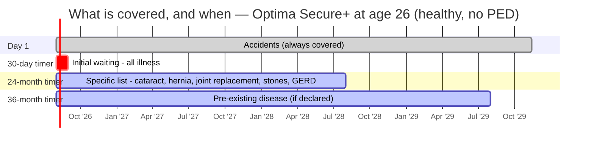

# Module 2 — Exclusions & Waiting Periods

_Source: **binding policy wording** `my:Optima Secure` (UIN **HDFHLIP26058V082526**, in `resources/`), Section A (Definitions), Section C (Waiting Periods & Exclusions), §1.21, §1.24, §2.7, §2.12, §2.13. **The wording governs.**_
_Profile studied: **Individual (single adult), age 26, metro tier-1**_
_Studied across SI tiers: **₹10L / ₹25L / ₹50L / ₹1Cr**_
_🔄 **Re-tested January 2026 against the full current framework** — nine dimensions discovered after HDFC was studied are applied below. **One of them overturns a claim in the original file.**_

> **Plain-English intro — the three ideas that matter.**
> Module 1 asked *"what do they pay for?"*. This module asks the harder question: **"what will they NOT pay for, and how long am I paying premiums before each cover actually switches on?"**
> - **Waiting period** = a timer. You're paying, but that specific thing isn't covered yet.
> - **PED (Pre-Existing Disease)** = anything you already had before buying. The longest timer, and the **#1 reason claims get rejected**.
> - **Exclusion** = never covered, no timer, ever.
>
> **This is where most claim denials are born** — which is why it carries 20% of the score.

---

## Claim-lever definitions (extract first)

| Definition | Optima Secure+ | What it means for you |
|------------|----------------|------------------------|
| **Pre-existing disease (lookback)** | **36 months** (Def. 35) — anything diagnosed, or for which advice/treatment was received, in the 3 years before the policy starts | The window that defines "pre-existing". **Shorter than the 48 months some plans use** — in your favour. ⚠️ Distinct from the *waiting* period, which is also 36 months here |
| **Any One Illness — relapse window** | ⚠️ **45 days** (Def. 2) — a relapse within 45 days is the **same** illness | Limits how much the Restore benefit can help you: two admissions 40 days apart count as **one claim**. *(Care Supreme and SBI have **no** relapse rule — a genuine point against HDFC)* |
| **Reasonable & Customary charges** | Defined and used (Excl. C.3.p) | Lets the insurer trim a bill to "customary" local rates — **discretionary** |
| **Medically Necessary** | Defined and used | Lets the insurer refuse care it deems unnecessary — **discretionary** |

---

## Waiting periods & restrictions

| Item | Detail | Concern |
|------|--------|---------|
| **Initial (30-day) waiting** | **30 days** (Excl03). ✅ Accidents exempt from day 1; ✅ waived entirely once you have **>12 months continuous coverage** | Standard and mild |
| **PED waiting** | **36 months** (Excl01) — reduces by 1 year for each continuous policy year | 🚩 **The plan's single genuine weakness.** **Care and Bajaj also sit at 36 months, but SBI gives 24 and ACKO 0–3 years.** ⚠️ **A reduction to 24/12 months EXISTS (§2.12) but you cannot buy it:** *"allowed to be opted at **channel level only** and only at the time of policy inception. **Policyholders will therefore not be able to opt for the same.**"* **A reduction that exists on paper but is unreachable for an individual buyer** |
| **PED reduction is a ONE-WAY DOOR** *(NEW ROW — SBI M2 dimension)* | §2.12: *"This option once selected **cannot be opted out in the lifetime of the Policy**."* | ⚠️ Academic for you (you can't opt it anyway), but it confirms HDFC's optional covers can be **permanent and irreversible** — relevant to the room modifier below |
| **Specific-disease waiting (list)** | **24 months** (Excl02) — a **closed, fully enumerated list** (below) | ✅ Standard duration, matching Care and Bajaj. ⚠️ Not applicable to accidents; where a listed disease is also your PED, **the longer timer applies** |
| **Is the list CLOSED or OPEN?** *(NEW ROW — ACKO M2 dimension)* | ✅ **CLOSED** — every condition is enumerated in the wording. **No "any other condition specified in the Schedule" catch-all** | ⭐ **Passes a check ACKO fails.** ACKO's list ends with an open item 18 letting it add *any* condition via your schedule. **With HDFC you can read the wording and know your worst case** |
| **Third waiting tier?** *(NEW ROW — Bajaj M2 dimension)* | ✅ **NONE.** Architecture is genuinely two-tier: **30-day + 24-month specific + 36-month PED**. 36 months appears **only** for PED | ⭐ **Passes.** **Bajaj quarantines joint replacement, spine surgery, bariatric and Parkinson's in a separate 36-month tier**; HDFC keeps **joint replacement and ligament/meniscal tear in the ordinary 24-month list** |
| **Enhancement-of-SI resets waiting** | ⚠️ **YES** — both PED (Excl01.ii) and specific-disease (Excl02.ii) waiting **apply afresh on the increased portion** | ⚠️ **Material for a 26-year-old.** "Buy ₹10L now, step up to ₹50L at 35" restarts a **36-month PED clock on the new ₹40L**. ✅ **Mitigant unique to this plan:** the **Infinite Benefit grows your cover ~₹10L every year with no clock reset at all** — so you rarely *need* to enhance the base SI. This is the cleanest answer to the enhancement trap in the study |
| **Co-pay** | ✅ **NONE — mandatory, age-triggered or zone-triggered.** Def. 8 exists but is not applied in Secure+ | ⭐ **Excellent and rare.** Many plans force co-pay on senior entrants; HDFC never does |
| **Sub-limits / disease capping** | ✅ **No disease-wise caps at all.** Room and ICU At Actuals. The only rupee sub-limits sit on peripheral items: **AYUSH** (schedule-set), **air ambulance ₹5L**, **daily cash ₹800/day (max ₹4,800)**, **health check-up ₹2,000–₹8,000** | ✅ Very clean. ⚠️ But see the erosion check below |
| **Do rupee sub-limits scale with the bonus-inflated SI?** *(NEW ROW — SBI M2 dimension)* | ⚠️ **No.** Air ambulance (₹5L) and daily cash (₹800/day) are **flat** — identical at ₹10L and ₹2Cr. Health check-up steps with the **base** SI band, not with accrued Infinite Benefit | ⚠️ **Over a 40-year hold at 10–14% medical inflation these decay to irrelevance.** Less damaging than SBI's case (whose ambulance/check-up caps are the *only* ones) because HDFC's sub-limited items are all peripheral — **nothing core is rupee-capped** |
| **Modern-treatment sub-limits (12 mandated)** | ✅ **No sub-limit found in the wording → covered up to SI** (robotic surgery, oral chemo, deep-brain stimulation, etc.) | ⭐ **Beats the industry norm** of a 50%-of-SI or flat-₹5L cap. Matches Care and SBI. ⚠️ Verify against the current Annexure A at purchase |
| **Mental-illness coverage (parity?)** | 🚩 **CORRECTED — see the finding below.** The wording contains **zero occurrences of "Mental Illness" or "Mental Health Establishment"**, and its **Hospital definition requires "a fully equipped operation theatre"**. Mental illness is **not excluded**, and HDFC's own materials state it is covered up to SI | 🚩 **The original file recorded "parity OK" on insurer confirmation. Applying the ACKO M2 dimension, that is brochure-level, not wording-level.** See the analysis below |
| **Zone-based co-pay** | ✅ **NONE.** §1.24 "Premium Tier" sets **premium** by city (Tiers 1–6); **treatment in a costlier tier triggers no co-pay** | ✅ The brochure's *"No Geography-Based Co-payment"* is **confirmed by the wording**. Feeds M4 pricing |
| **Deductible / aggregate deductible** | **Optional only** — Aggregate Deductible ("Value Buy") for a premium discount (Def. 3, §2.7). Base plan has **no deductible**. Does **not** reduce the SI | ⚠️ **Reversibility unverified** — *confirming source: §2.7 read against the renewal-endorsement clause, or written confirmation from HDFC.* Given §2.12's PED modifier is expressly irreversible, **do not assume this one is reversible** |
| **Voluntary room-cap modifier** *(NEW ROW — SBI/Bajaj M1 dimension)* | ⚠️ **PRESENT — §2.13:** opt down from At Actuals to **1% of base SI/day** (+ ICU modification) for cheaper premium, **re-enabling proportionate deduction** | ⚠️ **Reconfigurable at renewal** (company's discretion) — not a permanent lock. **Don't opt it, and check your schedule doesn't carry it** |
| **Lifestyle-attributable illness exclusion** *(NEW ROW — Care M2 dimension)* | ✅ **ABSENT — zero mentions of tobacco**, and no "illness attributable to smoking/alcohol" carve-out | ⭐ **A significant win over both Care and ACKO.** **Care excludes any illness *"attributable to"* tobacco/alcohol/smoking; ACKO excludes oral, oropharyngeal and respiratory cancers outright *"in a tobacco user"*.** HDFC has **no equivalent clause** — only the standard addiction-treatment exclusion |
| **Permanent exclusions (full list)** | Standard IRDAI set (Excl04–18) plus specific exclusions: war/nuclear · self-injury & suicide · **external** congenital defects · stem-cell harvesting · OPD · hearing aids, spectacles, contact lenses · alopecia · artificial limbs & durable equipment (unless accident/intra-operative) · **refractive error <7.5 dioptres** · sterility & infertility · maternity (add-on) | ✅ **~standard, nothing unusually harsh.** No sleep-apnoea exclusion (ACKO has one), no HRT exclusion (ACKO has one), no STD exclusion beyond standard |
| **Underwriting-imposed permanent exclusion** | ⚠️ **Possible** (§1.21 + Excl. C.3.q) — via counter-offer HDFC may **permanently exclude a declared condition**, add extra waiting, or **load the premium up to 100% per condition / 150% per person** | ⚠️ **The HDFC M2 dimension in its original form.** An "accepted" proposal can still leave your main risk uncovered. **Read the counter-offer letter carefully.** ✅ For a healthy 26-year-old with nothing to declare, the risk is ~nil today |
| **Pre-policy medical-test grid** *(NEW ROW — Care M2 / SBI M4 dimension)* | ⚠️ **Not stated in the wording** — no age/SI test grid found | ⚠️ **unverified** — *confirming source: the prospectus underwriting grid or a live quote at ₹10L and ₹1Cr.* **This matters: it is the gate that triggers the loadings and carve-outs above.** Care requires **no tests to age 65 at any SI**; SBI flips to full medicals at ₹30L |
| **Non-disclosure consequences** | Void / premium forfeited for misrepresentation; three remedies for PED non-disclosure; **60-month moratorium** | Detail in Module 6 |

---

## 🚩 The mental-health finding — this corrects the original file

The original Module 2 recorded: *"Mental-illness coverage: **Covered up to SI, no sub-limit** (no exclusion; insurer-confirmed incl. HIV) — **parity OK**."* Re-tested against the **ACKO M2 dimension**, that conclusion rests on the wrong kind of evidence.

| Test | HDFC Optima Secure+ | SBI Super Health | Care Supreme | ACKO |
|---|:---:|:---:|:---:|:---:|
| "Mental Illness" **defined** in wording | ❌ **absent** | ✅ def. 17 | ✅ def. 2.2.14 | ❌ absent |
| "Mental Health Establishment" deemed a Hospital | ❌ **absent** | ✅ def. 19 | — | ❌ absent |
| Mental illness **expressly excluded**? | ✅ No | ✅ No | ✅ No | ✅ No |
| Hospital definition demands an **operation theatre** | ⚠️ **Yes** | — | ⚠️ Yes | ⚠️ Yes |

> **The problem is not the absence of cover — it is the absence of a qualifying facility.** Mental illness is **not excluded**, so on a plain reading a psychiatric admission should be payable. **But the Hospital definition requires *"a fully equipped operation theatre of its own where surgical procedures are carried out"*** — and most standalone psychiatric hospitals, rehabilitation facilities and mental-health establishments **have no operating theatre**. They would therefore **fail the Hospital test**, making the claim inadmissible.
>
> This is exactly why IRDAI's standard construct includes a **separate "Mental Health Establishment" definition** — which **SBI carries and HDFC does not**.
>
> ⚠️ **Status: UNVERIFIED, not disproven.** HDFC's own materials state mental illness is covered up to SI, and the framework's rule is that *a benefit only counts if it's in the wording*. **The honest position is that parity is claimed but not wording-backed.** *Confirming source: written confirmation from HDFC that a claim at a non-surgical mental-health establishment is admissible, or an IRDAI/Ombudsman ruling.* **This does not change the score — HDFC's overall exclusions sheet remains strong — but "parity OK" was too confident.**

---

## 📋 The specific-disease list — what's actually on the 24-month timer

> **Plain English:** named conditions **not covered for the first 24 months** — *even if you develop them after buying, and even if you're perfectly healthy today*. Accidents are always exempt.

**Eyes:** cataract · glaucoma · retinal detachment
**Bones & joints:** osteoarthritis & osteoporosis · **joint replacement** · ligament / tendon / meniscal tear
**ENT:** tonsils & adenoids, and related ENT surgery
**Digestive:** hernia · piles / fissure / fistula · gallbladder disease · **all forms of cirrhosis** · pancreatitis · GERD
**Urinary:** kidney & bladder stones · benign prostatic hyperplasia (BPH)
**Gynaecological:** hysterectomy · fibroids · PCOD · endometriosis · uterine prolapse · dilatation & curettage (D&C)
**Growths:** benign tumours, cysts, polyps, breast lumps
**Circulatory:** varicose veins

| Timer | Applies to | Duration | Reducible? |
|-------|-----------|:--------:|:----------:|
| Day 1 | Accidents; everything not otherwise listed (after 30d) | — | — |
| **30 days** | Any illness (waived once >12 months continuous cover) | 30d | — |
| **24 months** | The specific list above | 24 mo | ❌ No option offered |
| **36 months** | PED (declared & accepted only) | 36 mo | ⚠️ **Channel-only — not available to you** |

> **For this buyer (healthy, 26, no PED):** only the **30-day initial** and the **24-month specific list** realistically bite. **After two years the policy is effectively fully switched on.** That is **slower than SBI Platinum (12 months) and ACKO (0)** but **level with Care and Bajaj**. The 36-month PED timer is irrelevant unless you already have a condition.

---

## 🔬 HDFC re-tested against the dimensions discovered *after* it was studied

| Dimension (discovered in) | HDFC result |
|---|:---|
| Third waiting tier *(Bajaj M2)* | ✅ **Pass** — none; joint replacement stays in the 24-month list |
| SI-gated waiting reductions *(ABHI M2)* | ✅ **N/A** — the PED reduction is channel-gated, not SI-gated |
| Who can opt the reduction *(HDFC's own M2)* | ⚠️ **Fail** — **channel-only; individuals cannot buy it** |
| One-way-door option locks *(SBI M2)* | ⚠️ **Present** — §2.12 PED modifier *"cannot be opted out in the lifetime"* |
| Frozen rupee sub-limits *(SBI M2)* | ⚠️ **Partial** — air ambulance & daily cash are flat, but only peripheral items are capped |
| Lifestyle-attributable exclusion *(Care M2)* | ✅ **Pass, best in study** — no tobacco/alcohol carve-out at all |
| Open vs closed waiting list *(ACKO M2)* | ✅ **Pass** — fully enumerated, no catch-all |
| Mental-illness enabling definitions *(ACKO M2)* | 🚩 **Fail** — no Mental Illness / Mental Health Establishment definitions |
| Pre-policy medical-test cliff *(Care M2 / SBI M4)* | ⚠️ **Unverified** — no grid in the wording |

**Result: 4 passes, 1 N/A, 3 partial/fail, 1 unverified.** The fails are **narrower than any rival's**: no tobacco exclusion, no open-ended list, no third tier — the three harshest devices found elsewhere in this study are all **absent** here.

---

## Brochure-vs-wording check *(Rule 2)*

✅ **No conflict on the material items.** Zero co-pay, no disease sub-limits, no geography co-payment, modern treatments uncapped, and the waiting-period structure all reconcile between brochure and wording.

⚠️ **One overclaim corrected and two items to verify:**
1. 🚩 **"Mental illness covered at parity"** is **insurer-stated, not wording-backed** — the enabling definitions are absent and the Hospital definition demands an operation theatre (above).
2. The **AYUSH sub-limit** is schedule-set — check the figure at your SI.
3. The **pre-policy medical-test grid** is not in the wording — confirm before assuming a clean underwriting path at ₹50L–₹1Cr.

> **Carry-forward flags** *(stage2_shortlist.md)*: HDFC carries **no open screening flags**. ⚠️ **New item raised here for the decision tree:** the **mental-health enabling-definition gap** is shared with ACKO and should be checked across **all** finalists — SBI is the only plan confirmed to carry the full IRDAI construct.

---

## Sources

- [**Binding wording — `my:Optima Secure`, UIN HDFHLIP26058V082526**](resources/PolicyWordings_myOptimaSecurePlus-76673175551+(1).pdf) — *69 pp; **Section A** Def. 2 (Any One Illness), Def. 3 (Aggregate Deductible), Def. 8 (Co-payment), Def. 35 (PED), **Hospital definition (operation-theatre requirement)**; **Section C** Excl01 (PED 36 mo), Excl02 (specific 24 mo + the closed list), Excl03 (30-day), Excl04–18 standard permanent exclusions, C.3.p (R&C), C.3.q (underwriting exclusion); **§1.21** counter-offer/loading, **§1.24** Premium Tier (no zone co-pay), **§2.7** Aggregate Deductible, **§2.12** PED-waiting modification (channel-only, irreversible), **§2.13** room-rent modification*
- [Optima Secure+ Brochure](resources/OptimaSecure_PlusBrochure.pdf) · [Prospectus](resources/optima-plus-prospectus.pdf) — *used for the brochure-vs-wording test*
- [HDFC ERGO — Optima Secure product page](https://www.hdfcergo.com/health-insurance/optima-secure) — *modern-treatment and mental-illness coverage statements (insurer-stated)*
- [Ditto — Optima Secure review](https://joinditto.in/health-insurance/hdfc-ergo/optima-secure/) — *corroboration on absence of disease sub-limits*
- [IRDAI Master Circular on Health Insurance, 29 May 2024](https://irdai.gov.in/) — *PED wait ≤36 months, 60-month moratorium, **mandated mental-illness parity since 31 Oct 2022**, 12 modern treatments*
- Framework: [study_plan.md](../../study_plan.md) · screening: [stage2_shortlist.md](../../screening/stage2_shortlist.md)
- Benchmarks compared: [Care Supreme M2](../care_supreme/module2_exclusions.md) · [SBI Super Health M2](../sbi_super_health/module2_exclusions.md) · [Bajaj Health Guard M2](../bajaj_health_guard/module2_exclusions.md) · [ACKO Platinum M2](../acko_platinum_health/module2_exclusions.md)

---

## Module 2 score: **4 / 5** *(unchanged after re-testing)*

**Rationale.** An exceptionally clean restriction profile that **survives the full current framework**: **zero co-pay of any kind** — no mandatory, no age-triggered, no zone-triggered — **no disease-wise sub-limits**, **modern treatments uncapped up to SI**, a **deductible only if you opt in**, and a **closed, fully enumerated specific-disease list** with **no hidden third waiting tier** (Bajaj quarantines joint replacement for 36 months; HDFC keeps it at 24). Three of the harshest devices this study found elsewhere are **entirely absent here**: **no lifestyle-attributable tobacco/alcohol exclusion** (Care and ACKO both carry one, ACKO's excluding three cancer sites outright), **no open-ended waiting-list catch-all** (ACKO's list is extensible via your schedule), and **no undefined subjective exit clause**. For a healthy 26-year-old the policy is **effectively fully switched on after 24 months**.

It is held to 4/5 by three real frictions, one newly surfaced. **(1) The 36-month PED wait is the plan's genuine relative weakness** — SBI gives 24 months inbuilt and ACKO 0–3 years — and the reduction to 24/12 months, although it exists in §2.12, is **channel-only and expressly unavailable to individual buyers**, making it a benefit you can see but never buy. **(2) Enhancing the sum insured restarts both waiting clocks** on the increase, though HDFC answers this better than any rival: the **uncapped Infinite Benefit grows your cover every year with no reset at all**, so you rarely need to enhance the base. **(3) Newly found: the mental-health parity claim is insurer-stated, not wording-backed** — the wording contains **no "Mental Illness" or "Mental Health Establishment" definition** while its **Hospital definition demands an operation theatre**, the same structural gap ACKO has and SBI does not. Add the **45-day Any-One-Illness relapse window**, a **voluntary room-cap modifier (§2.13)** that can re-enable proportionate deduction, **flat air-ambulance and daily-cash caps** that decay with inflation, and an **unverified pre-policy medical-test grid**, and the picture is a strong exclusions sheet whose only material timing weakness is PED.
