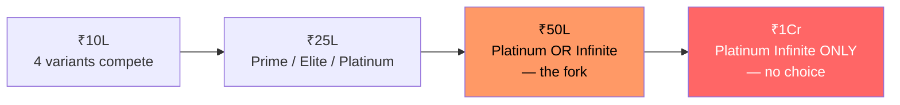
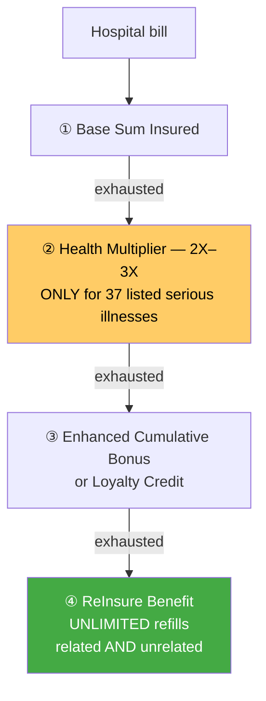

# Module 1 — Coverage & Benefits

_Source: Super Health Insurance **policy wording** (UIN **SBIHLIP24141V022324**), Sections A & C + Annexure I (Product Benefit Table); prospectus; premium rate chart. All files in `resources/`._
_Profile studied: **Individual (single adult), age 26, metro tier-1**_
_Studied across SI tiers: **₹10L / ₹25L / ₹50L / ₹1Cr**_

> **Plain-English intro.** "Coverage" = *what the policy pays for, and how much*. Two policies with the same ₹25L **Sum Insured** (SI = the most the insurer will pay in a year) can behave very differently once you read: **(a)** whether you can pick any hospital room or get penalised for it, **(b)** how much free extra cover you earn each year, **(c)** whether your SI can be *refilled* after a big claim, and **(d)** the silent gaps — gloves, syringes, PPE, the "non-payable" items that run ₹15k–₹1L per admission. This module scores all of that, at every SI tier.

---

## ⚠️ Variant decision — Super Health is **5 plans under ONE name + ONE UIN**

The single most important structural fact about this product. "Super Health Insurance" is **not one plan** — it is a **five-rung ladder** sharing UIN `SBIHLIP24141V022324`. The rungs differ materially, and **the four SI tiers we study do not all exist on the same rung**:

| Variant | SI range offered | ₹10L? | ₹25L? | ₹50L? | ₹1Cr? |
|---------|------------------|:-----:|:-----:|:-----:|:-----:|
| **Prime** | ₹3L – ₹25L | ✅ | ✅ | ❌ | ❌ |
| **Elite** | ₹3L – ₹25L | ✅ | ✅ | ❌ | ❌ |
| **Premier** | ₹3L – ₹10L | ✅ | ❌ | ❌ | ❌ |
| **Platinum** | ₹10L – ₹50L | ✅ | ✅ | ✅ | ❌ |
| **Platinum Infinite** | ₹50L – ₹2Cr | ❌ | ❌ | ✅ | ✅ |



> **Finding — the SI ladder forces a variant change.** At **₹1Cr there is no choice**: only Platinum Infinite sells it. This matters because Platinum Infinite **removes the Enhanced Cumulative Bonus entirely** (below) — so the *highest* SI tier gets the *weakest* cover-growth engine. **Coverage does not scale monotonically with SI in this product.**
>
> ⚠️ **Variant-ladder mis-selling check** *(framework dimension — HDFC M1)*: because all five rungs share one name and one UIN, **the policy schedule must literally name the rung** ("Platinum"), not merely "Super Health Insurance". A **Prime** policy at ₹25L looks identical on the certificate but **has no Health Multiplier at all** and caps the bonus at 100% instead of 200%. **Confirm the schedule names the variant.**

## Variant / configuration
| Item | Detail |
|------|--------|
| Product variant studied | **All five rungs compared** (Prime · Elite · Premier · Platinum · Platinum Infinite). **Platinum** is the reference rung for this profile — the only rung spanning ₹10L→₹50L, and the richest bonus |
| Product / UIN | Super Health Insurance · **SBIHLIP24141V022324** (v02, 2023-24 filing) |
| Wording version in `resources/` | `policy_wording_super_health.pdf` — 31 pp, current version on SBI General's downloads page (fetched 16-Jul-2026) |
| Base sum insured option | ₹10L · ₹25L · ₹50L · ₹1Cr studied (product range ₹3L – ₹2Cr) |
| Basis | **Individual** (not floater) — single adult, age 26 |
| Zone bought | **Not applicable — premium is "Zone Agnostic"** on all rungs (a genuine metro advantage — see new dimensions) |

---

## 🔑 Claim-lever definitions (Phase-1 wording forensics)
_The fine-print levers an insurer uses to trim or deny a claim. Extract these before trusting any headline benefit._

| Definition | Super Health wording | Why it matters | vs HDFC Optima (benchmark) |
|------------|----------------------|----------------|-----------------------------|
| **PED — waiting period** | **24 months** (Sec E; CIS: *"Pre-Existing diseases: Covered after 24 months"*) | How long your pre-existing conditions stay uncovered | Optima **36 mo** → **SBI is 12 months better** ✅ |
| **Room Rent (def.)** | Sec A-47 — anchors the proportionate-deduction maths | Defines the room benefit | Standard |
| **Reasonable & Customary** | Present (used in D.5 and generally) | Lets insurer trim a bill to "customary" rates — discretionary | Present in Optima too |
| **Medically Necessary** | Present — benefit clauses gated on *"Medically Necessary Treatment"* | Lets insurer reject care it deems excessive | Present in Optima too |
| **Any One Illness — relapse window** | **Not located as a defined relapse window** in the extracted wording. Notably C.12(d): *"Anyone Illness cover will not be applicable under this benefit"* (ReInsure) | The absence *helps*: no relapse rule shrinking your refill | Optima has a **45-day** relapse rule → **SBI cleaner** ✅ |
| **Proportionate deduction** | C.1 cond. iii — applies **only if the schedule states a room-rent limit**; cond. iv exempts hospitals not doing differential billing | The bill-shrinking mechanic | Optima: no cap → not triggered |

> ⚠️ **Assumption marked:** "Any One Illness" was not found as a defined term in the text-extracted wording. Since C.12(d) explicitly disapplies it to ReInsure, relapse-window risk is treated as **low but unverified**. **Confirming source:** a clean read of Section A (Definitions) in the original PDF layout.

---

## 🛏️ Room economics — the headline strength

> **Why this matters most (plain English).** If a policy caps your daily room rent and you take a costlier room, the hospital's *entire* bill — surgeon, tests, ICU, everything — is cut back **in the same proportion**. It is the biggest silent shrinker of a payout, and it bites hardest in **metro tier-1** where room rates are highest.

| SI tier | Room rent eligibility | ICU | Proportionate-deduction risk? |
|---------|----------------------|-----|-------------------------------|
| **₹10L** | **Actuals up to Sum Insured** — any room, no cap | **Actuals up to SI** | ✅ **None** |
| **₹25L** | **Actuals up to SI** | **Actuals up to SI** | ✅ **None** |
| **₹50L** | **Actuals up to SI** | **Actuals up to SI** | ✅ **None** |
| **₹1Cr** | **Actuals up to SI** | **Actuals up to SI** | ✅ **None** |

> **Finding — room economics are excellent and, unusually, do NOT degrade at low SI.** Every rung, at every SI from ₹3L to ₹2Cr, gets **"Actuals up to Sum Insured"** for both room and ICU (wording Annexure I, confirmed identically in the brochure). There is **no room-rent cap and therefore no proportionate deduction anywhere in the ladder.**
>
> **This beats the peer set at the bottom of the ladder.** Bajaj Health Guard caps you to a *single A/C room* below ₹10L and grants "any room" only at ₹10L+. **SBI has no such SI threshold** — a ₹3L Prime policy carries the same uncapped room right as a ₹2Cr Infinite. On room economics SBI **matches the HDFC Optima benchmark ("at actuals") and beats Bajaj's SI-gated design.**

> ⚠️ **The one room trap — a voluntary cap sold as a discount.** Annexure I lists **"Base Cover Modifiers"**: `[Room Rent – 2%, ICU – 4%, Bariatric – INR 50,000, …]`. Opting these **imposes** a 2%-of-SI daily room cap and 4% ICU cap in exchange for cheaper premium — **switching proportionate deduction back on**. At ₹10L that is a ₹20,000/day room cap (comfortable in most metros); at ₹3L it is ₹6,000/day (tight). **Do not opt the modifier if you value the no-cap benefit — and check the schedule doesn't carry it silently.**

---

## Benefit-stacking math

> **How the layers combine (plain English).** Think of buckets drawn down in a **fixed order** (wording C.3(c) / C.12(b)):
> **① Base SI** → **② Health Multiplier** (only for 37 named serious illnesses) → **③ Enhanced Cumulative Bonus / Loyalty Credit** (free cover earned at renewal) → **④ ReInsure** (unlimited refills).



| Layer | This plan | Notes |
|-------|-----------|-------|
| **Base SI** | ₹10L / ₹25L / ₹50L / ₹1Cr | The headline cover |
| **Instant multiplier (e.g. 2x day-1)** | **Health Multiplier — 2X to 3X of Base SI, but ONLY for 37 named Serious Illnesses** (C.3). **Prime = NA (none at all)**; Elite 2X (₹3–10L) / 3X (₹15L+); Premier 2X; Platinum 2X (₹10L) / 3X (₹15L+); Infinite **3X** | ⚠️ **Condition-gated, not unconditional** — see new dimension. Triggers **once per policy year**, **cannot be carried forward**, applies only to C.1/C.6/C.14/C.15 claims |
| **Annual bonus / infinite benefit** | **Enhanced Cumulative Bonus: +50% of Base SI per claim-free year** — cap **100%** (Prime/Elite/Premier) or **200%** (Platinum). **Platinum Infinite: NO ECB — replaced by Loyalty Credit, +50%/renewal, cap 100%** | ⚠️ **ECB is claim-dependent:** *"If a claim is made… the ECB accrued shall be reduced at the same rate at which it has accrued"* (C.22). **Loyalty Credit is claim-INDEPENDENT** (C.23) — better *quality*, lower *ceiling* |
| **Restoration / recharge** | **ReInsure Benefit — UNLIMITED times, up to 100% of Base SI per claim** (200% on Infinite, or via the *Enhanced ReInsure* optional cover on lower rungs) | ✅ **Best-in-class.** Triggers **from the very first claim**, covers **related AND unrelated** illness, and *"Anyone Illness cover will not be applicable"* (C.12d) — **no relapse-window trap** |
| **Per-claim cap rule** | **Base SI + Health Multiplier (if listed illness) + ECB/Loyalty Credit + ReInsure**, drawn strictly in that sequence | ReInsure refills serve subsequent claims, unlimited times in the year |

### ⚠️ NEW DIMENSION — **Bonus-ceiling inversion at the top SI tier**
The bonus does **not** improve as you climb the SI ladder — **it inverts at the top**:

| SI tier | Only variant(s) | Bonus engine | Ceiling | Claim-proof? |
|---------|-----------------|--------------|:-------:|:------------:|
| ₹10L / ₹25L | Prime / Elite / Premier | ECB +50%/yr | **100%** | ❌ reduces on claim |
| ₹25L / ₹50L | **Platinum** | ECB +50%/yr | **200%** ⭐ | ❌ reduces on claim |
| **₹1Cr** | **Platinum Infinite (forced)** | **Loyalty Credit** +50%/renewal | **100%** ⬇️ | ✅ **claim-proof** |

> **Finding — buying the biggest SI *halves* your bonus ceiling, at a 77% premium.** Platinum at ₹50L can grow to **₹150L** (200% ECB). Platinum Infinite at ₹50L grows only to **₹100L** (100% Loyalty Credit) — **and costs 77% more** (**₹45,944 vs ₹25,895** — corrected figures, see M4). The Infinite premium buys 180-day post-hospitalisation, 200% ReInsure, ₹10L air ambulance and richer value-adds — but **surrenders the 200% bonus**. At ₹1Cr the buyer **cannot get the 200% ECB at all**.
>
> ⭐ **At ₹50L, Platinum strictly dominates Platinum Infinite for this buyer: 44% cheaper AND double the bonus ceiling.** The fork only favours Infinite if the 180-day post-hosp and 200% ReInsure are worth ₹20,049/yr — for a healthy 26-year-old, they are not.
>
> **The honest read:** Loyalty Credit is *better in kind* (accrues **irrespective of claims** — a real advantage over an ECB that one claim erodes) but *worse in degree* (100% vs 200%). A genuine trade, not a pure downgrade — but the marketing framing ("Infinite" = more) is the opposite of the bonus reality.

### How total cover scales with SI (after 4 claim-free years)
```
                    Base SI    + Bonus (ECB / Loyalty)        = Ceiling    Premium @26
  ₹10L  Platinum    ▓▓          ▓▓▓▓ (200% = +₹20L)             ₹30L        ₹19,446
  ₹25L  Platinum    ▓▓▓▓▓       ▓▓▓▓▓▓▓▓▓▓ (200% = +₹50L)       ₹75L        ₹22,727
  ₹50L  Platinum    ▓▓▓▓▓▓▓▓▓▓  ▓▓▓▓▓▓▓▓▓▓▓▓▓▓▓▓▓▓▓ (+₹100L)    ₹150L ⭐     ₹25,895  ← best value
  ₹50L  Infinite    ▓▓▓▓▓▓▓▓▓▓  ▓▓▓▓▓▓▓▓▓▓ (100% = +₹50L)       ₹100L ⬇      ₹45,944  ← +77%, worse ceiling
  ₹1Cr  Infinite    ▓▓▓▓▓▓▓▓▓▓▓▓▓▓▓▓▓▓▓▓  (100% = +₹1Cr)        ₹2Cr        ₹48,152

  + Health Multiplier 2–3X on top — for the 37 listed serious illnesses ONLY
  + ReInsure refills the SI UNLIMITED times for further claims in the same year
```
> **Read:** cover scales cleanly *within* a rung — the bonus is %-of-SI with **no flat-rupee ceiling**, so SBI **passes the multiplier hard-cap check** that clips Bajaj's Recharge (flat ₹5L → only 5% delivered at ₹1Cr) and ABHI's Super Credit (₹3Cr cap). The scaling break is **between** rungs, at the ₹50L fork.

### Premium scaling with SI *(Single Adult, age band 18-35 = age 26; office premium — **GST-free, so this is the final price** — full age-curve is M4)*

> ✅ **CORRECTED (by M4, 16-Jul-2026).** These figures were originally taken from the rate chart's **text layer**, which extracts table captions out of visual order; the **1A+1C Family Floater** rows were mis-read as Single Adult, overstating every premium by 16–32%. **The table below is read off the rendered rate-chart pages and is correct.** See [module4_cost.md](module4_cost.md) for the correction log.

| SI | Prime | Elite | Premier | Platinum | Platinum Infinite |
|----|------:|------:|--------:|---------:|------------------:|
| ₹10L | ₹9,313 | ₹9,685 | ₹15,039 | ₹19,446 | — |
| ₹25L | ₹12,398 | ₹12,941 | — | ₹22,727 | — |
| ₹50L | — | — | — | **₹25,895** | ₹45,944 |
| ₹1Cr | — | — | — | — | ₹48,152 |
| ₹2Cr | — | — | — | — | ₹51,518 |

**Premium per ₹1L of cover** *(SI-efficiency curve — framework dimension, Bajaj M4)*:

| SI | Platinum ₹/lakh | Infinite ₹/lakh |
|----|---------------:|----------------:|
| ₹10L | ₹1,945 | — |
| ₹25L | ₹909 | — |
| ₹50L | **₹518** ⭐ | ₹919 |
| ₹1Cr | — | **₹482** |
| ₹2Cr | — | **₹258** |

> **Finding — high SI is disproportionately cheap; ₹50L Platinum is the sweet spot of the whole product.** Going ₹10L→₹50L on Platinum costs **+33% premium (₹19,446→₹25,895) for 5× the cover** — per-lakh cost collapses from ₹1,945 to **₹518**. Even better: **₹50L costs only 14% more than ₹25L for double the cover.** With the 200% ECB that is a **₹150L ceiling for ₹25,895/yr**. For a healthy 26-year-old, buying a large SI young is the efficient move. ⚠️ **But M4 finds a hidden catch:** ₹30L+ on Platinum triggers **mandatory pre-policy medicals** (₹25L does not) — exposing the buyer to a lifetime 150% loading and M2's permanent ICD-exclusion. *(Full age-curve, discounts, escalation and the medical-test cliff are in [M4](module4_cost.md).)*

---

## Feature checklist

| Feature | Detail | Notes |
|---------|--------|-------|
| **Room rent** | ✅ **Actuals up to SI — no cap, ALL variants, ALL SI tiers** | Matches HDFC Optima; **beats Bajaj** (capped <₹10L). ⚠️ optional 2%/4% modifier can re-impose a cap — don't opt it |
| **Cumulative Bonus ceiling** | +50%/claim-free yr → **100%** (Prime/Elite/Premier) · **200%** (Platinum) · **NA** (Infinite → Loyalty Credit 100%) | ⚠️ **Inverts at the top tier** — see new dimension |
| **Claim impact on bonus** | ⚠️ **ECB reduces at the same rate it accrued** on any claim (C.22). **Loyalty Credit does NOT** (C.23) | Optional **ECB Safeguard** protects the bonus if the claim ≤ ₹1L — *not available on Infinite* |
| **Pre / post-hospitalisation** | **60 days pre / 90 days post** — all rungs except **Platinum Infinite: 60 / 180** | ⚠️ **Real gap:** 90-day post-hosp vs **HDFC Optima's 180**. Only the ₹50L+ Infinite rung matches the benchmark |
| **Day-care procedures** | ✅ **All day-care covered, up to SI** (C.6; >2 hrs; incl. angiography, dialysis, radiotherapy, chemotherapy) | Broad — not a limited list |
| **Domiciliary / home healthcare** | ✅ **Both covered — Actuals up to SI, all rungs** (C.7 / C.8) | ✅ **Beats Bajaj** (covers neither). Domiciliary needs 3+ days, reimbursement-only; Home Health Care is pre-auth, **not** available on reimbursement |
| **AYUSH** | ✅ **Actuals up to SI, all rungs** (C.15) | Full-SI, no sub-limit — best-in-class |
| **Modern treatments** | ✅ **Actuals up to SI, all rungs** (C.14) — robotic, oral chemo, immunotherapy, deep-brain stimulation, stem-cell, etc. | ✅ **No 50%/₹5L cap** — beats the common industry sub-limit |
| **Day-1 cover for listed chronic conditions** | ❌ **None day-1.** Hypertension / Diabetes / Cardiac carry a **90-day** wait; the paid **"Early Start" add-on** cuts it to **30/60 days** | ⚠️ Weaker than Aditya Birla's true day-1 chronic cover — but 90 days is far shorter than a PED wait, and Early Start makes it ~1 month. **Add-on UIN unprinted in the on-file CIS → unverified** |
| **Consumables / non-medical (Protect-type)** | ✅ **Claims Shield — Annexure II List I "Expenses not covered" items become payable, up to SI, on ALL five rungs** (C.17) | ✅ **Major strength.** Not a rider, not rung-gated — the ₹15k–₹1L gloves/PPE/syringes gap is closed on every variant, even the cheapest ₹3L Prime |
| **Consumables economics (₹ per admission covered?)** | Covered **up to Sum Insured**, no separate rupee cap, against the wording's 37-item List I (gloves, PPE, file charges, pulse-oximeter, etc.) | Typical real gap ₹15k–₹1L/admission → **fully absorbed** |
| **Wellness / HealthReturns / earn-back** | **Walk Healthy** (optional Wellness Benefit D.7.4): step targets → **up to 30% discount on renewal premium** (single-adult grid); plus AI fitness coaching, dietician e-consults, unlimited gym | ✅ Genuine earn-back, comparable in magnitude to ABHI HealthReturns. ⚠️ **Optional cover, opt-in at inception ONLY** — cannot be added at renewal. Feeds M4 net cost |
| **Ambulance (road / air)** | Road: **₹3,000** (Prime/Elite) · ₹4,000 (Premier) · ₹5,000 (Platinum) · **up to SI** (Infinite). Air: **₹2L** all rungs · **₹10L** (Infinite) | Road cap is thin for metro but low-stakes; air ambulance ₹2L reasonable |
| **Organ-donor cover** | ✅ **Actuals up to SI, all rungs** (C.11) | Donor's pre/post-hosp expenses excluded |
| **Daily cash / shared room** | **₹500/day, max ₹4,000** (Prime/Elite/Premier) · ₹500/day max ₹8,000 (Platinum) · **₹1,000/day max ₹15,000** (Infinite) | Requires >48 hrs in shared accommodation at a **network** hospital; not payable for ICU time |
| **Preventive health check-up** | **₹2,500** (Prime/Elite/Premier — *1st renewal onwards*) · **₹5,000** (Platinum — *since inception*) · **₹10,000** (Infinite — *since inception*) | ⚠️ Lower rungs make you wait a year; Platinum+ gives it from day 1. Does not touch SI or ECB |
| **E-opinion / global-emergency cover** | E-Opinion: **NA** (Prime/Elite/Premier) · 4 per member (Platinum) · Unlimited (Infinite). **Global Cover / Medical Treatment Abroad: Platinum & Infinite ONLY** — 16 listed major illnesses, diagnosed in India, **36-month wait**, reimbursement-only | ⚠️ Global cover is a **Platinum+ privilege** — another reason the cheap rungs are not "the same plan" |
| **Maternity / OPD / add-ons** | Maternity: **NA** (Prime/Elite) · ₹25k/₹50k (Premier) · ₹50k/₹75k (Platinum) · ₹2L (Infinite); waits **48 mo single adult** / 24 mo other combinations. OPD: Platinum & Infinite only, with **30% co-pay** on pharmacy/diagnostics, **20%** on consultation; Dental/Vision **50% co-pay** | *(Down-weighted per framework.)* For a single 26-yo the **48-month single-adult maternity wait** is the relevant number |
| **Zone-based pricing / zone co-pay** *(NEW ROW — Rule 3)* | ✅ **"Premium Type [Zone Agnostic]" — all five rungs** (Annexure I) | ✅ **Genuine metro win** — no Zone-A loading and **no zone-based co-pay clause** anywhere in the wording |
| **Multiplier hard-cap check** *(NEW ROW — framework dimension, ABHI M1)* | ✅ **Passes.** ECB, Loyalty Credit and Health Multiplier are all **%-of-SI with no flat-rupee ceiling** | Contrast Bajaj Recharge (flat ₹5L cap) and ABHI Super Credit (₹3Cr cap). SBI's growth engines scale cleanly |
| **Recovery Benefit** *(NEW ROW)* | Lump sum on hospitalisation >5 consecutive days: **NA** (Prime/Elite) · ₹2,500 (Premier) · ₹5,000 (Platinum) · ₹10,000 (Infinite) | Over and above SI; does not reduce it |
| **Bariatric surgery** *(NEW ROW)* | ₹50,000 (Prime/Elite/Premier) · **₹2L** (Platinum/Infinite) | Sub-limited; BMI ≥40, or ≥35 with comorbidities |

---

## 🆕 NEW DIMENSIONS discovered in this module *(Rule 3)*

### 1. Zone-agnostic pricing *(→ new bullet in study_plan M4; new row above)*
The framework treats **zone-based pricing** and **zone co-pay** only as *risks to detect*. SBI Super Health is **"Zone Agnostic"** on every rung — one price nationwide, no zone co-pay clause. For a **metro tier-1 buyer this is a real, quantifiable advantage** the framework had no place to *credit*. It also removes the classic trap where a buyer priced in Zone C is co-paid for treatment in Zone A. → **Now a positive check, not just a risk.**

### 2. Bonus-ceiling inversion / bonus-type swap across the variant ladder *(→ new bullet in study_plan M1; section above)*
Distinct from the existing **multiplier hard-cap check** (which catches *flat-rupee* ceilings). Here the *top* variant **swaps the bonus engine entirely** — trading a claim-dependent 200% ECB for a claim-proof 100% Loyalty Credit — so **cover-growth potential falls as SI rises**, and the top-tier buyer cannot opt back. → **New generalisable check: "does the bonus engine change *type* or *ceiling* across the SI/variant ladder, and does the top rung lose something?"**

### 3. Condition-gated SI multiplier *(→ new bullet in study_plan M1; row above)*
The template's *"Instant multiplier (e.g. 2x day-1)"* row implicitly assumes an **unconditional** multiplier (HDFC's 2× day-1 applies to any claim). SBI's **Health Multiplier is gated to a named list of 37 Serious Illnesses**, triggers once a year, **cannot be carried forward**, and is **entirely absent on Prime**. A gated 3× is worth far less than an unconditional 2×; headline comparisons treating them as equivalent are wrong. → **New check: "is the multiplier unconditional, or gated to a named illness list / trigger?"**

### 4. Voluntary room-cap modifier sold as a discount *(→ new bullet in study_plan M1)*
Now seen in **two** plans (Bajaj's 8%-discount room cap; SBI's `Room Rent – 2%, ICU – 4%` Base Cover Modifier) → generalisable. A plan can advertise "no room cap" truthfully while selling an **opt-in cap** that silently re-enables proportionate deduction. → **New check: "does the plan sell a voluntary room-cap/sub-limit modifier, and does the schedule carry it?"**

---

## Brochure-vs-wording check *(Rule 2)*

✅ **No conflict found.** The Annexure I Product Benefit Table in the **binding wording** and the corresponding grid in the **brochure** agree line-for-line on every material item tested — room rent, ICU, ECB caps, Loyalty Credit, ReInsure %, post-hospitalisation days, Health Multiplier, Claims Shield, waiting periods. This is a **cleaner brochure-vs-wording record than Bajaj**, whose brochure carried a stale AYUSH sub-limit and an obsolete modern-treatment cap.

⚠️ **Two documentation gaps (not conflicts):**
1. The **"Early Start" add-on UIN is unprinted** ("XXXXXXXXXX") in the on-file CIS — so the add-on that cuts the diabetes/hypertension/cardiac wait to 30/60 days is **unverified**. *Confirming source: SBI General's add-on filing / the IRDAI UIN register.*
2. **"Any One Illness"** not locatable as a defined term in the text-extracted wording (see claim-lever table).

> **Carry-forward flags** *(stage2_shortlist.md)*: SBI's open flags are **M3/M5** (newer product — verify real claims experience; and the unverified ~18,000 network count). **Neither is an M1 matter** — both are carried forward intact to Module 3 / Module 5. Nothing in this module resolves or weakens them.

---

## Sources

- [Super Health Insurance — Policy Wording, UIN SBIHLIP24141V022324](resources/policy_wording_super_health.pdf) — *binding; Sec A definitions, Sec C covers, Annexure I Product Benefit Table, Annexure II List I non-payables*
- [Super Health Insurance — Prospectus](resources/prospectus_super_health.pdf) — *B.2 Plan & Sum Insured grid; C.1–C.27 cover detail; D.1–D.7 optional covers*
- [Super Health Insurance — Customer Information Sheet](resources/customer_information_sheet_cis.pdf) — *IRDAI-mandated summary; waiting periods; 1-hr / 3-hr claim TAT*
- [Super Health Insurance — Premium Rate Chart](resources/premium_rate_chart.pdf) — *office premium excl. tax; Prime, Elite, Premier, Platinum, Platinum Infinite single-adult grids*
- [Super Health — General Brochure](resources/brochure_general.pdf) and [Platinum Infinite Brochure](resources/brochure_platinum_infinite.pdf) — *comparison grids used for the brochure-vs-wording test*
- [SBI General Insurance — official downloads portal](https://www.sbigeneral.in/downloads) — *source of all of the above, fetched 16-Jul-2026*
- Framework: [study_plan.md](../../study_plan.md) · carry-forward flags: [stage2_shortlist.md](../../screening/stage2_shortlist.md)
- Benchmarks referenced: [HDFC Optima Secure+ M1](../hdfc_optima_secure/module1_coverage.md) · [Bajaj Health Guard M1](../bajaj_health_guard/module1_coverage.md)

---

**Module 1 score (1–5): 4.0 / 5**

**Rationale.** Super Health is a genuinely rich coverage book whose two best features are **structural, not rung-gated**: **uncapped room + ICU at actuals on every variant and every SI tier** (no proportionate-deduction risk anywhere — matching the Optima benchmark and *beating* Bajaj's SI-gated room right), and **Claims Shield consumables cover up to SI on all five rungs**, closing the ₹15k–₹1L non-payables gap most rivals leave open or sell as a rider. Add **unlimited ReInsure from the first claim covering related *and* unrelated illness with no Any-One-Illness relapse trap** (best-in-class restore), full-SI AYUSH / modern treatment / day-care / domiciliary / home healthcare, **zone-agnostic pricing** (a real metro win), and growth engines with no flat-rupee cap.

Held to 4.0, not higher, by three real defects: **(1) post-hospitalisation is only 90 days** on four of five rungs versus the benchmark's 180 — a live gap for long recoveries, purchasable only by paying 46% more for Infinite; **(2) the ECB is claim-dependent** — one claim erodes the accrued bonus, where HDFC's Infinite Benefit accrues regardless; and **(3) the bonus-ceiling inversion** — the ₹1Cr buyer is forced onto Platinum Infinite and *loses* the 200% ECB for a 100% Loyalty Credit, so cover-growth degrades exactly where the buyer pays most. The **Prime rung's total absence of a Health Multiplier** under the same product name is a live mis-selling hazard. **Best value for this profile: Platinum at ₹25L–₹50L** (**₹22,727–₹25,895** — corrected in M4; **₹518/lakh at ₹50L**; 200% ECB; 1-yr specific-disease wait; global cover included).
