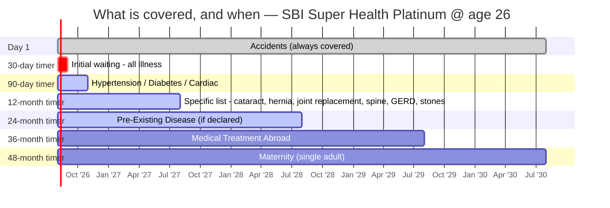

# Module 2 — Exclusions & Waiting Periods

_Source: Super Health Insurance **policy wording** (UIN **SBIHLIP24141V022324**) — Section A (Definitions), **Section E (Waiting Period)**, **Section F (Exclusions: A. Standard / B. Specific)**, Section G (Standard Terms), Annexure I. Files in `resources/`._
_Profile studied: **Individual (single adult), age 26, metro tier-1**_
_Studied across SI tiers: **₹10L / ₹25L / ₹50L / ₹1Cr**_

> **Plain-English intro.** Module 1 asked *"what do they pay for?"*. This module asks the harder question: **"what will they NOT pay for, and how long am I paying premiums before each cover actually switches on?"** Three ideas do all the work:
> - **Waiting period** = a timer. You're paying, but that specific thing isn't covered yet.
> - **PED (Pre-Existing Disease)** = anything you already had before buying. Longest timer — and the #1 reason claims get rejected.
> - **Exclusion** = never covered, no timer, ever.
>
> **This is the module where most claim denials are born** — hence 20% of the score.

---

## Claim-lever definitions (extract first)

| Definition | This plan | Why it bites |
|------------|-----------|--------------|
| **Pre-existing disease (lookback)** | **36 months** (Sec A def. 40) — anything *diagnosed*, or for which *advice/treatment was received*, in the 36 months before the policy starts | The window that defines "pre-existing". **Distinct from the waiting period** — SBI digs back 36 months (industry-standard) but then makes you wait only 24 |
| **Any One Illness (relapse window)** | **Not defined as a relapse window.** C.12(d) explicitly: *"Anyone Illness cover will not be applicable under this benefit"* (ReInsure) | ✅ **Its absence helps.** HDFC Optima's 45-day relapse rule treats a return within 45 days as the *same* claim; SBI has no such trap on its refill |
| **Reasonable & Customary charges** | Present — used in D.5 and generally | Lets insurer trim a bill to "customary" rates — discretionary |
| **Medically Necessary** | Present — benefits gated on *"Medically Necessary Treatment"*; reinforced by Specific Exclusion **B.X**, allowing refusal if, per medical textbooks / WHO protocols / clinical guidelines, the hospitalisation *"is not necessary or the stay… unduly long"* | Lets insurer reject treatment or trim a long stay. **B.X is an unusually explicit evidence-based-medicine refusal power** — broader than usual boilerplate |

> ⚠️ **Internal wording gap (not brochure-vs-wording).** Definition **49** says *"Specific Waiting Period means a period up to **36 months** (as per plan opted)"*, but operative clause **E.II** says **24/12 months** and Annexure I says **2 years / 1 year**. The definition is a **boilerplate ceiling with headroom no current rung uses** — the schedule and Annexure I bind. Harmless today; re-check if SBI files a variant that occupies the 36-month headroom. *(New dimension below.)*

---

## Waiting periods & restrictions

| Item | Detail | Concern |
|------|--------|---------|
| **Initial (30-day) waiting** | **30 days** for any illness (E.I, Code-Excl 03). **Exceptions:** ✅ accidents covered day 1; ✅ **does not apply at all with >12 months continuous coverage**; ✅ does not apply to Hypertension/Diabetes/Cardiac or Medical Treatment Abroad (own timers) | ⚠️ **Applies afresh to any enhanced Sum Insured** (E.I.c) |
| **PED waiting** | **24 months** (E.III, Code-Excl 01) — **all five rungs** | ✅ **Best-in-study.** HDFC Optima **36 mo**, Bajaj **36 mo** → **SBI a full year better**. ⚠️ **Reducible? NO** — SBI sells **no PED-waiting-reduction option at all**, so the HDFC "channel-only" trap and ABHI "SI-gated" trap **cannot arise** (nothing to gate). ⚠️ **E.III.d: cover after 24 months applies only if the PED was *declared at application and accepted*** — an undeclared PED is **never** covered, however long you wait |
| **Specific-disease waiting (list)** | **24 months** (Prime/Elite/Premier) · **12 months** (Platinum / Platinum Infinite) — E.II, Code-Excl 02. **Full list extracted below** | ✅ **12 months on Platinum is exceptional** (industry norm 24). ⚠️ E.II.c: if a listed disease is *also* your PED, **the LONGER timer applies** (→24 mo). ⚠️ E.II.d: the timer applies **even if you contract it *after* buying** — not a PED-only rule |
| **Enhancement-of-SI resets waiting** | ⚠️ **YES — all three timers restart on the increase**: 30-day (E.I.c), specific-disease (E.II.b), PED (E.III.b) — *"shall apply afresh to the extent of Sum Insured increase"* | ⚠️ **Material for a 26-year-old.** The natural plan — "buy ₹10L now, step up to ₹50L at 35" — **restarts a 24-month PED clock on the new ₹40L**. Argues for **buying the larger SI at entry** (M1: ₹50L is only +41% over ₹10L) rather than laddering up later |
| **Co-pay** | ✅ **NONE mandatory.** Co-pay is a **purely optional** 10%/20% discount lever (D.3). **No age trigger anywhere** — max entry age is *"No limit"* and no clause switches co-pay on at any age | ✅ **Excellent and rare** — many plans force co-pay on senior entrants. ⚠️ **One-way door:** *"once the Co-Payment option is availed… it cannot be opted out of at subsequent Renewal"* (D.3). Also **additive** to any other co-pay |
| **Sub-limits / disease capping** | ✅ **No disease-wise capping on any illness.** Rupee sub-limits only on peripheral items: bariatric **₹50k** (Prime/Elite/Premier) / **₹2L** (Platinum/Infinite) · road ambulance ₹3–5k · air ambulance ₹2L/₹10L · health check-up ₹2.5–10k · shared-room cash ₹4–15k · Recovery ₹2.5–10k · maternity ₹25k–₹2L | ⚠️ **The real catch: sub-limits are FROZEN as your SI compounds** (C.22.i / C.23.h — *"sub-limits… shall not increase proportionately with the Sum Insured"*). New dimension below |
| **Modern-treatment sub-limits (12 mandated)** | ✅ **NONE — "Actuals up to Sum Insured" on all five rungs** (Annexure I; C.14): robotic surgery, oral chemo, immunotherapy, deep-brain stimulation, stereotactic radiosurgery, uterine artery embolisation/HIFU, balloon sinuplasty, intra-vitreal injections, bronchial thermoplasty, green/holmium laser prostate, IONM, haematopoietic stem-cell | ✅ **Standout.** Industry norm is a **50%-of-SI or flat ₹5L cap**. SBI caps **nothing** — at ₹50L Platinum a robotic surgery can draw the full ₹50L. **Beats the benchmark** |
| **Mental-illness coverage (parity?)** | ✅ **Covered at full SI, no sub-limit.** Full IRDAI-compliant construct — def. **17** Mental Illness, def. **18** Medical Practitioner for mental Illnesses, def. **19** Mental Health Establishment (treated as a Hospital) — and mental illness appears **nowhere in the exclusions** | ✅ **Genuine parity, not neutered.** No separate cap, waiting period or co-pay. With room rent uncapped (M1), a psychiatric admission is treated like any other. *(Mental retardation carved out of the definition — standard.)* |
| **Zone-based co-pay** | ✅ **NONE.** Premium is **"Zone Agnostic"** on all rungs (Annexure I); **no zone-co-pay clause exists** in the wording | ✅ **Genuine metro win.** The classic trap — priced in a cheap zone, co-paid for treatment in a costly one — **cannot occur here**. Carried from M1's new dimension |
| **Deductible / aggregate deductible** | **Optional only** (D.4) — an Aggregate Deductible you bear before the insurer pays anything that year. Does **not** reduce SI. Exempt from it: shared-accommodation cash, road & air ambulance, bariatric, e-opinion, health check-up, Recovery Benefit | ⚠️ **A ratchet and a one-way door:** *"cannot be opted out or reduced at any time… Deductible however **can be increased** at the time of Renewal"* (D.4.b) — it can only ever get worse |
| **Permanent exclusions (full list)** | **26 items = 15 Standard + 11 Specific.** Standard (F.A, Excl 04–18): investigation/evaluation admissions · rest cure & respite care · obesity/weight control (unless BMI ≥40, or ≥35 w/ comorbidities) · change of gender · cosmetic/plastic surgery · hazardous sports **(professional participation only)** · breach of law · excluded providers · alcoholism/drug abuse · health hydros/spas · non-prescription supplements · **refractive error <7.5 dioptres** · unproven treatments · sterility & infertility (incl. IVF/surrogacy) · maternity (disapplied where C.20 bought). Specific (F.B): war · nuclear/chemical/biological · treatment outside India *(disapplied on Platinum/Infinite, which buy C.24)* · circumcision · convalescence/general debility/**external congenital anomaly** · vaccination (except post-animal-bite / C.21) · doctor's home visits & attendant nursing during pre/post-hosp · self-injury & attempted suicide · **ICD-code carve-out (B.IX)** · **evidence-based-medicine refusal (B.X)** · **underwriting permanent exclusion (B.XI)** | ✅ **Standard catalogue, no unusual carve-outs.** Notable positives: hazardous sports excluded only for **professionals** (recreational climbing fine); **internal** congenital disease is *covered* after the specific wait (only **external** congenital anomaly permanently excluded); transgender care protected per the 2019 Act. ⚠️ Attendant nursing / home visits during pre-post hosp excluded |
| **Underwriting-imposed permanent exclusion on declared conditions** | ⚠️ **YES — two clauses.** **B.IX:** *"In respect of the existing diseases, disclosed by the insured and mentioned in the policy schedule… policyholder is **not entitled to get the coverage for specified ICD codes**."* **B.XI:** *"Any permanent exclusion applied on any medical or physical condition… as specifically mentioned in the Policy Schedule and as specifically accepted by Policyholder… applied for the condition(s) that otherwise **would have resulted in rejection** of insurance coverage."* | ⚠️ **The HDFC M2 dimension applies in full.** SBI can **accept your proposal but permanently carve out your declared condition by ICD code** — so an "accepted" policy can leave your main risk uncovered **forever**, not merely for 24 months. Requires your consent and must be named in the schedule. **For this profile (healthy 26-yo, no PED) the risk is ~nil today** — but it is the clause to re-read at any future SI enhancement or migration |
| **Non-disclosure consequences** | ⚠️ **Harsh:** *"The Policy shall be **void** and **all premiums paid thereon shall be forfeited**"* on misrepresentation, mis-description or non-disclosure of any **Material Fact** (G.A.a). **Fraud** (G.A.f): all benefits **and** premium forfeited; paid claims clawed back, jointly & severally. **Mitigant:** fraud cannot be alleged if the insured proves the statement was true to the best of their knowledge with no deliberate intent | ⚠️ Standard-harsh, **moderated by the 60-month moratorium** (after 5 continuous years nothing is contestable except **established fraud**). **Feeds M6.** Practical rule: **over-disclose at proposal** — a 24-month PED wait is cheap; a voided policy at 45 is not |

---

## 📋 The specific-disease list — the actual conditions *(E.II, extracted verbatim)*

> **Plain English:** named things **not covered for the first 12 months (Platinum/Infinite) or 24 months (Prime/Elite/Premier)** — *even if you develop them after buying, and even if you're perfectly healthy today*. Accidents are always exempt.

**I. Illnesses (23):** Internal congenital diseases · Non-infective arthritis · Gall-bladder disease incl. cholecystitis · Urogenital (kidney/bladder stone) · Pancreatitis · Ulcer & erosion of stomach/duodenum · All forms of cirrhosis · **GERD (acid reflux)** · Perineal & perianal abscesses · **Cataract** · Fissure/fistula in anus, haemorrhoids incl. pilonidal sinus · Gout & rheumatism · Benign tumours, cysts, nodules, polyps incl. breast lumps · **Osteoarthritis & osteoporosis** · Polycystic ovarian disease · Fibroids · Sinusitis & rhinitis · Tonsillitis · Skin tumours · Benign hyperplasia of prostate · **Genetic disorder**

**II. Surgical procedures (20):** Adenoidectomy · Tonsillectomy · Tympanoplasty · Mastoidectomy · Dilatation & curettage (D&C) · Nasal concha resection · Myomectomy · Genito-urinary surgery · Prostate surgery · Cholecystectomy · **Hernia** · Hydrocele/rectocele · **Surgery for prolapsed intervertebral disc (spine)** · **Joint replacement surgeries** · Varicose vein surgery · Nasal septum deviation · Perianal abscess surgery · Fissurectomy, haemorrhoidectomy, fistulectomy · ENT surgeries

### ✅ Third-waiting-tier check *(framework dimension — Bajaj M2)* — **SBI has NO third tier**

| Procedure | Bajaj Health Guard | **SBI Super Health (Platinum)** |
|-----------|:------------------:|:-------------------------------:|
| Joint replacement | **36 months** (separate tier) | ✅ **12 months** |
| Vertebral / spine surgery | **36 months** (separate tier) | ✅ **12 months** |
| Genetic disorder | **36 months** (separate tier) | ✅ **12 months** |
| Bariatric | **36 months** (separate tier) | ✅ **12 months** (+ ₹2L sub-limit) |
| Parkinson's | **36 months** (separate tier) | ✅ Not listed → **30 days only** |

> **Finding — SBI's biggest M2 win.** Bajaj quarantines joint replacement, spine surgery, bariatric, Parkinson's and genetic disorders in a **separate 36-month tier** *longer* than its 24-month list. **SBI folds all of them into the single 24/12-month list.** On Platinum a **joint replacement is covered after 12 months versus Bajaj's 36** — a **three-fold shorter wait** on one of the most commonly-claimed major procedures. SBI's architecture is genuinely **two-tier (30-day + 24/12-month) + PED 24-month**, with no hidden third rung.

---

## 🕐 The waiting-period timeline (Platinum, healthy 26-year-old, no PED)

| Timer | Applies to | Platinum | Prime/Elite/Premier |
|-------|-----------|:--------:|:-------------------:|
| Day 1 | Accidents; everything not otherwise listed (after 30d) | ✅ | ✅ |
| 30 days | Any illness (waived with >12 mo continuous cover) | 30d | 30d |
| **90 days** | Hypertension · Diabetes · Cardiac *(→30/60d with paid "Early Start" add-on)* | 90d | 90d |
| **12 / 24 months** | The 43-item specific list above | **12 mo** ⭐ | 24 mo |
| **24 months** | PED (declared & accepted only) | **24 mo** ⭐ | 24 mo |
| 36 months | Medical Treatment Abroad | 36 mo | n/a (not sold) |
| 48 months | Maternity (single adult) | 48 mo | n/a (not sold) |

> **For this buyer (healthy, 26, no PED):** the only timers that realistically bite are the **30-day initial** and the **12-month specific list**. After **one year** on Platinum the policy is effectively fully switched on — **the fastest ramp-up in the study.**

---

## ⚠️ The Hypertension / Diabetes / Cardiac 90-day timer — read carefully

A **separate, unusual timer** (E.IV) that cuts both ways:

- **The catch:** these three carry a **90-day wait even if you are perfectly healthy at purchase and develop them later.** Most plans have no such carve-out — a new diabetes diagnosis in month 2 would normally be covered after the 30-day wait. **SBI makes you wait 90 days.**
- **The relief:** if they *are* pre-existing and disclosed, the normal **24-month PED** timer applies instead — not a longer one.
- **"Early Start" add-on** cuts the 90 days to **30/60 days** for a fee.

> ⚠️ **Unverified:** the Early Start add-on's **UIN is unprinted ("XXXXXXXXXX") in the on-file CIS**, and the wording does not state whether it is **individual-buyable or channel-restricted**, nor whether it is **SI-gated**. Both the HDFC (*"who can opt it — channel vs individual"*) and ABHI MAX (*"SI-gated waiting reduction"*) framework checks are therefore **OPEN on this add-on**. **Confirming source:** SBI General's add-on filing / IRDAI UIN register / a live quote at ₹10L and ₹1Cr.

---

## 🆕 NEW DIMENSIONS discovered in this module *(Rule 3)*

### 1. Rupee sub-limits frozen while the SI compounds *(→ new bullet in study_plan M2; row above)*
Wording **C.22(i)** and **C.23(h)** state plainly: *"The sub-limits applicable to various Benefits will remain the same and **shall not increase proportionately with the Sum Insured**."* So as the bonus grows a ₹25L Platinum to **₹75L** over four claim-free years, the **road ambulance stays ₹5,000, bariatric stays ₹2L, health check-up stays ₹5,000**. The headline SI triples; sub-limited items don't move. Over a **40-year hold at ~10–14% medical inflation**, every rupee-denominated sub-limit **decays to irrelevance**.
> **New generalisable check:** *"Do the plan's rupee sub-limits scale with the bonus-inflated SI, or are they frozen? Which benefits are rupee-capped rather than %-of-SI — and what are they worth after 20–40 years of medical inflation?"* This is the **slow-erosion mirror** of M1's multiplier hard-cap check: there the *bonus* is rupee-clipped; here the *benefits* are.

### 2. Irreversible / inception-only option locks — "one-way doors" *(→ new bullet in study_plan M2 + M4; rows above)*
Super Health's flexible options are **asymmetric ratchets**. The framework's existing *"deductible-linked discounts — the premium-vs-out-of-pocket trade-off"* (M4) never flagged that the trade may be **permanent**:

| Option | Add later? | Remove later? |
|--------|:----------:|:-------------:|
| **Co-payment** (10/20% discount) | — | ❌ **Never** — *"cannot be opted out of at subsequent Renewal"* (D.3) |
| **Aggregate Deductible** (discount) | ✅ at renewal | ❌ **Never**, and **can only be increased** (D.4.b) |
| **ECB Safeguard** (bonus protection) | ❌ **inception only** (D.2.b) | — |
| **Wellness / Walk Healthy** (up to 30% renewal discount) | ❌ **inception only** (D.7.b) | — |

> **New generalisable check:** *"For every optional cover and discount lever — is it reversible, and is it inception-only? A premium discount taken at 26 that cannot be undone at 56 is a 30-year commitment, not a discount."* Buyer rule: **take the inception-only *benefits* (ECB Safeguard, Wellness); refuse the irreversible *discounts* (co-pay, deductible).**

### 3. Definition-vs-benefit-table internal headroom *(→ new bullet in study_plan, Phase-1 wording forensics)*
Definition 49 permits a Specific Waiting Period *"up to **36 months** (as per plan opted)"*, while every rung in Annexure I uses **24 or 12**. Boilerplate with **unused headroom**. Not a live conflict — but the framework only tests **brochure vs wording**, never **wording vs itself**.
> **New generalisable check:** *"Compare the Definitions section against the Product Benefit Table. Where a definition's ceiling exceeds the grid's actual number, note the headroom — a future variant or revision can occupy it without a new UIN."*

---

## Brochure-vs-wording check *(Rule 2)*

✅ **No conflict.** Waiting periods agree across all three documents tested — the **binding wording** (E.I–E.VI), the **CIS**, and **Annexure I**: PED 24 mo, specific 24/12 mo, initial 30 days, Hypertension/Diabetes/Cardiac 90 days, maternity 48/24 mo, treatment-abroad 36 mo. Co-pay is described as **optional** in all three. As in M1, SBI's documentation is **internally consistent** — a materially cleaner record than Bajaj's stale brochure entries.

⚠️ **Open items (not conflicts):** ① the **Early Start add-on UIN is unprinted** → its terms, channel availability and SI-gating are **unverified**; ② **definition 49's 36-month headroom** vs the grid's 24/12.

> **Carry-forward flags** *(stage2_shortlist.md)*: SBI's open flags are **M3/M5** — *"newer product, verify real claims experience"* and the **unverified ~18,000 network count**. Neither is an M2 matter; **both carried forward intact** to Modules 3 and 5. Stage-2 scored SBI **Waiting = 5/5** on brochure-level data; this deep read **substantially confirms it** (PED 24 mo and specific 12 mo are real and wording-backed), with the caveats that SI-enhancement restarts every clock and the 90-day Hypertension/Diabetes/Cardiac timer is an unadvertised negative.

---

## Sources

- [Super Health Insurance — Policy Wording, UIN SBIHLIP24141V022324](resources/policy_wording_super_health.pdf) — *binding; Sec A defs 17–19, 40, 49; **Sec E Waiting Period I–VI**; **Sec F Exclusions A.I–XV (Standard) & B.I–XI (Specific)**; Sec G Standard Terms (disclosure, fraud, multiple policies); C.14 modern treatments; C.22(i)/C.23(h) sub-limit freeze; D.2–D.4 & D.7 optional covers; Annexure I*
- [Super Health Insurance — Customer Information Sheet](resources/customer_information_sheet_cis.pdf) — *waiting-period summary; sub-limits; co-pay; 60-month moratorium*
- [Super Health Insurance — Prospectus](resources/prospectus_super_health.pdf) — *D.1–D.7 optional-cover conditions and irreversibility clauses*
- [Super Health — General Brochure](resources/brochure_general.pdf) — *benefit grid used for the brochure-vs-wording test*
- [IRDAI Master Circular on Health Insurance, 29 May 2024](https://irdai.gov.in/) — *regulatory floor: PED wait ≤36 mo, 60-month moratorium, mandated mental-illness & modern-treatment cover*
- [SBI General Insurance — official downloads portal](https://www.sbigeneral.in/downloads) — *source of all policy documents, fetched 16-Jul-2026*
- Framework: [study_plan.md](../../study_plan.md) · carry-forward flags: [stage2_shortlist.md](../../screening/stage2_shortlist.md)
- Benchmarks referenced: [HDFC Optima Secure+ M2](../hdfc_optima_secure/module2_exclusions.md) · [Bajaj Health Guard M2](../bajaj_health_guard/module2_exclusions.md)

---

**Module 2 score (1–5): 4.5 / 5**

**Rationale.** The **best waiting-period architecture in the study so far, and the wording backs the brochure**. The **PED wait is 24 months on every rung** — a full year shorter than both HDFC Optima and Bajaj (36 mo) — and Platinum cuts the **specific-disease wait to 12 months** against an industry norm of 24. Decisively, SBI has **no hidden third waiting tier**: joint replacement, spine surgery, bariatric and genetic disorders sit in the ordinary 12-month list where **Bajaj quarantines them for 36**. Add **no mandatory and no age-triggered co-pay** (rare, and valuable over a 40-year hold), **no zone co-pay**, **genuine mental-illness parity at full SI**, and **uncapped modern treatments** where the industry norm is a 50%/₹5L cap. For this profile — **healthy, 26, no PED — the policy is effectively fully switched on after 12 months**, the fastest ramp in the study.

Half a point is withheld for four real, wording-verified frictions, none fatal: **(1) enhancing the SI restarts all three clocks** on the increase — punishing the natural "buy small now, step up later" plan and arguing for a bigger SI at entry; **(2) rupee sub-limits are explicitly frozen while the SI compounds** (C.22.i/C.23.h), so ambulance/bariatric/check-up caps decay to irrelevance over a 40-year hold; **(3) the underwriting ICD-code carve-out (B.IX/B.XI)** lets SBI accept a proposal but permanently exclude a declared condition — inert for this buyer today, live at any future enhancement or migration; and **(4) the co-pay and deductible discounts are irreversible one-way doors**, while the unadvertised **90-day Hypertension/Diabetes/Cardiac timer** applies even to the newly healthy. Non-disclosure remains void-and-forfeit — standard, and moderated by the 60-month moratorium (M6).
