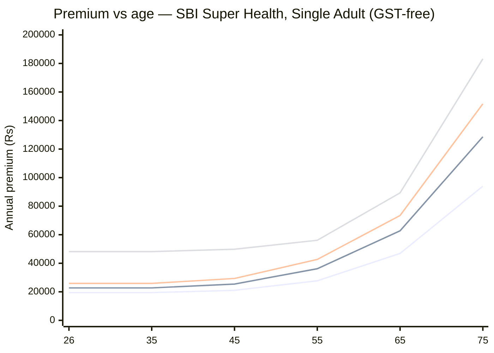

# Module 4 — Cost & Premium

_Source: **Super Health official Premium Rate Chart** (`resources/premium_rate_chart.pdf`, UIN **SBIHLIP24141V022324**) + **policy wording** §G.j–G.n (loadings, instalments, revision) + prospectus §P–T (medical tests, loadings, discounts). All files in `resources/`._
_Profile studied: **Individual (single adult), age 26, metro tier-1** — the **"Single Adult Office Premium"** table is the correct basis._
_Studied across SI tiers: **₹10L / ₹25L / ₹50L / ₹1Cr**_

> **Plain-English intro.** Health premiums don't rise every birthday — they jump when you cross an **age band**. So the question isn't "what does it cost now?" but **"what will this cost me at 55, 65, 75 — when I actually need it and can least afford to drop it?"** Two jargon terms:
> - **Office premium** = the insurer's base price before tax. **Since 22-Sep-2025 individual health insurance is GST-exempt, so the office premium IS the final price you pay** — no 18% on top.
> - **Loading** = an *extra* premium the insurer can charge you personally if your medical tests come back adverse.

> ### ⚠️ DATA CORRECTION — this module supersedes Module 1's premium figures
> Module 1's premium table was built from **text-extracted** rate-chart rows. Rendering the actual PDF pages proved the captions sit **above** their tables, and M1 had accidentally read the **"1A+1C Family Floater"** rows as Single Adult. **Every premium in M1 was ~19–86% too high.** The figures below are read directly off the rendered rate-chart pages and are correct. **M1's premium tables have been corrected to match.**
>
> | Variant @ age 26 | M1 said (wrong — 1A+1C floater) | **Correct (Single Adult)** | Error |
> |---|---:|---:|---:|
> | Prime ₹10L | ₹13,628 | **₹9,313** | −32% |
> | Elite ₹10L | ₹14,064 | **₹9,685** | −31% |
> | Platinum ₹10L | ₹23,125 | **₹19,446** | −16% |
> | Platinum ₹25L | ₹28,081 | **₹22,727** | −19% |
> | Platinum ₹50L | ₹32,676 | **₹25,895** | −21% |
> | Infinite ₹50L | ₹47,694 | **₹45,944** | −4% |
> | Infinite ₹1Cr | ₹50,946 | **₹48,152** | −5% |

---

## Premium by age — the age-curve (Single Adult, office premium = final price, GST 0%)

> **Age → band mapping** (SBI bands: 18-35 / 36-45 / 46-50 / 51-55 / 56-60 / 61-65 / 66-70 / 71-75 / 76-80 / 81-85 / 85+):
> age **26 → 18-35** · **35 → 18-35** (*same band!*) · **45 → 36-45** · **55 → 51-55** · **65 → 61-65** · **75 → 71-75**

| Age | Band | **Platinum ₹10L** | **Platinum ₹25L** | **Platinum ₹50L** | **Infinite ₹1Cr** |
|-----|------|------------------:|------------------:|------------------:|------------------:|
| **26** (entry) | 18-35 | **₹19,446** | **₹22,727** | **₹25,895** | **₹48,152** |
| **35** | 18-35 | ₹19,446 | ₹22,727 | ₹25,895 | ₹48,152 |
| **45** | 36-45 | ₹21,031 | ₹25,431 | ₹29,333 | ₹49,853 |
| **55** | 51-55 | ₹27,705 | ₹36,167 | ₹42,683 | ₹56,107 |
| **65** | 61-65 | ₹46,883 | ₹62,726 | ₹73,462 | ₹89,322 |
| **75** | 71-75 | ₹94,007 | ₹1,28,617 | ₹1,51,702 | ₹1,83,237 |

_Lines top-to-bottom at age 75: Infinite ₹1Cr (₹1.83L) · Platinum ₹50L (₹1.52L) · Platinum ₹25L (₹1.29L) · Platinum ₹10L (₹0.94L)._

### 🎁 The 9-year flat window — a real age-banding win
**Ages 26 → 35 sit in the SAME band (18-35), so the premium does not rise at all for nine years.** A 26-year-old buying Platinum ₹25L pays **₹22,727 every year until 36**. This is the single biggest argument for **buying young**: nine years of zero increase, plus nine years of Enhanced Cumulative Bonus accrual (M1) that maxes the 200% ceiling by age 30.

### Curve-shape read

| Metric | Platinum ₹10L | Platinum ₹25L | Platinum ₹50L | **Infinite ₹1Cr** |
|--------|:-------------:|:-------------:|:-------------:|:-----------------:|
| **Multiplier 26→35** | **1.00×** | **1.00×** | **1.00×** | **1.00×** |
| Multiplier 26→45 | 1.08× | 1.12× | 1.13× | **1.04×** |
| **Multiplier 26→55** | 1.42× | 1.59× | 1.65× | **1.17×** |
| Multiplier 26→65 | 2.41× | 2.76× | 2.84× | **1.85×** |
| **Multiplier 26→75** | **4.83×** | **5.66×** | 5.86× | **3.81×** |
| **Steepest jump band** | \multicolumn — see below | | | |

> **Finding — the age curve FLATTENS as SI rises.** Buying ₹1Cr means the premium rises only **3.81×** from 26→75, versus **5.66×** at ₹25L. A larger fixed/base component dilutes the age-risk component. **The big-SI buyer ages more gently**, which compounds the per-lakh efficiency finding below. **Buying a large SI young is doubly rewarded: cheaper per lakh, and a flatter curve.**

**Where the price accelerates (Platinum ₹25L, band-to-band):**

| Transition | Increase |
|------------|:--------:|
| 18-35 → 36-45 | +11.9% |
| 36-45 → 46-50 | +23.2% |
| 46-50 → 51-55 | +15.4% |
| 51-55 → 56-60 | +23.2% |
| **56-60 → 61-65** | **+40.8%** ⚠️ |
| **61-65 → 66-70** | **+42.9%** ⚠️ |
| **66-70 → 71-75** | **+43.5%** ⚠️ |

> **The cliff starts at 61.** Every five-year band from 61 onward adds **~40–44%**. Between 60 and 75 the Platinum ₹25L premium triples (₹44,555 → ₹1,28,617). **This is the affordability stress point of the whole 40-year hold** — and it lands exactly when income typically stops.

### Premium per ₹1L of cover @ age 26 *(SI-efficiency curve — framework dimension, Bajaj M4)*

| SI | Prime | Elite | Premier | **Platinum** | **Infinite** |
|----|------:|------:|--------:|-------------:|-------------:|
| ₹10L | ₹931 | ₹969 | ₹1,504 | ₹1,945 | — |
| ₹25L | ₹496 | ₹518 | — | ₹909 | — |
| ₹50L | — | — | — | **₹518** ⭐ | ₹919 |
| ₹1Cr | — | — | — | — | **₹482** |
| ₹2Cr | — | — | — | — | **₹258** |

> **Finding — ₹50L Platinum is the sweet spot of the entire product.** It costs **only 14% more than ₹25L (₹25,895 vs ₹22,727) for DOUBLE the cover**, dropping to **₹518/lakh**. Combined with M1's 200% ECB ceiling, ₹50L Platinum reaches a **₹150L cover ceiling for ₹25,895/yr** — **₹173 per lakh of eventual ceiling**, the most efficient position on the ladder. *(Infinite ₹1Cr reaches a ₹2Cr ceiling for ₹48,152 = ₹241/lakh-of-ceiling — worse.)*

> ⚠️ **But SBI is NOT the price leader.** Against Bajaj Health Guard Platinum (framework, Bajaj M4: **₹1,763/lakh @₹10L → ₹355/lakh @₹1Cr**):
> | | Bajaj | **SBI** | SBI vs Bajaj |
> |---|---:|---:|---:|
> | @₹10L | ₹1,763/lakh | ₹1,945/lakh | **+10% pricier** |
> | @₹1Cr | ₹355/lakh | ₹482/lakh | **+36% pricier** |
> On sticker price at comparable feature level, **SBI loses to Bajaj at both ends of the ladder.** The escalation clause below reverses this — see the headline finding.

---

## 🏆 Headline finding — SBI has **no pre-announced escalation**; Bajaj does. This dominates the entry-price gap.

The framework's **"pre-announced/contractual annual base-rate escalation"** dimension (Bajaj M4) records that **Bajaj prints a fixed forward escalation in its rate chart: *"8% increase on base rates every year for policies with RID from 25 Oct 2026"*** — compounding *on top of* age-banding.

**SBI's rate chart and wording contain no such clause.** SBI's only re-pricing power is the standard **§G.n**: *"The Company, with prior approval of IRDAI, may revise or modify the terms of the Policy including the premium rates. The Insured Person shall be notified **three months** before the changes are effected."* — i.e. **discretionary, regulator-gated, and not pre-committed.**

**What that's worth, quantified (₹10L, single adult, age 26 → 35):**

| | Age 26 | Age 35 | Change |
|---|---:|---:|---|
| **Bajaj Platinum ₹10L** *(₹1,763/lakh, +8%/yr contractual)* | ₹17,630 | **≈₹35,240** | **+100%** (8%/yr × 9 yrs = 2.0×) |
| **SBI Platinum ₹10L** *(same 18-35 band, no escalator)* | ₹19,446 | **₹19,446** | **0%** |

> **SBI starts ~10% dearer and is ~45% cheaper by age 35.** Bajaj's contractual 8%/yr doubles its base rate every ~9 years *before* any age-band jump; SBI's premium is **flat for the same nine years**. Over a 40-year hold this is far more consequential than the entry-price gap.
>
> ⚠️ **Assumptions marked:** (a) Bajaj's 8%/yr is taken from the framework's Bajaj M4 note, applied as printed — **verify in Bajaj's own module**; (b) SBI's freedom from escalation is **not a price guarantee** — §G.n still permits IRDAI-approved block re-pricing (below). The comparison is **contractual escalation vs none**, not certainty vs risk.

---

## Premium dynamics

| Lever | Detail |
|-------|--------|
| **Claims-experience discount (premium ↑/↓ with claims)** | ✅ **None — and none possible.** Wording §G.j.vi: *"**No loading shall apply on Renewals based on individual Claims experience**"*, reinforced in prospectus §S.ii. **SBI has no Favourable-Claims-Experience Discount either** — unlike HDFC Optima, whose premium can move with claim history. **SBI's pricing is claim-blind: cleaner and more predictable.** *(Note: the Enhanced Cumulative Bonus still shrinks on a claim — that's cover, not premium; see M1.)* |
| **Underwriting risk loadings (max %)** | ⚠️ **Up to 150% per Insured Person** (prospectus §S.ii) — premium can be up to **2.5×**. Based on health status, habits, lifestyle, past records, proposal declarations and pre-policy medicals. ⚠️ **Persists for life:** *"Loadings will be applied from the Inception Date of the first Policy **including subsequent Renewals**"* — a loading taken at 26 is not shed at 36. ✅ Notified via **counter-offer letter**; policy issues only on your **consent**; no reply within **10 working days** → application cancelled, premium refunded. **Matches HDFC Optima's 150%/person cap.** |
| **Deductible-linked discount** | **Aggregate Deductible → 20% premium discount for a ₹1L deductible** (brochure worked example: *"Mr Puri gets 20% discount on premium by opting to pay first ₹1 lac of claim in a policy year"*). Platinum ₹25L: ₹22,727 → **≈₹18,182**. ⚠️ **Far weaker than HDFC Optima's up-to-65%.** ⚠️ **And it is a ONE-WAY DOOR** (M2 dimension): §D.4.b — *"cannot be opted out or reduced at any time… however **can be increased**"*. **Trading ₹4,545/yr for a permanent ₹1L first-loss is a bad deal at this age** — the deductible is real money at every claim, forever |
| **Discount stack (family / loyalty / long-term / lifetime)** | Prospectus §T: **Direct Channel 10%** ✅ · **Long-term 2yr 4% / 3yr 6%** ✅ *(void if instalment opted)* · Family Individual (**≥2 members**) 5% ❌ **N/A to a single adult** · SBI group entity 5% *(only if SBI-group employed)*. **Realistic clean stack for this buyer: Direct 10% + 3-yr long-term 6% ≈ 16%** → Platinum ₹25L ≈ **₹19,090/yr**. ⚠️ **How the two combine (additive vs multiplicative) is unverified** — *confirming source: a live quote on sbigeneral.in* |
| **Instalment-premium option** | Annual · Half-yearly · Quarterly · **Monthly** (§G.m). ✅ Grace 15 days (monthly) / 30 days (others); ✅ **coverage IS live during the instalment grace window**; ✅ **no interest charged**. 🚩 **BUT the instalment claim trap is CONFIRMED** (framework dimension, HDFC M6) — §G.m.vi–vii: *"**In the event of a Claim, all subsequent premium instalments shall immediately become due and payable**"* and *"The Company has the right to **recover and deduct all the pending instalments from the Claim amount**"*. **Claim in month 2 on a monthly plan → ~10 months' premium deducted from your payout.** Also, instalments **void the 4–6% long-term discount**. **Verdict: pay annually** |
| **Wellness earn-back (net premium)** | **Walk Healthy (§D.7.4): up to 30% off renewal premium** on the single-adult grid — 15L steps/9mo → 5%; 22.5L → 15%; 30L → 20%; **≥37.5L → 30%**. Plus AI fitness coaching, dietician e-consults, unlimited gym. ✅ **Genuine, and large** — comparable to ABHI HealthReturns. Platinum ₹25L at max: ₹22,727 → **≈₹15,909**. ⚠️ **Inception-only opt-in** (§D.7.b — *"cannot be opted at subsequent renewals"*) → **a one-way door in the buyer's FAVOUR: take it at purchase.** ⚠️ Optional-cover premium cost itself **unverified** — *confirming source: live quote* |
| **Section 80D effective cost** | Premium is deductible up to **₹25,000** (self, under-60). **Platinum ₹25L (₹22,727) sits entirely inside the limit → fully deductible**; at a 30% slab, net cost ≈ **₹15,909**. Platinum ₹50L (₹25,895) and Infinite ₹1Cr (₹48,152) exceed it → only ₹25,000 counts. 🚩 **BUT 80D exists only under the OLD tax regime.** The **new regime is the default** since FY24 and is where most young earners sit → **for this buyer the 80D benefit is most likely ₹0.** ⚠️ **Confirm the buyer's regime before crediting any tax saving** |
| **Zone-based pricing / zone co-pay** | ✅ **NONE — "Premium Type [Zone Agnostic]" on all five rungs** (Annexure I). One price nationwide; **no Zone-A metro loading and no zone-co-pay clause anywhere in the wording.** **A genuine, quantifiable win for a metro tier-1 buyer** — most rivals load Zone A. *(M1 new dimension, confirmed here.)* |
| **GST on premium (~~18%~~ → 0%)** | ✅ **0% — individual health insurance is GST-EXEMPT from 22-Sep-2025** (56th GST Council, 3-Sep-2025), still in force in 2026. **The "Office Premium (Excluding Tax)" in the rate chart IS the final price.** Worth ~15% vs the old ×1.18 basis: Platinum ₹25L would have been **₹26,818**, is now **₹22,727**. ⚠️ **Group/employer cover still attracts 18%** — irrelevant to this individual policy |
| **Age-banded vs annual increase** | ✅ **AGE-BANDED** ("Premium Type [Zone Agnostic] **Age Banded**", Annexure I) — the policyholder-friendly model. Premium steps only at band crossings, **not every birthday**. ⭐ **The 18-35 band delivers 9 years of zero increase from entry at 26** |
| **Medical-inflation / block-repricing risk** | ⚠️ **The main un-hedgeable long-term threat.** §G.n permits SBI, **with prior IRDAI approval**, to *"revise or modify the terms of the Policy including the premium rates"*, with **3 months' notice**. This applies to the **whole product cohort** and sits **on top of** the age-band curve above — so **every projection here is a floor, not a forecast**. ✅ Mitigants: regulator-gated, 3-month notice, and **no pre-announced escalator** (unlike Bajaj's 8%/yr). Linked risk: **product withdrawal** (§G.k) forces migration to a *similar* product preserving continuity but **NOT the rate** — see M6 |
| **Base-vs-(base+super top-up) cost** | ⚠️ **Not computed — unverified.** SBI's companion super-top-up product was not identified in the on-file documents. **In-product proxy:** the **Aggregate Deductible** is a crude self-layering lever (₹1L deductible → 20% off), but at only 20% it is **poor value versus a true super top-up**, and it is irreversible. **Also note:** the M1/M2 finding that **enhancing SI restarts all waiting clocks** makes the "buy small, layer later" route costlier than it looks. *Confirming source: SBI General product list / a live quote for Arogya Top-Up or equivalent* |
| **Premium revision history** | ⚠️ **UNVERIFIED — the key gap in this module.** No revision history for UIN SBIHLIP24141V022324 (or predecessor SBIHLIP23050V012223) was locatable. Without it, **the frequency and size of past block re-pricing cannot be assessed**, so §G.n's risk is unquantified. *Confirming source: IRDAI product-filing records / SBI General [public disclosures](https://www.sbigeneral.in/about-us/public-disclosure) / a rate-chart version comparison across years* |
| **Pre-policy medical-test cliff** *(NEW ROW — Rule 3)* | 🚩 **An SI-gated underwriting cliff between ₹25L and ₹30L on Platinum.** Prospectus §P grid: | 

### 🩺 The medical-test cliff — the hidden cost of a bigger SI *(NEW dimension)*

| Variant | Test triggered at | **A healthy 26-year-old?** |
|---------|-------------------|:--------------------------:|
| Prime / Elite ₹3–10L | age **>55** | ✅ **No test** |
| Prime / Elite ₹15–25L | age **>45** | ✅ **No test** |
| Premier (₹3–10L) | age **>55** | ✅ **No test** |
| **Platinum ₹10–25L** | age **>45** | ✅ **No test** |
| **Platinum ₹30–50L** | **≥18 years** | 🚩 **TEST REQUIRED** |
| **Platinum Infinite ₹50L–₹2Cr** | **≥16 years** | 🚩 **TEST REQUIRED** |

> **Finding — a ₹5L step from ₹25L to ₹30L changes the entire underwriting regime.** At **₹25L Platinum the buyer faces no medical test at all**: no exposure to the **150% risk loading**, and no exposure to M2's **B.IX/B.XI permanent ICD-code exclusion** (which can only bite on a *declared/detected* condition). At **₹30L+ every buyer is tested from age 18**, opening both doors — permanently, since loadings persist through all renewals.
> **This is a real, unpriced cost of the otherwise-brilliant ₹50L tier** (₹518/lakh). ✅ **Mitigant: the tests are FREE** — *"Medical tests will be facilitated by Us and full cost of all such tests will be borne by Us"* (§P) — and a genuinely healthy 26-year-old should clear them. **But the option to buy cover with zero underwriting scrutiny exists only at ≤₹25L.**

---

## Projected outgo

> **Assumptions (explicit):** Single Adult · **Platinum ₹25L** · office premium = final price (GST 0%) · **no block re-pricing** (§G.n not exercised — the key assumption; these are **floors**) · no discounts applied · no wellness earn-back · no loading.

- **10-yr projected outgo (age 26→35):** 10 × ₹22,727 = **₹2,27,270** *(entirely inside the flat 18-35 band)*
- **20-yr projected outgo (age 26→45):** ₹2,27,270 + (10 × ₹25,431) = **₹4,81,580**
- **40-yr projected outgo (age 26→65):** ₹2,27,270 + ₹2,54,310 + (5 × ₹31,342) + (5 × ₹36,167) + (5 × ₹44,555) + (5 × ₹62,726) = **₹13,55,530**

| Horizon | Total outgo | Avg/yr | With Direct-10% + 3yr-6% (≈16%) |
|---------|------------:|-------:|--------------------------------:|
| 10 yrs (26→35) | ₹2,27,270 | ₹22,727 | ≈ **₹1,90,907** |
| 20 yrs (26→45) | ₹4,81,580 | ₹24,079 | ≈ **₹4,04,527** |
| 40 yrs (26→65) | ₹13,55,530 | ₹33,888 | ≈ **₹11,38,645** |

> **Read:** ₹13.6 lakh buys 40 years of cover that (via the 200% ECB) is worth **₹75L of ceiling** throughout — **before** any block re-pricing. **The 26→45 half of the hold costs only ₹4.8L (35% of the 40-year total) while delivering the same cover** — the front half of a young policy is extraordinarily cheap. The back half is where medical inflation and §G.n live.

---

## 🆕 NEW DIMENSION discovered in this module *(Rule 3)*

### SI-gated pre-policy medical-test cliff *(→ new bullet in study_plan M4 + M2; row above)*
The framework has **"underwriting risk loadings"** (M4) and **"underwriting-imposed permanent exclusion"** (M2) — but nothing that asks **at what SI/age the medical test that triggers them becomes mandatory**. That threshold is the actual gate. SBI: **Platinum ₹25L = no test at 26; Platinum ₹30L = test from age 18.** A ₹5L SI step flips the buyer from *zero underwriting scrutiny* to *full medicals + 150%-loading exposure + permanent-ICD-exclusion exposure*. The cliff is invisible in the premium table, so a per-lakh efficiency analysis (which makes ₹50L look free) **systematically understates the cost of the higher tier**.
> **New generalisable check:** *"Extract the pre-policy medical-test grid. At which SI and age do tests become mandatory — and does the buyer's target SI cross that line? Below the line, the loading and permanent-exclusion clauses are dead letters; above it, they are live for life. Price the cliff, not just the premium. Also check who bears the test cost."*

---

## Brochure-vs-wording check *(Rule 2)*

✅ **No brochure-vs-wording conflict.** The rate chart, prospectus (§P–T) and wording (§G.j–G.n) agree on loadings (150%), the no-claim-loading rule, instalment terms, discounts and the revision clause.

🚩 **But the module's biggest data problem was self-inflicted and is worth recording as a method finding:** the rate chart's **text layer extracts table captions out of visual order**, which caused **Module 1 to mis-read the 1A+1C Family Floater rows as Single Adult** and overstate every premium by up to 86%. **Only rendering the PDF pages as images revealed the true layout.** → **Method rule now applied: for any rate chart, verify the table caption by rendering the page, never by text extraction alone.**

> **Carry-forward flags** *(stage2_shortlist.md)*: Stage-2 scored SBI **Value = 4/5**. This module **broadly confirms it, with a split verdict** — SBI is **not** the cheapest per lakh (Bajaj beats it by 10% at ₹10L and 36% at ₹1Cr), but it carries **no contractual escalator** where Bajaj compounds **8%/yr**, and it is **zone-agnostic and age-banded with a 9-year flat window**. Over the 40-year hold that combination is worth more than the entry-price gap. No M4 flag was open; none is raised. *(The M3-raised Bajaj ICR flag is separate.)*

---

## Sources

- [Super Health — Premium Rate Chart (official)](resources/premium_rate_chart.pdf) — *UIN SBIHLIP24141V022324; **Single Adult Office Premium** tables: Prime p.1, Elite p.13, Premier p.25, Platinum p.38, Platinum Infinite p.50. **Read by rendering pages to image** — the text layer mis-orders captions*
- [Super Health — Policy Wording](resources/policy_wording_super_health.pdf) — *§G.j.vi no claim-based loading · §G.k product withdrawal (90-day notice) · §G.l moratorium 60 mo · §G.m instalments (**vi–vii the claim trap**) · §G.n premium-revision power (IRDAI approval, 3-month notice) · §D.4 aggregate deductible irreversibility · §D.7.4 Walk Healthy grid*
- [Super Health — Prospectus](resources/prospectus_super_health.pdf) — *§P **pre-policy medical-test grid** (the SI cliff) + tests free · §Q instalment options · §R change of SI · §S **loadings (max 150%/person, persist through renewals, counter-offer, 10 working days)** · §T **discount stack** (Direct 10%, long-term 4%/6%, family 5%, SBI-group 5%)*
- [Super Health — General Brochure](resources/brochure_general.pdf) — *worked example: ₹1L aggregate deductible → **20% premium discount***
- [Annexure I Product Benefit Table](resources/policy_wording_super_health.pdf) — *"Premium Type **[Zone Agnostic] Age Banded**" on all five rungs*
- [ClearTax — GST on Health Insurance 2026](https://cleartax.in/s/gst-on-health-insurance) · [Ditto — GST on Health Insurance 2026](https://joinditto.in/articles/health-insurance/gst-on-health-insurance/) — ***individual health GST-exempt from 22-Sep-2025, still nil in 2026**; group cover still 18%*
- [Kerala High Court, Jan 2026 — GST exemption restricted to individual policies](https://taxo.online/latest-news/10-01-2026-gst-exemption-on-health-insurance-premium-restricted-to-individual-policies-group-health-insurance-policies-are-not-eligible-for-gst-exemption-kerala-high-court/) — *confirms the individual/group split holds*
- [SBI General — public disclosures](https://www.sbigeneral.in/about-us/public-disclosure) — *the source that would confirm the **unverified premium-revision history***
- Framework: [study_plan.md](../../study_plan.md) *(Bajaj M4 8%/yr escalator; per-lakh SI-efficiency curve; GST re-basing)* · flags: [stage2_shortlist.md](../../screening/stage2_shortlist.md)
- Benchmarks: [HDFC Optima Secure+ M4](../hdfc_optima_secure/module4_cost.md) · [Bajaj Health Guard M4](../bajaj_health_guard/module4_cost.md)

---

**Module 4 score (1–5): 4.0 / 5**

**Rationale.** For **this** buyer the cost structure is genuinely strong, and its best features are structural rather than promotional: **zone-agnostic pricing** (no metro loading and no zone-co-pay — a real edge in tier-1), **age-banded** rather than annual increases, and a **9-year flat window from 26 to 35** in which the premium does not move at all while the 200% bonus maxes out. Decisively, **SBI carries no pre-announced escalator** where **Bajaj contractually prints +8%/yr** — so although SBI starts ~10% dearer at ₹10L, it is **~45% cheaper by age 35**, and over a 40-year hold that dominates the entry-price gap. **Pricing is also claim-blind** (no claims-experience loading *or* discount), the **age curve flattens as SI rises** (₹1Cr rises just 3.81× from 26→75 vs ₹25L's 5.66×), and **₹50L Platinum costs only 14% more than ₹25L for double the cover (₹518/lakh)** — the most efficient position in the product. GST at **0%** makes the quoted office premium the final price.

It is held to 4.0 by five real frictions. **(1) SBI is not the price leader** — Bajaj is 10% cheaper per lakh at ₹10L and 36% at ₹1Cr on sticker. **(2) The old-age curve is steep**: every band from 61 on adds ~40–44%, tripling the premium between 60 and 75 (₹44,555 → ₹1,28,617 at ₹25L) exactly when income stops. **(3) A newly-found SI-gated medical-test cliff** means the excellent ₹50L tier triggers mandatory medicals from age 18 — exposing the buyer to a **150% loading that persists for life** and to M2's permanent ICD-code exclusion — while **₹25L escapes underwriting entirely**. **(4) The instalment claim trap is confirmed** (all remaining instalments deducted from any payout), and the deductible discount is a weak, **irreversible** 20% against HDFC's 65%. **(5) The premium-revision history is unverified**, so §G.n block-repricing risk — the one threat no projection here can price — remains unquantified, and **80D relief is likely ₹0** under the default new tax regime. **Best buy for this profile: Platinum ₹25L at ₹22,727 (≈₹19,090 with Direct+long-term discounts), or ₹50L at ₹25,895 if confident of clean medicals.**
